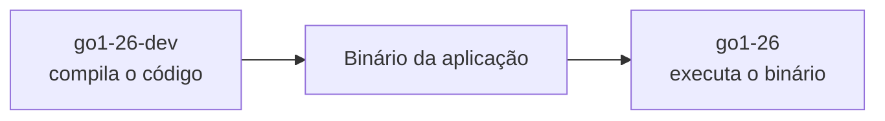
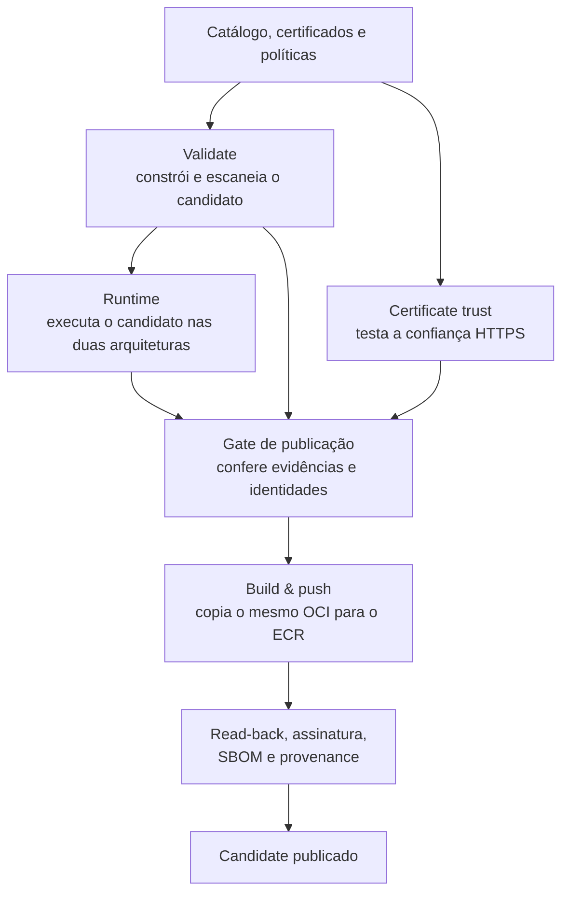
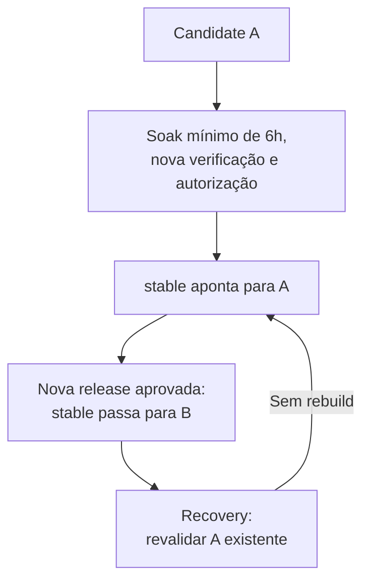

# Distroless — visão da solução para o time

> **Construir uma vez, testar a imagem produzida e publicar exatamente o que foi validado.**

O `alric-containers-image-base` é uma **fábrica de imagens base para aplicações**. Ele reúne construção (build), testes, análise de segurança, publicação e controle de versões em um fluxo automatizado.

## 1. O que entregamos

A proposta é oferecer uma base comum para as aplicações, com runtimes definidos, certificados, testes e origem verificável. Isso permite centralizar a manutenção das bases e rastrear o que foi disponibilizado.

**A Factory entrega a imagem base; o desenvolvedor acrescenta sua aplicação.** Ela não implanta aplicações nem atualiza automaticamente os serviços que já estão rodando.

**Distroless** significa manter o ambiente final mínimo, sem ferramentas de desenvolvimento desnecessárias. Não significa ausência de bibliotecas ou de vulnerabilidades.

## 2. Runtime e `-dev`: duas funções diferentes

**Runtime** é o ambiente necessário para executar a aplicação. A variante **`-dev`** contém ferramentas para prepará-la ou compilá-la: compiladores, SDKs — conjuntos de ferramentas de desenvolvimento — ou npm, o gerenciador de pacotes do Node.js.

O compilador fica no estágio de construção. A imagem final recebe o binário, não o ambiente completo de desenvolvimento.

O catálogo documentado contém **16 imagens: nove runtimes e sete variantes `-dev`**.

| Família | Versões | Como usamos |
| --- | --- | --- |
| .NET | 10 | SDK no `-dev`; runtime ASP.NET na imagem final. |
| Go | 1.25 e 1.26 | Compilador no `-dev`; binário no runtime mínimo. |
| Java | 21 e 25 | JDK, com compilador, no `-dev`; JRE, para execução, no runtime. |
| Node.js | 22 e 24 | Node + npm no `-dev`; Node no estágio final. |
| Python | 3.13 e 3.14 | Runtime independente, sem `-dev` neste catálogo. |

Go, Java e .NET formam **pares** nos contratos de publicação e promoção. Node pode usar dev/runtime na construção de uma aplicação, mas mantém contratos independentes. A ausência de Python `-dev` não significa que toda aplicação Python dispense ferramentas de build.

## 3. Ferramentas: quem faz o quê

Um **pacote** é um componente instalado na base. Um **artefato** é o resultado de uma etapa, como uma imagem ou relatório. **OCI** é o formato usado para representar e transportar as imagens de container.

| Ferramenta | Papel na solução |
| --- | --- |
| **Wolfi** | Fornece os pacotes que compõem as bases. |
| **Melange** | Constrói pacotes adicionais, como o pacote de certificados. |
| **Apko** | Monta a imagem a partir de YAMLs que descrevem pacotes e configurações. |
| **GitHub Actions** | Organiza os workflows: sequências automatizadas de jobs e etapas. |
| **Trivy** | Procura vulnerabilidades conhecidas e segredos, conforme a política da Factory. |
| **Docker / QEMU** | Docker executa os containers; QEMU permite testar outra arquitetura por emulação. |
| **Skopeo** | Copia a imagem validada para o registro sem reconstruí-la. |
| **Amazon ECR** | Armazena imagens e materiais associados para distribuição. |
| **Cosign / Sigstore** | Assinam e verificam a identidade da imagem e declarações sobre ela. |
| **Terraform** | Declara e provisiona a infraestrutura utilizada pela Factory. |

**Apko compõe as imagens base sem Dockerfile.** Dockerfiles continuam sendo usados nas aplicações de teste e nas aplicações consumidoras construídas sobre essas bases.

## 4. Entendendo os jobs do fluxo

Um **gate** é uma checagem obrigatória antes de avançar. Cada job responde a uma pergunta diferente.

**Certificate trust e construção/validação são ramos paralelos.** Ambos precisam fornecer as provas exigidas antes da publicação.

| Job | Pergunta | O que faz |
| --- | --- | --- |
| **Certificate trust `<framework>`** | Os certificados funcionam como esperado? | Constrói imagens de teste com uma CA sintética e verifica conexões TLS aceitas e rejeitadas. |
| **Validate `<framework>`** | Conseguimos construir e aprovar esta base? | Constrói o OCI real, verifica integridade, gera SBOM e escaneia as duas arquiteturas. |
| **Runtime `<framework>`** | O candidato realmente funciona? | Executa programas de teste ou compila/executa um projeto mínimo; verifica versão, usuário, acesso a arquivos e TLS. |
| **Build & push `<framework>` — both architectures** | Podemos publicar o candidato aprovado? | Confere evidências, copia o OCI existente, verifica o resultado remoto e produz assinatura e declarações. |

**O build da base acontece em `Validate`. “Build & push” não reconstrói essa base.** As imagens sintéticas de certificados são separadas e nunca substituem o candidato.

CA significa **autoridade certificadora**, usada para verificar certificados. **TLS** protege as conexões HTTPS. O teste sintético comprova a integração, não a legitimidade de certificados corporativos ainda não aprovados.

### Duas arquiteturas, execução real

As bases suportam **`linux/amd64` e `linux/arm64`**. Um **OCI Image Index** reúne as referências das duas plataformas; o cliente resolve a correspondente.

Não basta listar duas arquiteturas: os contratos executam o comportamento esperado em ambas. Os relatórios distinguem execução nativa de emulada.

### Falha não vira aprovação

Sem evidência válida, não há autorização. Scans e contratos podem bloquear uma imagem ou par; uma falha no **Image Trust agregado bloqueia todo o lote**. Se a assinatura falhar depois do push, pode restar conteúdo parcial no ECR: existir uma tag não comprova sucesso completo.

## 5. Identidade, conteúdo e origem

O **digest** é o hash do conteúdo: uma impressão digital que identifica a imagem exata. O **read-back** é a leitura independente após publicar, comparando o resultado no ECR com o digest aprovado.

| Evidência | O que explica |
| --- | --- |
| **Assinatura Cosign** | Quem assinou o digest e qual identidade pode ser verificada. |
| **SBOM em formato SPDX** | A lista de componentes da imagem; SPDX é o formato desse inventário. |
| **Provenance** | A origem da imagem: repositório, revisão e contexto de produção, em uma declaração autenticada. |

O Apko gera o SBOM na construção; o publicador preserva e atesta esses documentos.

**OIDC** permite obter sessões temporárias na AWS e identidade de assinatura sem introduzir chaves AWS estáticas no workflow. Confiança HTTPS, autenticação AWS e assinatura da imagem são controles distintos.

Assinatura não substitui análise de vulnerabilidades nem teste funcional. Não há promessa de “zero CVE” — CVE é o identificador de uma vulnerabilidade conhecida.

## 6. Candidate, `stable` e recovery

**Candidate** é a imagem publicada com digest e tag imutável, ainda sujeita à aprovação de release. **`stable`** é uma tag móvel apontando para a versão aprovada naquele destino, não outra imagem reconstruída.

O **soak** da referência é uma espera mínima de seis horas desde o push registrado pelo ECR. A nova análise após essa janela pode detectar vulnerabilidades conhecidas depois do build; não é um teste com tráfego real de usuários.

A promoção exige autorização operacional e os gates de segurança. Nos pares compilados, ambos são autorizados antes das escritas, mas **as duas escritas no ECR não são uma transação**: falhas parciais exigem tratamento.

**Recovery** reposiciona a tag para um digest existente e revalidado. Na versão documentada, opera uma imagem por execução, sem recuperação coordenada do par. A **quarentena** exclui digests da seleção automática para evitar repromover uma versão retirada.

Mover `stable` não atualiza aplicações já construídas; a atualização da base pertence ao fluxo da aplicação consumidora.

## 7. Infraestrutura e certificação

**PLAN calcula as mudanças; APPLY aplica a infraestrutura autorizada; BUILD usa o destino pronto.** O publisher não cria ECR nem corrige sua configuração. O **state** registra os recursos gerenciados pelo Terraform; o **lock** controla o acesso concorrente a esse registro.

O image-base mantém catálogo, políticas e fluxo do produto. O repositório reusable oferece workflows reutilizáveis, consumidos por revisão fixa.

| Fluxo | O que comprova |
| --- | --- |
| **CI - Repository checks** | Integração contínua: verifica código, testes offline e governança dos workflows. |
| **Runtime contract** | Funcionamento do candidato antes da publicação. |
| **Catalog certification** | O catálogo completo atravessa o mesmo fluxo real e publica candidates. Não promove `stable`. |
| **App certification** | Aplicações reais consomem as bases do ECR por digest, respondem HTTP e encerram corretamente. Não precisa de `stable`. |

As **16 imagens** correspondem a **11 contratos internos**: cinco pares compilados e seis imagens interpretadas independentes. A App Certification usa **nove cenários × duas arquiteturas = 18 execuções**, cobrindo as 16 bases.

As aplicações respondem em `/health`, `/ready` e `/info`; os testes verificam também execução sem root (usuário administrador), raiz somente leitura, áreas graváveis explícitas e encerramento controlado. O **Pipeline health** acompanha a cadência e as evidências operacionais, sem substituir esses testes.

## 8. Evidências e limites da referência

O documento de origem registra sucesso no **LAB**: Catalog Certification com 16 publicações e App Certification com **18/18 execuções** — nove amd64 nativas e nove arm64 emuladas.

Na referência, a agenda normal ainda publica somente o par Go 1.26; FULL é a certificação manual. A App Certification é complementar: seu PASS não é consultado automaticamente pela promoção.

O modelo `develop → DEV`, `staging → HOM` e `main → PROD futuro`, com `stable` por ambiente, aparece no anexo como **evolução prevista**. O status corporativo atual deve ser consultado no checkpoint da implantação, não inferido dos resultados do LAB.

> **Não entregamos apenas uma imagem pequena. Entregamos uma base cuja identidade, conteúdo e funcionamento podem ser verificados, preservando o mesmo artefato entre construção, testes e publicação.**

---

**Referência:** `ALRIC-CONTAINERS-IMAGE-BASE-FLOW.md`, leitura de 21/09/2026, commit `f44b2edf84538b41bfb96dde68e0aa7ffb192d00`. Esta versão apoia a apresentação ao time; preserva o documento técnico detalhado e não substitui um guia de uso ou operação.
