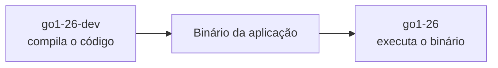
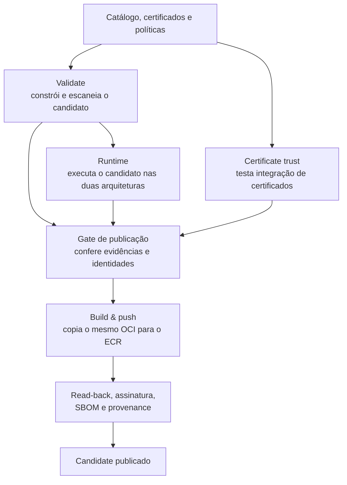
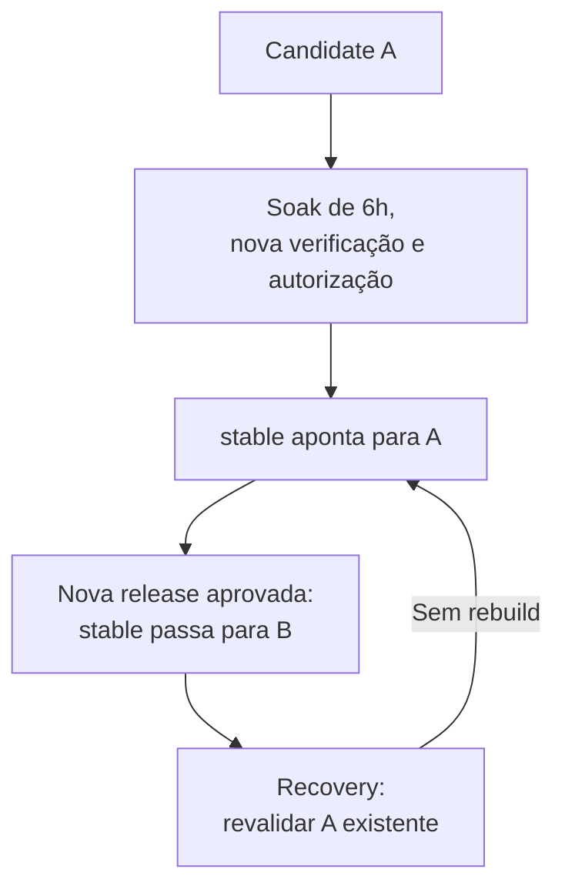

# Distroless — imagens base como produto de plataforma

> **Construir uma vez, testar a imagem produzida e publicar exatamente o que foi validado.**

A Factory centraliza a construção, os testes, a segurança e a distribuição de imagens base. **A plataforma entrega a base; cada time acrescenta sua aplicação.**

## 1. O propósito da RFC e o que entregamos

Uma **RFC** (*Request for Comments*) organiza uma proposta técnica para discussão e decisão. A **RFC-013** propõe sair de imagens base heterogêneas, certificados espalhados e manutenção repetida pelas squads para um produto compartilhado do **Containers Products**.

O objetivo não é apenas diminuir imagens: é padronizar **como construímos, verificamos, atualizamos e disponibilizamos** essas bases.

| Entrega | Valor para o time |
| --- | --- |
| **Catálogo comum** | Bases para Java, Go, .NET, Node.js e Python, com separação entre desenvolvimento e execução. |
| **Conteúdo mínimo e manutenção centralizada** | Menos componentes desnecessários para manter e incorporar correções disponíveis. Redução de risco, não promessa de zero vulnerabilidade. |
| **Testes e origem verificável** | Evidência do conteúdo, de quem publicou e do funcionamento nas duas arquiteturas. |
| **Release controlada** | Candidato imutável, promoção separada para `stable` e recuperação de uma versão existente. |

A RFC registra a direção e os critérios de aceite; **não equivale a uma liberação automática para produção**. O estado da implantação corporativa fica no `PROGRESSO.md`.

## 2. Da POC do Gerson à Factory atual

**Não partimos do zero.** A POC do Gerson já trouxe Melange + Apko + Wolfi, catálogo por linguagem, multiarch, usuário não administrador, certificados customizados, Trivy, schedule e workflows reutilizáveis. Mantivemos essa fundação e evoluímos os controles ao redor dela.

A comparação abaixo resume a **POC descrita na RFC** e a **implementação registrada no FLOW**; não é uma nova auditoria do repositório original.

| Dimensão | POC do Gerson | Evolução da implementação de referência |
| --- | --- | --- |
| **Runtime e ferramentas** | Algumas bases reuniam runtime e ferramentas de build. | Nove runtimes e sete variantes `-dev`, separando execução de compilação/preparação. |
| **Construção e scan** | Build por arquitetura; scan descrito em amd64; publicação por `apko publish`, com nova construção. | Um OCI candidato, scan em amd64 e arm64 e cópia do mesmo conteúdo, conferida por digest. |
| **Teste funcional** | Construção e análise de vulnerabilidades. | Testes de certificados, execução do candidato e aplicações consumidoras reais nas duas arquiteturas. |
| **Evidências** | SBOM gerado pelo Apko. | SBOM atestado, assinatura, provenance e verificação pelo consumidor. |
| **Release** | `stable` e timestamp publicados no fluxo de build. | Candidate separado de `stable`, espera e novo scan antes da promoção, leitura de confirmação e recovery. |
| **Distribuição e operação** | Docker Hub, token, schedule e reusable workflow. | ECR provisionado com Terraform, autenticação temporária, executores por revisão fixa e monitoramento do pipeline. |

> **A POC demonstrou como construir bases melhores. A evolução acrescenta como verificar e operar essas bases como um produto de plataforma.**

## 3. Slim, distroless, scratch e hardened

Esses termos descrevem coisas diferentes; **uma imagem pequena não é automaticamente segura**.

| Termo | Significado |
| --- | --- |
| **Slim** | Versão reduzida de uma imagem convencional. O nome, sozinho, não define garantias de segurança ou atualização. |
| **Distroless** | Base orientada à execução, normalmente sem shell, gerenciador de pacotes ou ferramentas administrativas. Mantém bibliotecas e arquivos necessários. |
| **Scratch** | Ponto de partida vazio. Todos os arquivos necessários precisam ser adicionados; pode servir para binários estáticos. |
| **Hardened** | Abordagem de segurança que combina conteúdo definido e mínimo, manutenção, testes e evidências verificáveis. Pode usar uma base distroless. |

Na RFC, o hardening reúne **quatro pilares**: minimalismo; imutabilidade do artefato publicado; manutenção contínua; e verificabilidade de conteúdo e origem.

A solução aplica controles nesses quatro eixos. Isso não significa certificação formal, SLA de correção já aprovado ou impossibilidade de comprometimento. **A ausência de shell não torna o filesystem somente leitura**: esse controle também depende da configuração de execução.

## 4. Como a base é composta

**Runtime** é o ambiente para executar a aplicação. **`-dev`** inclui compiladores, SDKs — conjuntos de ferramentas de desenvolvimento — ou npm para preparar a aplicação.



O catálogo documentado tem **16 imagens**: .NET 10; Go 1.25/1.26; Java 21/25; Node.js 22/24; Python 3.13/3.14. São **nove runtimes e sete variantes `-dev`**. Python não tem companion neste catálogo. Go, Java e .NET formam pares para publicação/promoção; Node pode usar dev/runtime no build da aplicação, mas mantém contratos independentes.

Um **pacote** é um componente da base; um **artefato** é o resultado preservado de uma etapa; **OCI** é o formato de imagem utilizado.

| Ferramenta | Papel na solução |
| --- | --- |
| **Wolfi** | Fornece os pacotes usados nas imagens. |
| **Melange** | Constrói pacotes adicionais, como o pacote de certificados. |
| **Apko** | Compõe a base a partir de YAMLs com pacotes/configurações e gera seu inventário. |
| **Trivy** | Identifica vulnerabilidades conhecidas e segredos; o pipeline aplica a política de bloqueio. Não corrige pacotes. |
| **Docker / QEMU** | Executam os testes; QEMU permite execução de outra arquitetura por emulação. |
| **Skopeo / ECR** | Skopeo copia o artefato sem rebuild; ECR armazena e distribui as imagens e evidências associadas. |
| **GitHub Actions / reusable workflows** | Organizam e reutilizam as etapas automatizadas, com revisões fixadas. |
| **Terraform** | Provisiona/configura a infraestrutura. PLAN calcula; APPLY aplica a mudança autorizada; BUILD usa o destino pronto. |

**As bases não usam Dockerfile: são compostas pelo Apko.** As aplicações consumidoras usam Dockerfiles para acrescentar seu código sobre essas bases. O publisher não cria ECR nem corrige sua configuração.

## 5. O que cada job comprova

Um **gate** é uma checagem obrigatória para avançar. **CA** é uma autoridade certificadora; **TLS** protege conexões como HTTPS.



| Job | Prova principal |
| --- | --- |
| **Certificate trust `<framework>`** | Imagens de teste incorporam uma CA sintética; conexões confiáveis funcionam e certificados não confiáveis são rejeitados. |
| **Validate `<framework>`** | Constrói o OCI real, verifica integridade, gera SBOM e escaneia amd64 e arm64. |
| **Runtime `<framework>`** | Executa programas ou compila/executa um projeto mínimo; verifica versão, usuário, filesystem e TLS. |
| **Build & push `<framework>` — both architectures** | Confere as provas, publica o OCI existente e produz evidências de origem/conteúdo. Não reconstrói a base. |

**Trust e construção são ramos paralelos.** As imagens sintéticas não substituem o candidato publicável. O teste de integração não comprova, sozinho, a legitimidade das CAs corporativas.

**Multiarch** significa suporte a `linux/amd64` e `linux/arm64`. Um **OCI Image Index** reúne as duas plataformas. Além de listar os manifests, os contratos executam cada arquitetura e registram se foi nativa ou emulada.

## 6. Como verificamos identidade, conteúdo e origem

O **digest** é a impressão digital do conteúdo. O **read-back** lê novamente a imagem no ECR e compara sua identidade com a que foi aprovada.

| Evidência | Pergunta respondida |
| --- | --- |
| **Assinatura Cosign / Sigstore** | Quem assinou o digest? Sua identidade pode ser verificada? |
| **SBOM em SPDX** | Quais componentes estão na imagem? SBOM é o inventário de software; SPDX é seu formato. |
| **Provenance** | De qual repositório, revisão e processo veio a imagem? É uma declaração autenticada de origem. |

O Apko gera o SBOM; o publicador preserva e **atesta** os documentos, vinculando-os por assinatura aos artefatos. **OIDC** permite autenticação temporária na AWS e identidade de assinatura sem introduzir chaves AWS estáticas no workflow.

Assinatura não substitui scan ou teste. Sem as provas obrigatórias, a publicação não é autorizada. Falhas específicas podem bloquear uma imagem/par; uma falha no **Image Trust agregado bloqueia o lote**. Se uma etapa pós-push falhar, pode existir conteúdo parcial no ECR sem release completa.

## 7. Candidate, `stable` e recuperação

**Candidate** é a imagem publicada por digest e tag imutável. **`stable`** é uma referência móvel para a versão aprovada naquele destino — não outra imagem reconstruída.

O **soak** da referência é uma espera mínima de seis horas desde o push registrado no ECR. Depois há novo scan e verificação. A espera permite incorporar informações recentes de vulnerabilidade; não é teste com tráfego de usuários nem garantia contra descobertas futuras.



**Recovery** reposiciona a tag para um digest existente e revalidado. Na implementação documentada, opera uma imagem por execução; não coordena a recuperação do par. Na promoção, os pares são autorizados antes da escrita, mas **duas escritas ECR não são uma transação**. A **quarentena** exclui digests da seleção automática e precisa ser mantida pelo fluxo operacional.

## 8. Como as correções chegam às aplicações

**Trivy detecta; a atualização dos componentes corrige.** Remover componentes desnecessários reduz o que precisamos manter. Incorporar pacotes corrigidos exige um novo build da base e novos testes.

**CVE** identifica uma vulnerabilidade conhecida. Na referência, CVEs com correção disponível bloqueiam conforme as severidades configuradas; as sem correção são reportadas separadamente. Um scan aprovado não significa “zero CVE”.

O ciclo de adoção é:

```text
Correção disponível → nova base validada → release aprovada
→ aplicação consome a nova base → rebuild, testes e deploy
```

**Mover `stable` não altera aplicações já construídas nem containers em execução.** A pipeline consumidora precisa usar efetivamente a base nova; com digest fixo, é necessário atualizar a referência. Dependências e código da aplicação continuam sob responsabilidade da squad.

Para não depender de um PR humano meses depois, atualização por bot ou rebuild periódico são **evoluções do consumo**, não automações já entregues pela Factory.

## 9. O que já foi provado e os limites da entrega

Na leitura técnica de **21/09/2026**, a referência registra no **LAB**:

| Certificação | Evidência registrada |
| --- | --- |
| **Catalog Certification** | 16 candidates publicados pelo mesmo engine; 11 contratos internos cobrindo o catálogo. Não promove `stable`. |
| **App Certification** | Nove aplicações consumidoras, 18/18 execuções: nove amd64 nativas e nove arm64 emuladas. Consome ECR por digest, sem depender de `stable`. |

As aplicações respondem em `/health`, `/ready` e `/info`. Os testes incluem usuário não administrador, raiz somente leitura, áreas graváveis explícitas e encerramento controlado. O CI verifica código/governança; o Pipeline health acompanha cadência e evidências operacionais.

**Capacidade FULL não significa agenda FULL:** a baseline do LAB documentada mantém o schedule no par Go 1.26. App Certification é complementar, não um gate automaticamente consultado pela promoção.

O desenho corporativo considera **`develop → DEV`, `staging → HOM` e `main → PROD futuro`**, com `stable` por ambiente. Resultados do LAB não comprovam homologação corporativa; implantação, aprovações e pendências ficam no checkpoint correspondente.

A base hardened **não substitui código seguro, gestão de secrets ou permissões/configuração seguras no Kubernetes**. Também não entrega migração automática, deploy das aplicações ou SLA corporativo de correção por si só. Ganhos de CVE, tamanho, pull e adoção devem ser medidos, não presumidos.

> **A entrega é uma base menor, padronizada e verificável, com um processo controlado para construir, testar, publicar e evoluir.**

---

### Documentos de apoio

- [RFC-013 — propósito, escopo e evolução da POC](../RFC-013-Image-Base-Completa-com-Mermaid.md).
- [IMAGE-BASE FLOW — funcionamento e limites da implementação](ALRIC-CONTAINERS-IMAGE-BASE-FLOW.md).
- [Estratégia de ambientes — evolução DEV/HOM/PROD](FACTORY-DISTROLESS-ENVIRONMENTS.md).

**Base desta síntese:** RFC fornecida para motivação/comparação histórica; FLOW de 21/09/2026, revisão `f44b2edf84538b41bfb96dde68e0aa7ffb192d00`, para fluxo, contagens e evidências. A RFC contém trechos de diferentes momentos; por isso, esta apresentação não usa suas contagens históricas como inventário atual. Os conceitos de slim/distroless/hardened também seguem o trecho de vídeo fornecido, sem incorporar promessas comerciais de fornecedores. Links relativos preparados para este arquivo em `TODO/`.
