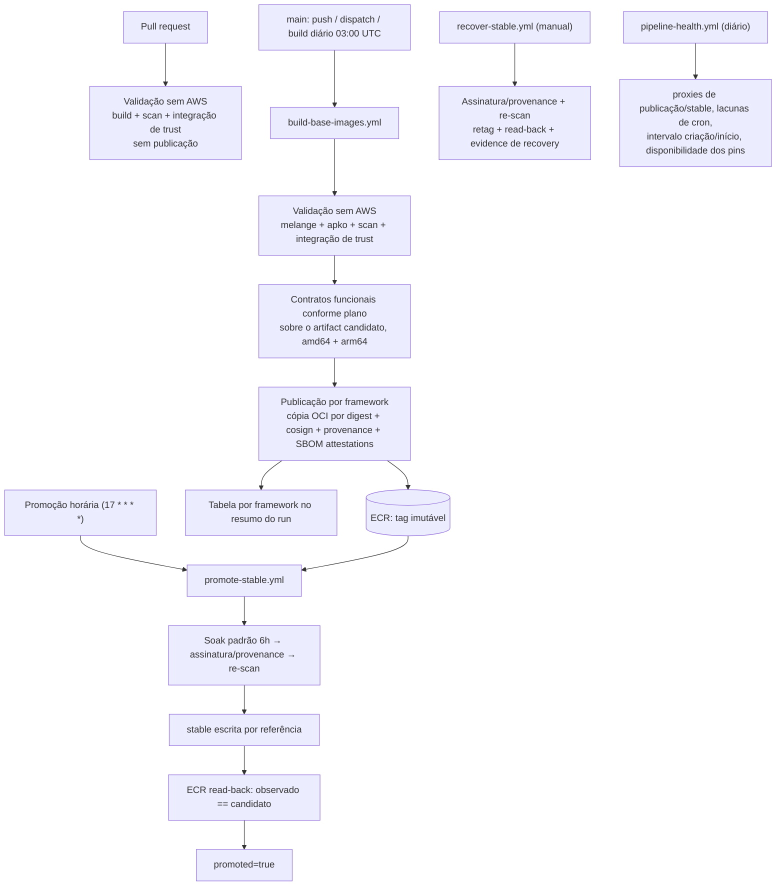
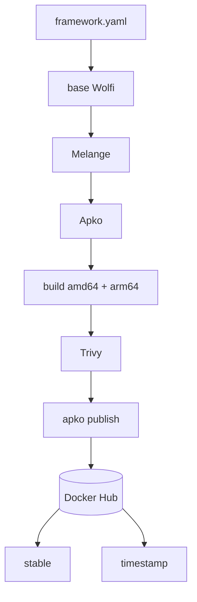
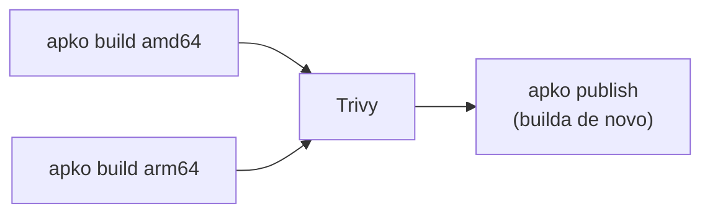
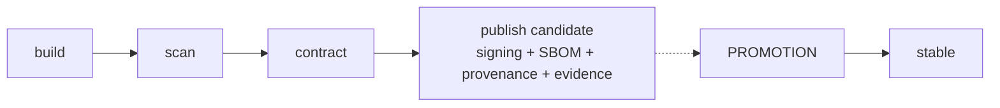
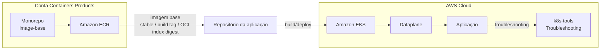

# RFC-013 - Plataforma de imagens base seguras e padronizadas para containers

## Status

| Informação | Valor |
| --- | --- |
| Status | Proposto |
| Possíveis estados | Aceito - Obsoleto - Substituído |
| Owner | Containers Products |
| Data | 01/09/2026 |
| Última revisão técnica | 13/09/2026 — main `e3ed68259f66af41e8054a4c0ac29a54082ddd60`, após merge do P1-02 |
| Prontidão para produção | **Não** — ver [Prontidão para produção](#prontidão-para-produção) |
| Impacto | Alto |
| Criticidade | Alta |
| Referência | Segurança, Supply Chain e Eficiência Operacional |

Esta RFC descreve o que a plataforma entrega hoje e o que separa esse estado
de uma liberação para produção. O caminho até aqui — diagnóstico original da
POC, cada entrega, achados reais e links de PR/run — está preservado na
íntegra em [docs/rfc-013-historico-de-entregas.md](docs/rfc-013-historico-de-entregas.md).
A reconciliação desta revisão e suas fontes estão na
[spec P1-09/P1-10](specs/2026-09-13-consumer-contract-rfc-refresh/evidence.md).
Implementado significa presente no código identificado; não implica aceite
hospedado de toda fatia nem liberação corporativa.

## TL;DR

- **O que:** um monorepo que centraliza o build de imagens base distroless, multi-arquitetura e padronizadas para os frameworks do banco.
- **Por quê:** hoje as aplicações usam imagens base heterogêneas e não governadas, elevando risco de CVE, não conformidade, falhas de certificado e ineficiência operacional.
- **Como:** Melange para o pacote de certificados, Apko para compor as imagens OCI a partir de pacotes Wolfi, scan Trivy e contrato funcional nas duas arquiteturas antes de publicar, assinatura e provenance no ECR, e promoção de `stable` só depois de uma janela de soak com re-scan.
- **Onde está:** implementado e exercitado com infraestrutura real (GitHub Actions + ECR) em um sandbox; não está em produção e não deve ser tratado como tal.

## Resumo

Atualmente, as áreas constroem aplicações em container de forma descentralizada, consumindo imagens base diversas (Alpine, Oracle, Ubuntu, Debian e outras), sem um padrão corporativo único. Esse cenário aumenta a exposição a vulnerabilidades, gera inconsistências de configuração, cria riscos de compliance e amplia o esforço operacional dos times.

Esta RFC estabelece uma plataforma de imagens base corporativas, com foco em segurança, rastreabilidade e eficiência. A abordagem utiliza a stack Chainguard (Melange + Apko), produzindo imagens distroless e multi-arquitetura (`amd64` e `arm64`) para frameworks estratégicos, com versionamento, auditoria e governança centralizada.

## Contexto

O modelo atual apresenta os seguintes problemas estruturais:

- **Uso de imagens externas não controladas**, com diferentes níveis de hardening e atualização.
- **Adoção eventual de imagens enterprise não homologadas**, com impacto potencial em compliance.
- **Ausência de boas práticas consistentes** em Dockerfiles e na composição das imagens.
- **Certificados SSL versionados diretamente em repositórios de aplicação**, sem processo central de atualização.
- **Baixa visibilidade** sobre quais imagens são usadas por framework/time e qual o nível de aderência aos padrões.

Além disso, não há controle robusto da cadeia de supply para imagens base. Na prática, isso reduz previsibilidade, aumenta risco de exposição a CVEs e pode causar indisponibilidade por expiração de certificados ou limitação de pull em registries públicos.

## Problema

A ausência de padronização de imagens base leva ao uso de imagens externas não controladas, aumenta riscos de segurança e compliance, gera inconsistências técnicas entre aplicações e cria ineficiência operacional no ciclo de build e deploy.

## Objetivo

- Padronizar imagens base para os principais frameworks utilizados no ambiente corporativo.
- Disponibilizar imagens seguras, otimizadas e multi-plataforma (`amd64` / `arm64`).
- Reduzir vulnerabilidades e superfície de ataque com abordagem distroless.
- Centralizar governança de dependências e certificados.
- Melhorar eficiência operacional dos times de desenvolvimento e plataforma.

## Solução entregue

Origem: POC funcional em https://github.com/gersontpc/image-base. A stack e a
forma do catálogo vieram de lá e foram mantidas; o que mudou foi a engenharia
de release em volta delas.

### Componentes

1. **Catálogo declarativo** — `distroless/image-base.yaml` (`ca-certificates-bundle`, `tzdata` e âncoras adicionais aprovadas) e `frameworks/<nome>.yaml`, um por runtime/variante.
2. **Validação sem credenciais AWS** — preflight verifica chave Wolfi local/pin antes dos executores; Melange compila o pacote de CAs nas duas arquiteturas. Apko resolve `apko.lock.json` e compõe **um** OCI multiarch com o mesmo lock e data do commit; Trivy escaneia cada manifest separadamente (`--ignore-unfixed`, `CRITICAL,HIGH,MEDIUM,LOW`, mais segredos). O layout aprovado vira artifact `validated-oci-<framework>`.
3. **Contrato funcional** — executado sobre o próprio artifact candidato, nas duas arquiteturas, sem rebuild: Node e Python rodam um probe com o interpretador da imagem; Go, Java e .NET compilam um projeto mínimo versionado com a variante `-dev` e o executam na variante de runtime. Confere versão, UID/GID herdados, raiz somente leitura com áreas graváveis explícitas, bundle de CAs, timezone e TLS positivo/negativo. O gate de integração de trust também testa a CA instalada no build; a cobertura aplicável é definida em código.
4. **Publicação por framework** — Skopeo copia o OCI aprovado para o ECR preservando digests, lê a tag de volta e compara; assina o índice com Cosign keyless, anexa provenance GitHub e atesta os SPDX originais do índice e dos dois manifests com Cosign. Tag imutável `ddmmaa-hhmm-r<run>-a<tentativa>`.
5. **Promoção de `stable`** — a cada ciclo, seleciona o build mais recente que completou o soak (padrão 6h; input manual validado), verifica assinatura/provenance com identidade fixa do workflow assinador, re-escaneia as duas arquiteturas com a base de CVE atual e só então move `stable` por referência. O ECR é consultado pela própria tag; somente digest observado igual ao candidato permite `promoted=true` (P1-01).
6. **Recuperação** — `recover-stable.yml` restaura `stable` para um digest já publicado, com as mesmas verificações e sem bypass; quarentena versionada impede a repromoção do candidato retirado.
7. **Retry parcial (P1-02)** — no mesmo workflow run, o publicador pode reutilizar contrato válido para o mesmo índice OCI, framework, revisão e plataformas (e par `-dev` quando aplicável), sem falha mais recente do producer relevante. Não rebuilda, repacka ou muda digest; ausência, corrupção e conflito bloqueiam.
8. **Chave Wolfi (P1-03)** — chave explícita local versionada, SHA pinado, preflight offline, rotação por revisão humana e monitor de drift detect-only. Isso é defense-in-depth: Apko ainda pode adicionar chaves descobertas via `/apk-configuration`/JWKS. Ver [runbook e risco residual](docs/wolfi-signing-key.md).
9. **Governança executável** — lints obrigatórios no merge (hardening dos workflows, cobertura e consistência dos pins, política de retenção e de cron), política de saúde/alerta versionada, tabela por framework em cada run.

Detalhes operacionais (como consumir, runbooks, configuração dos workflows)
estão no [README](README.md); arquitetura e fronteiras em
[docs/repository-architecture.md](docs/repository-architecture.md).

### O que o pipeline faz hoje



Todo framework precisa do próprio artifact validado e do gate comum de trust.
O contrato funcional é exigido quando previsto no plano versionado; skips
explícitos não equivalem a contrato aprovado. O lote atual possui 11 contratos
diretos, com cinco pares compilados. Uma falha de framework não aprova nem
bloqueia automaticamente todos os outros. Os caminhos de PR/fork de validação
não recebem credenciais AWS ou permissão OIDC.

### O que significa "hardened"

A plataforma não trata uma imagem base apenas como um filesystem mínimo. A
imagem base é mantida como um produto de segurança e supply chain, e uma
imagem hardened combina quatro propriedades principais: minimalismo,
imutabilidade, manutenção contínua e verificabilidade. Distroless cobre
fortemente o minimalismo, mas sozinho não garante política de atualização,
SBOM, assinatura ou provenance.

**Minimalismo** — a imagem contém somente o necessário para executar a
aplicação: runtime, bibliotecas necessárias, certificados, configuração
essencial e arquivos da aplicação. Ferramentas que não pertencem ao
runtime — shell, package manager, debuggers, download utilities — são
removidas sempre que possível, reduzindo superfície de ataque, quantidade
de pacotes, CVEs para triagem e possibilidades de abuso após
comprometimento.

**Imutabilidade** — a imagem publicada representa um artifact definido e
reproduzível; o runtime não depende de `apk add`, instalação dinâmica de
pacotes ou modificação da imagem durante a inicialização. As três
identidades de consumo (`stable`, build tag, OCI index digest) estão em
["Convenção de imagens"](#convenção-de-imagens).

**Manutenção contínua** — uma imagem hardened não é produzida uma única vez
e abandonada. A factory executa rebuilds recorrentes para incorporar
correções de segurança, novas versões de dependências e atualização de
certificados; o scan de vulnerabilidades roda de novo a cada build, e uma
imagem só avança no fluxo quando satisfaz os gates definidos.

**Verificabilidade** — o consumidor precisa responder três perguntas
diferentes: o que existe na imagem (SBOM, formato SPDX), como e onde ela
foi construída (provenance, vinculando o artifact ao processo que o
produziu) e quem publicou o artifact, íntegro (assinatura Cosign). O fluxo
completo está em ["Fluxo da fábrica de imagens"](#fluxo-da-fábrica-de-imagens).

#### Distroless não é sinônimo de hardened

Os conceitos são relacionados, mas não equivalentes:

- **Slim** — remove parte dos componentes de uma imagem convencional.
  Reduz tamanho, mas não estabelece por si só um contrato de segurança,
  supply chain ou atualização.
- **Distroless** — orientada ao runtime, normalmente sem shell, package
  manager ou ferramentas administrativas. Reduz fortemente a superfície de
  ataque, mas minimalismo sozinho não garante frequência de atualização,
  vulnerability management, SBOM, assinatura, provenance ou política de
  manutenção.
- **Scratch** — filesystem vazio. Útil para aplicações que operam com um
  conjunto extremamente pequeno de arquivos, como binários estáticos; não
  é necessariamente a melhor base para runtimes que precisam de
  bibliotecas, certificados ou estruturas adicionais, como Java.
- **Hardened** — pode ser distroless. A diferença é que o produto adiciona
  ao minimalismo: conteúdo definido, vulnerability management, atualização
  contínua, assinatura, SBOM, provenance, rastreabilidade e política de
  release.

```text
Distroless + Security gates + Maintenance + Supply-chain evidence + Verification
    =
Hardened Base Image
```

#### O que hardened images não resolvem

A imagem base é uma camada da segurança da aplicação, não substitui código
seguro, gestão de secrets, políticas de runtime, `runAsNonRoot`, Linux
capabilities, seccomp, `NetworkPolicy`, configurações seguras do Kubernetes
ou segurança da aplicação em si. A responsabilidade da factory é fornecer
uma base menor, rastreável, atualizável e verificável sobre a qual essas
outras camadas podem operar.

### Nível de maturidade

"Slim", "distroless" e "hardened" não são sinônimos. A solução está no
patamar distroless e cobre parte dos controles de hardened — estado atual
por pilar:

| Pilar | Estado em 13/09/2026 |
| --- | --- |
| Minimalismo | Base sem shell nem gerenciador de pacotes, comprovado por execução nas variantes finais de Node, Python, Go, Java e .NET. Go 1.25/1.26, Java 21/25 e .NET 10 têm runtime separado do toolchain; só `dotnet8` ainda carrega o SDK completo. |
| Imutabilidade | Tags de build imutáveis no ECR (exceção só para `stable`), rejeição de sobrescrita comprovada no conjunto histórico de 15 ECRs (09/09); o catálogo atual tem 17 definições. Raiz somente leitura testada em contrato; continua dependendo da configuração do consumidor em runtime. |
| Manutenção | Rebuild diário e promoção por soak em execução; ferramentas por SHA/digest com lint de cobertura. Cron é de melhor esforço; suas lacunas e falhas de pins são monitoradas. A amostra histórica de 10% não é SLA atual. Renovate configurado não comprova instalação ativa; destino externo de alertas e SLA corporativo continuam pendentes. |
| Verificabilidade | SPDX gerado e atestado por digest; assinatura Cosign e provenance GitHub sobre o índice, verificadas na promoção com IDs numéricos de origem. SBOM verification no consumo é uma etapa distinta; evidence disponível não é enforcement no cluster, nem atribui SLSA level formal. |

## Relação com a POC de referência

O repositório [gersontpc/image-base](https://github.com/gersontpc/image-base)
prova a ideia da fábrica. Esta solução transforma essa ideia numa plataforma
de imagens base hardened, governada e verificável — e boa parte do que há de
bom aqui nasceu diretamente daquele desenho inicial. Esta seção registra a
continuidade e as diferenças, dimensão por dimensão, para servir de base a
uma conversa técnica com quem projetou a POC.

### 1. O que a ideia inicial já entrega

O repositório de referência já tinha um núcleo muito bom:

- Melange + Apko + Wolfi, sem Dockerfile para as bases;
- Java, Node.js, Python, Go e .NET;
- duas versões por linguagem;
- `amd64` + `arm64`;
- usuário non-root;
- base comum compartilhada;
- pacote de certificados customizado via Melange;
- Trivy antes da publicação;
- `stable` + tag timestamp;
- schedule diário;
- workflow reutilizável;
- troubleshooting separado via ephemeral container;
- build local via Makefile.



Isso já resolve uma parte muito importante do problema: centralizar a
construção das imagens e parar de cada time inventar sua própria base.
Vale chamar esse repositório de **POC funcional / V0 da fábrica**.

### 2. A primeira diferença grande: "distroless" versus "hardened"

A POC é centrada em `distroless + multiarch + vulnerability scanning`. Esta
solução foi para `distroless + minimalismo + imutabilidade + manutenção +
verificabilidade + governança` (ver ["O que significa hardened"](#o-que-significa-hardened)).

Em outras palavras, a POC pergunta **"como construir imagens base
melhores?"**; esta solução pergunta **"como operar imagens base como um
produto de segurança e supply chain?"**. Esse é provavelmente o maior salto
conceitual entre as duas.

### 3. Runtime e build tooling

No repositório original, algumas imagens chamadas de base/runtime ainda
carregam toolchains completos (`go-1.26`, `dotnet-10-sdk`, `openjdk-21`,
`node` + `npm` + `busybox`) — uma mistura entre build environment e runtime
environment.

Esta solução formaliza a separação, e o catálogo atual já modela
explicitamente as variantes runtime/`-dev` (17 definições em
`frameworks/`):

```text
-dev                          runtime
├── compiler                  ├── runtime mínimo
├── shell quando necessário   ├── CA
├── build tooling             ├── libs necessárias
└── dependencies de build     └── aplicação
```

`go1-26-dev` é toolchain/build; `go1-26` é runtime — e o mesmo conceito
existe nas demais famílias que precisam de companion. Esse avanço aproxima
a solução do conceito real de hardened/distroless.

### 4. O problema mais importante do pipeline original: ele não é "build once"

No repositório original:



A premissa do README é que Apko é reprodutível, logo o que for publicado
será igual ao que foi escaneado — uma hipótese razoável, mas sem *binding*
criptográfico no pipeline que a prove.

Esta solução muda para o fluxo já descrito em
["Fluxo da fábrica de imagens"](#fluxo-da-fábrica-de-imagens): build once,
e o mesmo artifact validado é o que é publicado. Verificamos
`validated digest == copied digest == remote digest`. Não dizemos "deve ser
o mesmo" — provamos "é exatamente o mesmo artifact".

### 5. Scan

No workflow original, apesar de construir `amd64` e `arm64`, o step do
Trivy mostrado escaneia `image-ref: "${IMAGE_NAME}:latest-amd64"` e só
depois publica o índice multiarch.

Nesta solução o contrato é `amd64 → scan`, `arm64 → scan`, e ambas
precisam passar — uma diferença material. O gate também permanece
bloqueante mesmo quando isso passou a impedir frameworks inteiros pela
CVE de zlib (ver [ADR-0004](docs/adr/0004-v1-referencia-go126.md) e
[ADR-0006](docs/adr/0006-java21-zlib-blocker-remediation-options.md)), o que
mostra que o controle deixou de ser decorativo.

### 6. Contrato funcional

O repositório original responde "a imagem foi construída e não tem CVEs
bloqueantes?". Esta solução também pergunta "ela realmente funciona como
base daquela linguagem?": o candidate OCI executa um workload mínimo real
e confere runtime correto, usuário correto, filesystem correto, TLS
correto e arquitetura correta — já comprovado em `amd64` e `arm64` para Go.
É um nível diferente de qualidade.

### 7. Stable

Na ideia original, build e promoção são a mesma operação: `scan passou →
apko publish → stable + timestamp`.

Esta solução separa build de promoção:



`stable` deixa de significar "último build que não falhou no Trivy" e
passa a significar "artifact candidato que passou pelo contrato completo
de release". A esse desenho somam-se stable read-back, runtime/dev pair
binding e stable recovery — nada disso existia na POC inicial.

A formalização mais recente desse mecanismo — lifecycle de 7 dias com
`stable` protegida por prioridade de regra, e o binding runtime/dev via
`verify_promotion_pairs.py` — está em
[ADR-0005](docs/adr/0005-stable-lifecycle-realinhamento-rfc013.md), proposto em
16/09/2026 e ainda pendente de aceite; é a intenção original desta RFC,
não uma invenção nova, mas vale conferir o estado corrente do ADR antes de
citar como já aplicado em produção.

### 8. Supply chain

No repositório original existe geração de SBOM pelo Apko, mas funciona
mais como output de build — não há ali um contrato completo de
distribuição/verificação de supply chain.

Esta solução entrega um artifact com OCI digest, assinatura Cosign
keyless, SPDX SBOM attestation, provenance e read-back remoto — e isso já
foi validado de fora do CI (`cosign verify`, `cosign verify-attestation`,
`gh attestation verify`). Isso muda o significado do SBOM: na POC, "o
build produz SBOM"; aqui, "o consumidor consegue verificar a SBOM
associada ao artifact que recebeu".

### 9. Registry

O repositório original publica diretamente no Docker Hub
(`login com token → publish`). Esta solução separa infraestrutura de
conteúdo:

```text
containers-registry          containers-image-base
      ↓                            ↓
  Terraform                    Describe
      ↓                            ↓
     ECR                       Validate
                                    ↓
                                Publish
```

Princípio: *Infra provides the destination. Containers provides the
trusted artifact.* O publisher não pode criar repositório, mudar
mutability, scanning, lifecycle ou policy — mesmo quando a IAM
tecnicamente permitiria algumas dessas operações.

### 10. Autenticação

Na proposta inicial, `DOCKERHUB_TOKEN` é um secret estático. Nesta
solução, GitHub OIDC → AWS STS → role específica do repositório, sem
`AWS_ACCESS_KEY_ID`/`AWS_SECRET_ACCESS_KEY`. As roles seguem o padrão
`alric-github-repo-<github-repository-id>`, transformando autenticação
numa propriedade da identidade do workflow, não num segredo compartilhado.

### 11. Infraestrutura como código

A POC não administra o registry. Nesta solução existe um produto separado,
`alric-containers-registry`, responsável por ECR, mutability, exclusão de
`stable`, `scanOnPush`, AES256, lifecycle, IAM/OIDC de Infra e o Terraform
state — e já provamos que `image-base` publica e, em seguida,
`terraform plan` não mostra mudanças. É uma evidência forte de ownership.

### 12. Lifecycle

Não existe esse conceito de lifecycle de produto no repositório inicial —
imagens publicadas se acumulam indefinidamente. Hoje, a policy aplicada
(`policies/operations/ecr-lifecycle.json`) expira apenas imagens **sem
tag** após 30 dias; toda imagem tagueada, incluindo build tags, é
preservada. A refinaria proposta em
[ADR-0005](docs/adr/0005-stable-lifecycle-realinhamento-rfc013.md) fecha essa
lacuna: build tags expiram em 7 dias, e `stable` é protegida por prioridade
de regra (a primeira regra reivindica qualquer imagem tagueada `stable`
antes que a segunda possa expirá-la por idade) — não por exclusão de
padrão de tag, já que uma mesma imagem pode ter as duas tags. Isso permite
`stable` movível e build tags imutáveis, simultaneamente, versionado em
Terraform.

### 13. Certificates

A ideia original já introduzia algo interessante: um pacote Melange
próprio (`bundle-pem-test`) somado ao Mozilla CA bundle — uma boa POC para
provar "consigo produzir um pacote próprio e incorporá-lo via Apko", ainda
que instalando um `bundle.pem` adicional.

Esta solução passou a tratar certificados como um contrato de trust store,
com mecanismo para âncoras controladas e testes de runtime. Uma dependência
corporativa permanece, no entanto: o mecanismo evoluiu, mas o conteúdo de
PKI real ainda precisa vir do ambiente corporativo (ver
[Pacote de adoção](docs/corporate-adoption.md)).

### 14. Reusable workflow

A reutilização via `workflow_call` já estava na ideia original
(`build-base-images.yml` com inputs `registry`/`frameworks`) — uma boa
ideia que esta solução manteve e não deveria perder. A diferença é que hoje
o reusable workflow é tratado como interface de plataforma, com contratos,
testes, pinning e governança, incluindo um repositório dedicado
(`alric-containers-reusable-workflows`). A evolução foi de "um YAML pode
ser chamado por outro repo" para "reusable workflow é uma API de CI/CD com
contrato, versão, inputs, outputs e testes".

### 15. Tool pinning

O repositório original usa `cgr.dev/chainguard/apko:latest` e
`cgr.dev/chainguard/melange:latest` — o próprio comentário reconhece que
`APKO_VERSION`/`MELANGE_VERSION` são apenas informativos, então o pipeline
pode mudar mesmo sem nenhum commit no repositório. Esta solução evoluiu
para governança de pins, inventário (`pin_inventory.py`) e Renovate,
melhorando reprodutibilidade e auditabilidade.

### 16. Operação

O repositório original tem CI badge e schedule diário. Esta solução
adiciona pipeline health, monitoramento de schedule, estado de release,
saúde de promoção, escopo de execução explícito, visibilidade de CVE,
verificação pelo consumidor e recovery. Ainda há uma lacuna conhecida:
`external_destination` (canal corporativo/e-mail de plantão) segue
indefinido em `policies/operations/health.json` — mas já existe um modelo
operacional que não existia antes.

### Resumo lado a lado

| Dimensão | POC de referência | Esta solução |
| --- | --- | --- |
| Melange/Apko/Wolfi | ✅ | ✅ |
| Distroless | ✅ | ✅ mais estrito, runtime/`-dev` separados |
| Non-root | ✅ | ✅ |
| Multiarch | ✅ | ✅ |
| Catálogo multi-framework | 10 imagens | 17 definições |
| Scan | Trivy `amd64` | Trivy `amd64` + `arm64` |
| Build once | ❌ rebuild no publish | ✅ artifact único |
| Digest binding | ❌ assumido | ✅ comprovado (validated == copied == remote) |
| Contrato funcional | ❌ | ✅ |
| SBOM | gerado | ✅ publicado/atestado, verificável pelo consumidor |
| Assinatura | ❌ | ✅ Cosign keyless |
| Provenance | ❌ | ✅ SLSA |
| Verificação pelo consumidor | ❌ | ✅ |
| Registry | Docker Hub | ECR governado (Terraform) |
| Autenticação | token estático | OIDC (GitHub → AWS STS) |
| Infra as Code | ❌ | ✅ Terraform |
| Publisher preflight | ❌ | ✅ fail-closed |
| Build tag imutável | ✅ | ✅ |
| `stable` | direto no build | promoção separada, com soak e re-scan |
| Stable read-back | ❌ | ✅ |
| Stable recovery | ❌ | ✅ |
| Lifecycle | ❌ | ✅ 30 dias (sem tag); 7 dias com proteção por prioridade proposto em ADR-0005 |
| Runtime/dev pair binding | ❌ | ✅ |
| Retry sem rebuild | ❌ | ✅ |
| Health | ❌ | ✅ |
| Reusable workflow | ✅ básico | ✅ governado, com contrato e testes |
| Tool pinning | ❌ (`:latest`) | ✅ inventário + Renovate |

### Como apresentar isso ao autor da POC

A narrativa sugerida evita "eu refiz e deixei melhor" e usa continuidade:

> Usei a sua POC como baseline. Mantive os princípios principais — Melange,
> Apko, Wolfi, distroless, multiarch, Trivy, catálogo por framework,
> `stable` + tag de build, schedule e reusable workflow. A partir disso fui
> fechando os gaps necessários para transformar a POC numa fábrica
> operável: separar runtime de build toolchain, garantir build once com
> preservação de digest, validar as duas arquiteturas, adicionar contratos
> funcionais, assinatura/SBOM/provenance verificáveis pelo consumidor,
> separar publicação de promoção de `stable`, adicionar recovery e
> lifecycle, e tirar o ownership do ECR do publisher para Infra/Terraform.

Essa narrativa é forte porque mostra continuidade real:

```text
Ideia original → POC funcional → hardening → supply chain → governança → operação → produto de plataforma
```

### Questões em aberto para a conversa com Gerson

Para não gastar tempo da conversa pedindo aprovação para coisas que já têm
direção técnica definida, valem só quatro perguntas reais.

#### 1. Um repositório ou dois

- Um único repositório para factory + Terraform/ECR; ou
- Dois repositórios separados — o desenho atual: `image-base`
  (build/publicação/supply chain) e `alric-containers-registry`
  (Terraform/ECR/lifecycle/policies). Ver
  [Fronteira entre produto e workflows compartilhados](docs/repository-architecture.md#fronteira-entre-produto-e-workflows-compartilhados)
  para a separação equivalente entre produto e executor.

#### 2. Como tratar o bloqueio do zlib

- Aguardar o Wolfi publicar a correção; ou
- Manter temporariamente um package `zlib` próprio via Melange, a partir do
  commit oficial já corrigido no upstream (`madler/zlib`), ainda não
  lançado como release do Wolfi.
- Nos dois casos, o Trivy continua bloqueante, sem exceção.

Esta é literalmente a mesma pergunta já formalizada em
[ADR-0006](docs/adr/0006-java21-zlib-blocker-remediation-options.md)
("Pergunta objetiva para o Tech Lead"), com o spike de viabilidade e o
commit exato já investigados — a conversa com Gerson é o mecanismo para
resolvê-la.

#### 3. Estratégia de rollout das linguagens

Go 1.26 já está com o contrato completo ([ADR-0004](docs/adr/0004-v1-referencia-go126.md)).

- Liberar framework por framework, conforme cada um atingir o mesmo
  contrato; ou
- Esperar mais famílias ficarem prontas antes da adoção.

#### 4. Provisionamento dos ECRs

Depende diretamente da decisão do item 1. Se Infra ficar separada, decidir
se os ECRs são provisionados todos de uma vez ou conforme cada framework
entra no catálogo ativo.

#### O que já está decidido (fora da conversa)

- **Scanner** — Trivy.
- **CA corporativa** — buscar no S3 durante o build, usando o equivalente
  corporativo de [`certificados.sh`](scripts/certificates/certificados.sh)
  já provado no lab (ver [Pacote de adoção](docs/corporate-adoption.md), PAR-13).
- **Consumo** — `stable` oficial + build tag imutável + digest (ver
  [Consumer Verification Contract](docs/consumer-verification-contract.md)).
- **Lifecycle** — 7 dias preservando `stable`; direção já formalizada em
  [ADR-0005](docs/adr/0005-stable-lifecycle-realinhamento-rfc013.md), pendente
  de aceite de code owner — não uma decisão do Tech Lead, ao contrário dos
  quatro pontos acima.

### Em uma frase

O repositório original demonstra como construir imagens distroless
padronizadas. Esta solução define como construir, validar, publicar,
promover, verificar, operar e governar essas imagens como um produto de
plataforma.

## Catálogo

| Framework | Variante | Conteúdo | Contrato funcional | Observação |
| --- | --- | --- | --- | --- |
| `java21` / `java21-dev` | runtime / build | `openjdk-21-jre` / `openjdk-21` + shell | compilado (par) | — |
| `java25` / `java25-dev` | runtime / build | `openjdk-25-jre` / `openjdk-25` + shell | compilado (par) | separado em 10/09/2026 |
| `python3-13`, `python3-14` | runtime | `python-3.x` | interpretado | — |
| `go1-26` / `go1-26-dev` | runtime / build | só a base / `go-1.26` + shell | compilado (par) | binário estático não precisa de runtime |
| `go1-25` / `go1-25-dev` | runtime / build | só a base / `go-1.25` + shell | compilado (par) | separado em 10/09/2026 |
| `nodejs22`, `nodejs24` e `-dev` | runtime / build | `nodejs-2x` / + `npm` + shell | interpretado (as quatro) | — |
| `dotnet10` / `dotnet10-dev` | runtime / build | `aspnet-10-runtime` / `dotnet-10-sdk` + shell | compilado (par) | — |
| `dotnet8` | único | `dotnet-8-sdk` | nenhum | **bloqueado pelo scan**: correção `8.0.129-r1` ainda não existe no repositório Wolfi consultado (verificado em 09/09/2026 e 12/09/2026); nunca teve `stable`. **Fora do lote padrão** desde [ADR-0001](docs/adr/0001-dotnet8-fora-do-lote-padrao.md) |

O catálogo contém **17 definições**, com **16 no lote automático**. O publicador
cria um ECR por definição quando necessário; isso não prova 17 releases ou
17 tags `stable` disponíveis. A disponibilidade depende de publicação/promoção
bem-sucedidas e deve ser consultada no registry. As contagens históricas de
15 ECRs ou 14 imagens promovidas não são o inventário atual.

`dotnet8` permanece no catálogo e pode ser pedido manualmente; sua exclusão
não relaxa o scan. Motivo, owner e revisão em
[policies/operations/health.json](policies/operations/health.json).

## Melhorias M01–M16: estado

Diagnóstico original, critérios de aceite completos e as evidências de cada
item estão no [histórico](docs/rfc-013-historico-de-entregas.md). Aqui, só
o estado.

Nesta tabela, IMPLEMENTED descreve código entregue no sandbox; PARTIAL
preserva lacunas de cobertura/operação; EXTERNAL exige decisão/execução fora
do produto; DEFERRED identifica trabalho técnico posterior. Evidência
histórica permanece limitada ao commit/run em que foi obtida.

| ID | Tema | Estado | Fonte / limite atual |
| --- | --- | --- | --- |
| M01 | Scan por arquitetura | IMPLEMENTED | Build e promoção escaneiam amd64/arm64; CVE bloqueante impede artifact aprovado |
| M02 | Identidade do artifact | IMPLEMENTED | OCI verificado, Skopeo preserva digest, publicação faz read-back; P1-02 acrescenta binding do contrato |
| M03 | Gate de promoção | IMPLEMENTED | Assinatura/provenance, IDs e main conferidos; aceite hospedado P1-01 PASS, conforme evidence abaixo |
| M04 | Soak, concorrência, cron | PARTIAL | Soak padrão 6h e serialização presentes; scheduler sem SLA garantido |
| M05 | PR sem AWS / trust OIDC | IMPLEMENTED no sandbox | Policy por IDs; EXTERNAL para novo repository/owner corporativo |
| M06 | ECR immutable build tags | IMPLEMENTED | Exceção exata stable no publicador; prova histórica não substitui aceite corporativo |
| M07 | Runtime / toolchain | PARTIAL | Go/Java/.NET 10 em pares; dotnet8 com SDK, excluído do lote |
| M08 | Contratos funcionais | PARTIAL | 11 contratos diretos: seis interpretados e cinco compilados; dotnet8 sem contrato, plano depende do lote |
| M09 | Pins / atualização | PARTIAL | Inventário e disponibilidade, Skopeo immutable adotado; Renovate depende de ativação externa |
| M10 | CAs integradas | PARTIAL | PEM/JKS/Node e testes de CA instalada; perfil public ativo, Corporate CA anchors EXTERNAL |
| M11 | Saúde / visibilidade | PARTIAL | Resumos, health diário e drift Wolfi; external alert destination e corporate SLA EXTERNAL |
| M12 | Checks obrigatórios | PARTIAL | test/lint-workflows e revisão configurados; enforce_admins desligado por decisão do sandbox |
| M13 | Publicação por framework | IMPLEMENTED | Gates isolados; retry P1-02 integrado, aceite real de rerun pendente |
| M14 | Timeouts / concorrência | IMPLEMENTED | Hardening e grupos por PR/framework; ARM usa emulação quando necessário |
| M15 | Recovery | IMPLEMENTED | Verificação, re-scan e read-back sem bypass; quarentena exige PR explícito |
| M16 | Hardening / revisão | PARTIAL | Lint e CODEOWNERS; sem alegar enforcement contra administrador no sandbox |
| M09/M12 | Reusable workflows | IMPLEMENTED | SHA atual dos chamadores: 7a9b055a462eeb8552d3404c26538b44e8ccd83f; [origem revisada](policies/governance/reusable-workflows.json), checkout, contratos e referências Trivy conferidos localmente |
| — | Requisitos de segurança / scanner | EXTERNAL — a confirmar | [P1-06](docs/adr/0003-controles-seguranca-workflows-federados.md); Trivy continua o gate vigente; aplicabilidade de integração adicional não presumida |

Biblioteca aprovada: `alric-corp/alric-containers-reusable-workflows@7a9b055a462eeb8552d3404c26538b44e8ccd83f`.

A preparação P0-03 permite validar uma origem revisada da biblioteca sem
substituições automáticas: policy, referências literais dos chamadores/actions,
chamada Trivy interna, checkouts e Dependabot precisam concordar. Os checks
conferem origem local, SHA e bytes dos dois YAMLs consumidos; não comprovam
publicação do commit ou acesso privado. A origem sandbox e seus pins foram
preservados. A [reconciliação de 14/09/2026](specs/2026-09-14-shared-origin-portability/evidence.md)
registra PASS hospedado observado no PR #62 e na main para a origem sandbox,
sujeito à revisão independente dessa coleta. Migração real a outra origem
continua NOT RUN e acesso privado NOT VERIFIED. Ver [contrato de reuso](docs/m09-m12-reusable-workflows.md).

### Fatias recentes da RFC-013

| Fatia | Estado do código na main | Aceite hospedado específico |
| --- | --- | --- |
| P1-01 — stable read-back | IMPLEMENTED; confirmação ECR antes de promoted=true | PASS — go1-26 e go1-26-dev no [run 34768459323](https://github.com/alric-corp/alric-containers-image-base/actions/runs/34768459323), commit e3ed682 |
| P1-02 — partial retry | IMPLEMENTED; merge PR #64; laboratório comprovou reuse hospedado sem rebuild | PENDING — continuação de publicação ainda não exercitada |
| P1-03 — Wolfi defense-in-depth | IMPLEMENTED; merge PR #54 | PARTIAL / BLOCKED_UPSTREAM — mínimo hosted PASS observado em go1-26/go1-26-dev, run 34852458933/1; reconciliação sujeita a revisão |
| P1-04 — contrato de permissões IAM | [Inventário e templates locais propostos](docs/iam-permission-contract.md), sem aplicação IAM | Validação AWS/sandbox NOT RUN; aceite corporativo EXTERNAL_PENDING; PutImage no mesmo ECR não isola stable por principal |
| P1-05 — Sigstore Trust Model ADR | [ADR-0002](docs/adr/0002-sigstore-trust-model.md) PROPOSED; documenta o modelo existente | Decisão corporativa EXTERNAL / PENDING; sem novo controle ou aceite hospedado |
| P1-06 — controles em workflows federados | [ADR-0003](docs/adr/0003-controles-seguranca-workflows-federados.md); premissa de autoria/sustentação separada dos requisitos externos | Requisitos e primeiro aceite corporativo pendentes; somente documentação |
| P1-08 — contrato operacional, alertas e proposta de SLO/SLA | [Contrato operacional](docs/m11-m04-operational-health.md) proposto nesta fatia; mecanismos existentes preservados | Operação observada em amostra datada na [evidence](specs/2026-09-13-operational-readiness-slo/evidence.md); entrega externa, responsáveis e SLA corporativos pendentes; não encerra o P1-08 completo |
| P1-09 / P1-10 — contrato e estado da RFC | Documentação proposta nesta revisão | Revisão independente posterior; nenhum enforcement novo |

As specs originais conservam seus snapshots pré-merge. Para P1-03, a consulta
posterior confirmou preflight com hash igual e lock hospedado com chave local,
seguido de build/publicação Go no run 34735740791; isso é evidence observada
desse caminho, não aprovação formal, isolamento exclusivo ou lote inteiro verde.
P1-01 tem aceite hospedado comprovado no commit
`e3ed68259f66af41e8054a4c0ac29a54082ddd60`: no run `34768459323`, promoção,
re-scan e read-back passaram para `go1-26` e `go1-26-dev`. O artifact
`promotion-go1-26-1` registra `promoted=true`, `read_back_status=confirmed` e
`candidate_digest == stable_digest_observed == sha256:f658ed77f8734e1c3d218e07684f876f5cd38964afd79bb5c7a7c9e6571d339f`.
Detalhes na [evidence](specs/2026-09-13-consumer-contract-rfc-refresh/evidence.md).
Em 14/09/2026, a [nova coleta P1-03](specs/2026-09-13-wolfi-signing-key/evidence.md#reconciliação-hospedada--2026-09-14)
comprovou na main o mínimo preflight/Melange/Apko dos dois Go, nas duas
arquiteturas: PASS nesse escopo; lote PARTIAL / BLOCKED_UPSTREAM. P1-02
continua PENDING: a [coleta dirigida](specs/2026-09-13-partial-retry-without-rebuild/evidence.md#reconciliação-hospedada--2026-09-14)
não encontrou retry na janela e o gate observado registra reused=false.
As conclusões novas aguardam revisão independente, sem aceite corporativo.

## Prontidão para produção

**Não.** A fábrica executa no sandbox; as identidades, decisões e aceites
corporativos abaixo ainda precisam ser configurados e comprovados.

O [pacote P0-03](docs/corporate-adoption.md) organiza os parâmetros reais,
dependências, responsáveis, ordem de execução e checklist de aceite do destino.
O pacote local é revisável; implantação e homologação corporativas permanecem
pendentes. Não substitui os contratos nem encerra aceites hospedados anteriores.

### 1. Estado real da main e dos bloqueios

A main publica os frameworks que passam seus gates. Os bloqueios de 10/09
por renomeação, Skopeo removido e permissões aninhadas foram corrigidos;
os detalhes permanecem no [registro histórico de release](docs/release-readiness-2026-09-10.md).
O [run 34735740791](https://github.com/alric-corp/alric-containers-image-base/actions/runs/34735740791)
no commit 285ada4 publicou Go 1.26 e sua variante -dev, embora o lote tenha
falhas. Não se exige um lote inteiro verde para reconhecer uma publicação
individual comprovada.

Bloqueios upstream de CVE, como o incidente de zlib, continuam separados do
estado desta entrega documental. Scan bloqueado e ausência do artifact/contrato
correspondente não são aprovação nem demonstram regressão de retry. Nenhuma
exceção de CVE, severidade ou package foi alterada nesta revisão.

### 2. Fronteira sandbox / corporativo

O sandbox é GitHub `alric-corp` e uma conta AWS pessoal. Evidências de
pipeline, ECR, assinatura/provenance, promoção e recovery comprovam somente
os runs registrados. A identidade de produção ainda deve ser aprovada;
os nomes de destino nesta RFC são planejamento, não infraestrutura implantada.

| Item externo | Estado | Owner / aceite necessário |
| --- | --- | --- |
| Corporate CA anchors | EXTERNAL — pendente | Segurança/PKI + Containers Products: fontes e manifesto reais; release rejeita MOCK |
| Corporate GitHub protections | EXTERNAL — pendente | GitHub admins: repository IDs, owner IDs, times/CODEOWNERS, checks, proteção e enforce_admins |
| Corporate OIDC/IAM | EXTERNAL — pendente | Cloud/Security: avaliar [proposta P1-04](docs/iam-permission-contract.md), trust/permissions/provisionamento e restrições efetivas; negativos reais pendentes |
| Corporate ECR | EXTERNAL — pendente | Cloud: registry, resource/lifecycle policies, Org IDs e imutabilidade, testes autenticados |
| Corporate egress/mirror | EXTERNAL — pendente | Cloud/Network/Security, P0-03: boundary aprovada; isolamento Wolfi quando requerido |
| Sigstore decision | EXTERNAL — pendente | Segurança/AppSec: [ADR-0002 PROPOSED](docs/adr/0002-sigstore-trust-model.md), raízes/identidades, metadados públicos e processamento externo de SPDX, ou alternativa aprovada |
| Scanner/Veracode decision | EXTERNAL — pendente | AppSec/Segurança: adequação de Trivy e aplicabilidade de integração adicional à fábrica federada, conforme [P1-06](docs/adr/0003-controles-seguranca-workflows-federados.md); política das aplicações é separada |
| External alert destination | EXTERNAL — pendente | Containers Products: canal/owner/escalonamento; external_destination permanece null |
| Corporate SLA | EXTERNAL — pendente | Containers Products e responsáveis/consumidores: avaliar indicadores, cobertura e dependências conforme [P1-08](docs/m11-m04-operational-health.md); metas e prazo de atualização a negociar, sem garantia de correção upstream |
| First corporate E2E run | EXTERNAL — pendente | Owners conjuntos: build → scan/contrato → publish/attest → promote/read-back → consumo/recovery |

No sandbox, `enforce_admins` permanece desligado por decisão explícita;
a exigência de habilitá-lo pertence ao P0-03. Ver
[Capability Matrix](docs/ai/CAPABILITY-MATRIX.md). Não há alegação de merge
sem bypass administrativo no ambiente pessoal.

A premissa de autoria/sustentação e as perguntas corporativas do P1-06 estão
no [ADR-0003](docs/adr/0003-controles-seguranca-workflows-federados.md).
Levantamentos de outros fluxos são referências de interfaces e práticas;
não estabelecem requisitos obrigatórios nem comprovam homologação da fábrica.

### 3. Operação, cobertura e evidence

Renovate está configurado, mas sua instalação/ativação depende do administrador.
Monitor de saúde e drift são implementados; não constituem entrega de alerta
externo nem SLA corporativo. O [contrato operacional P1-08](docs/m11-m04-operational-health.md)
explicita proxies baseados em jobs, limites da coleta, scheduler compartilhado,
SLIs e SLOs apenas propostos. Relatório/falha de job não comprova entrega ou
reconhecimento de alerta; `external_destination` continua null. `dotnet8` permanece excluído por
[ADR-0001](docs/adr/0001-dotnet8-fora-do-lote-padrao.md); sua reentrada exige
os critérios do ADR, sem flexibilizar Trivy.

CAs corporativas, enforcement de consumo/admission e ARM nativo não são
propriedades obtidas por esta documentação. Enforcement e ARM nativo são
DEFERRED; suas políticas/infraestruturas futuras exigem trabalho próprio.
P1-01/02/03 têm código integrado e verificações locais registradas. A tabela
de fatias distingue aceites pendentes de observações hospedadas posteriores.

Assinatura, provenance e SBOM attestations disponíveis são insumos de
verificação. O [contrato de consumo](docs/consumer-verification-contract.md)
define o que o consumidor deve conferir; não instala enforcement no deploy.

## Valor e impacto

- Redução significativa de vulnerabilidades em imagens de runtime.
- Padronização de artefatos em diferentes frameworks e times.
- Redução da superfície de ataque por eliminação de pacotes desnecessários.
- Melhoria de performance de pull e armazenamento por imagens menores/otimizadas.
- Mitigação de risco de indisponibilidade por limites de pull em registries públicos.
- Melhor conformidade com requisitos de auditoria, segurança e supply chain.
- Menor esforço dos times de desenvolvimento na configuração de imagens base.
- Aceleração do ciclo de desenvolvimento e deploy com base reutilizável.

## Escopo inicial

| Item do escopo | Estado |
| --- | --- |
| Padrões de imagem base por framework prioritário (Java, Node.js, Python, Go e .NET) | Entregue (17 definições; 16 no lote automático) |
| Pipeline de build com Melange e Apko | Entregue |
| Primeiras imagens base em formato distroless | Entregue no sandbox |
| Build multi-plataforma (`amd64` e `arm64`) | Entregue, escaneado e testado por arquitetura |
| Consumo pela tag `stable` | Entregue por soak/read-back; stable é mutável; pin suportado por OCI index digest |
| Publicação no ECR | Entregue no sandbox; produção pendente |
| Pull liberado para todas as organizações consumidoras | Resource policy validada no sandbox com Org IDs de teste; produção pendente |
| Automação no GitHub com scheduler diário | Entregue; cadência real do agendador medida e documentada |
| Scan das imagens a cada build | Entregue com Trivy; scanner corporativo em decisão |
| Documentação de uso para consumidores | [Contrato canônico](docs/consumer-verification-contract.md), proposto nesta revisão; README mantém exemplos |
| Trilha de troubleshooting distroless | Toolkit em `troubleshooting/`, ciclo de vida separado |

## Fora de escopo

- Criação de imagens customizadas específicas por aplicação.
- Cobertura de 100% dos frameworks legados na primeira fase.
- Migração automática de aplicações existentes para novas imagens.
- Gestão de CI/CD dos times consumidores.
- Suporte a sistemas operacionais fora do modelo distroless proposto.
- Criação de ferramenta paralela fora da stack Melange/Apko nesta fase.
- Gestão de runtime dos containers em clusters (orquestração/execução).
- Enforcement bloqueante imediato de imagens externas na fase inicial.

## Plano de adoção

### Fase 1 - Fundação (em andamento)

- Pipeline estruturado e imagens publicadas por framework — feito no sandbox.
- Catálogo, naming e versionamento definidos — feito; SLA de atualização a formalizar.
- Documentação técnica e guia de consumo — feito.
- Itens P1 de M01–M11 antes da produção — M10 aberto, M08/M09 parciais; ver [Prontidão](#prontidão-para-produção).
- **Restante desta fase:** concluir aceites específicos pendentes, configurar o ambiente corporativo e executar seus aceites; fechar as decisões externas listadas acima.

### Fase 2 - Adoção assistida

- Onboard dos primeiros times com acompanhamento do Containers Products.
- Coleta de métricas de adoção, vulnerabilidades e performance de build/pull.
- Ajustes de imagem base conforme feedback operacional.
- Concluir os itens P2, incluindo os runtimes restantes (M07) e o SLA com métricas observadas.

### Fase 3 - Escala e governança

- Expandir cobertura de frameworks/versões conforme priorização.
- Formalizar política de exceção e trilha de conformidade.
- Evoluir para mecanismos de controle de consumo de imagens em produção.
- Estender a verificação de assinatura/provenance ao consumo das imagens e acompanhar o SLA de patch.

## Critérios de sucesso

- Percentual de aplicações migradas para imagens base corporativas.
- Redução de vulnerabilidades altas/críticas nas imagens de runtime.
- Redução do tamanho médio das imagens e do tempo médio de pull.
- Aumento da rastreabilidade de origem dos artefatos (SBOM/tag imutável).
- Redução de incidentes relacionados a certificado/cadeia de build.
- Percentual de imagens promovidas com assinatura e build provenance verificadas, scans e testes aprovados em ambas as arquiteturas.

## Diagramas da arquitetura

### Visão de consumo



### Fluxo da fábrica de imagens

```mermaid
flowchart LR
    SRC["Monorepo"] --> MELANGE["Melange<br/>pacote de certificados"]
    MELANGE --> APKO["Apko<br/>um layout OCI multi-arch por framework"]
    APKO --> SBOM["SBOM"]
    SBOM --> SCAN["Trivy + contrato funcional<br/>amd64 + arm64"]
    SCAN --> IMMUTABLE["ECR: mesmo digest validado<br/>tag de build imutável"]
    IMMUTABLE --> SIGN["cosign keyless + provenance GitHub + SPDX attestations"]
    SIGN --> SOAK["Candidato com soak concluído"]
    SOAK --> VERIFY["Assinatura/provenance<br/>+ re-scan nas duas arquiteturas"]
    VERIFY --> STABLE["stable escrita → ECR read-back<br/>observado == candidato"]
```



Os diagramas Mermaid acima são as visões versionadas nesta RFC.

## Arquitetura e fluxo de consumo

A solução separa a responsabilidade da plataforma de imagens base do ciclo de desenvolvimento das aplicações consumidoras:

1. O monorepo do **Containers Products** centraliza a definição e o build das imagens base.
2. As imagens são publicadas no **Amazon ECR**, com liberação de pull para as organizações consumidoras.
3. Cada framework/versão tem namespace próprio; releases aprovadas podem receber stable. Build tag identifica a release e OCI index digest identifica o artifact multiarch exato.
4. O repositório da aplicação consome a imagem corporativa como base.
5. A aplicação é construída e posteriormente executada no ambiente de containers, como EKS.
6. O troubleshooting específico de runtime permanece separado da fábrica de imagens base.

### Convenção de imagens

```text
image-base-java21:stable
image-base-<framework>:<ddmmaa-hhmm>-r<run_id>-a<tentativa>
image-base-<framework>@sha256:<digest>
```

| Identidade | Semântica | Consumo |
| --- | --- | --- |
| stable | Ponteiro mutável de conveniência; acompanha promoção | Convenience, sem identidade permanente |
| build tag | Identificador versionado/imutável da release no ECR | Rastreabilidade; existência da tag não prova finalização de assinatura/attestations |
| OCI index digest | Identidade exata do artifact multiarch | Reproducible deployment e verificação suportada |

A unidade assinada suportada é o **OCI index digest**. Manifests individuais
não recebem assinatura de imagem/provenance independentes neste fluxo; seus
SBOMs têm attestations próprias. Verificar assinatura Cosign, provenance GitHub
e SBOM attestation quando exigida pelo consumidor, sempre vinculadas ao digest.
Não se atribui SLSA level formal nem segurança do código por assinatura.

P1-01 confirma stable pelo ECR depois da escrita: observado == candidato antes
de promoted=true. Isso vale para aquele instante; não impede alteração
administrativa externa posterior. P1-02 reutiliza evidence no mesmo run/digest
com PASS válido e sem falha mais recente do producer relevante, sem rebuild.
Comandos, identidades e limites no [Consumer Verification Contract](docs/consumer-verification-contract.md).

### Um repositório ECR por linguagem/framework

Cada framework tem seu próprio repositório ECR (`image-base-java21`, `image-base-nodejs22`, `image-base-dotnet8`, etc.), em vez de um único repositório compartilhado com todas as linguagens diferenciadas por tag. Avaliada e descartada a alternativa de repositório único: a granularidade por repositório é o que viabiliza, sem trabalho extra, os controles já definidos neste RFC:

- **Least-privilege por consumidor:** a resource policy do ECR (`ecr:BatchGetImage`/`ecr:GetDownloadUrlForLayer`, ver `policies/policy-ecr.json`, fora deste repositório por conter identificadores reais de organização) é aplicada por repositório. Um time que só usa Java não precisa de permissão de pull nos repositórios de .NET ou Node.js. ECR não restringe ações por prefixo de tag, então um repositório único obrigaria conceder pull de tudo para todos, ou recriar a separação por convenção de tag — o que move a complexidade sem reduzi-la.
- **Imutabilidade com exceção (M06):** a exceção `IMMUTABLE_WITH_EXCLUSION` para a tag `stable` é configurada por repositório; um namespace de tags compartilhado entre linguagens multiplicaria o risco de colisão.
- **Blast radius:** um incidente ou rotação malformada na pipeline de uma linguagem fica contido ao repositório correspondente, sem risco de afetar tags ou permissões de outra.
- **Catálogo:** o nome do repositório já documenta o que ele contém (`image-base-java21`), sem depender de convenção de tag para diferenciar o conteúdo.

O custo é operacional (mais repositórios para criar/gerenciar lifecycle policy), mitigado por serem criados programaticamente pelo próprio workflow de build. Validado no sandbox: a resource policy least-privilege foi aplicada individualmente aos repositórios `image-base-*`, na mesma estrutura da produção (`Principal: "*"` restrito por `Condition` em `aws:PrincipalOrgID`), usando a Organization do sandbox no lugar dos Org IDs corporativos reais.

### Consumo

Os exemplos abaixo ilustram conveniência com stable; o registry foi omitido.
Para deployment reproduzível, fixe o índice de cada estágio conforme o
[contrato de consumo](docs/consumer-verification-contract.md).

Runtime pronto (binário já compilado, JAR, saída de `dotnet publish`):

```dockerfile
FROM image-base-java21:stable
COPY --chown=spring:spring app.jar /app/app.jar
CMD ["java", "-jar", "/app/app.jar"]
```

Compilação dentro do pipeline: variante `-dev` no estágio de build (toolchain
e shell, para `RUN` shell-form e wrappers como `mvnw`/`gradlew`), variante de
runtime no estágio final:

```dockerfile
FROM image-base-go1-26-dev:stable AS build
WORKDIR /app
COPY --chown=appuser:appuser . .
RUN go build -o server .

FROM image-base-go1-26:stable
COPY --chown=appuser:appuser --from=build /app/server /app/server
CMD ["/app/server"]
```

`RUN apk add` e pacotes customizados não existem na imagem final: dependências
adicionais de runtime entram pela composição declarativa da base governada,
com scan e testes. Exemplos para Node.js, .NET e Java no [README](README.md#como-usar).

### Publicação e retenção

- Publicação no ECR do sandbox; ECR corporativo e pull por Org IDs reais continuam externos.
- Uma tag `stable` para consumo e tags imutáveis para rastreabilidade.
- Retenção de evidências de CI por finalidade (OCI: 3 dias; Melange, SBOM e relatórios: 30 dias), versionada em `policies/operations/health.json` e conferida por lint contra os workflows. `retention-days` não é backup: novo build pode gerar outro digest; retry de publicação reutiliza o OCI existente sem reconstrução.
- Lifecycle ECR: policy expira somente imagens sem tag após 30 dias; aplicação/preview no conjunto histórico de 15 repositórios documentados em 10/09, sem extrapolar para todos os ECRs atuais. Todas as releases com tag permanecem preservadas para recuperação. Reduzir a retenção de releases publicadas exige definir a janela de recuperação.

## Repositórios

| Repositório | Papel |
| --- | --- |
| `https://github.com/corporate-org/corporate-containers-image-base` | Destino de produção do monorepo (a criar; nome ilustrativo) |
| `https://github.com/corporate-org/corporate-containers-k8s-tools` | Ferramentas de troubleshooting do ambiente de containers (nome ilustrativo) |
| `https://github.com/alric-corp/alric-containers-image-base` | Sandbox onde a implementação e as evidências desta RFC estão (antes `itau-xj7-containers-image-base`) |
| `https://github.com/alric-corp/alric-containers-reusable-workflows` | Executores compartilhados (validação, contrato, Trivy) consumidos por SHA |
| `https://github.com/gersontpc/image-base` | POC de referência |

## Referências

- [Chainguard Apko](https://github.com/chainguard-dev/apko), [Melange](https://github.com/chainguard-dev/melange), [Wolfi](https://github.com/wolfi-dev), [Trivy](https://github.com/aquasecurity/trivy).
- [Trivy: seleção explícita de arquitetura no scan](https://trivy.dev/docs/latest/target/container_image/#scan-image-on-a-specific-architecture-and-os).
- [Amazon ECR: imutabilidade de tags e filtros de exceção](https://docs.aws.amazon.com/AmazonECR/latest/userguide/image-tag-mutability.html).
- [GitHub Actions: uso seguro e fixação por SHA completo](https://docs.github.com/en/actions/reference/security/secure-use#using-third-party-actions).
- [GitHub Actions: reuso de workflows e identidade OIDC](https://docs.github.com/en/actions/how-tos/reuse-automations/reuse-workflows).
- [Wolfi: definição do OpenJDK 21 e subpacote JRE](https://github.com/wolfi-dev/os/blob/main/openjdk-21.yaml).
- [Veracode SCA — scan de containers](https://docs.veracode.com/r/c_sc_container_scan).
- Histórico completo de entregas, aceites e achados: [docs/rfc-013-historico-de-entregas.md](docs/rfc-013-historico-de-entregas.md).
