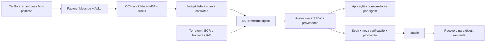
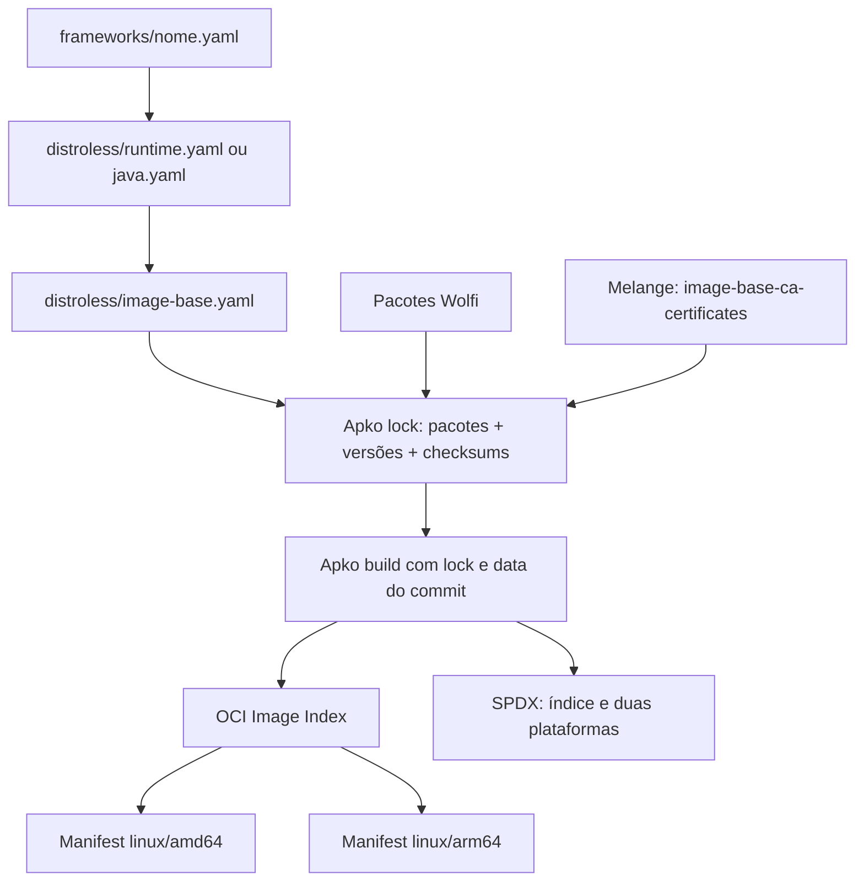
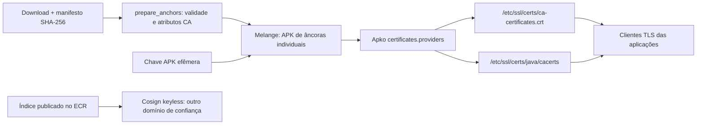
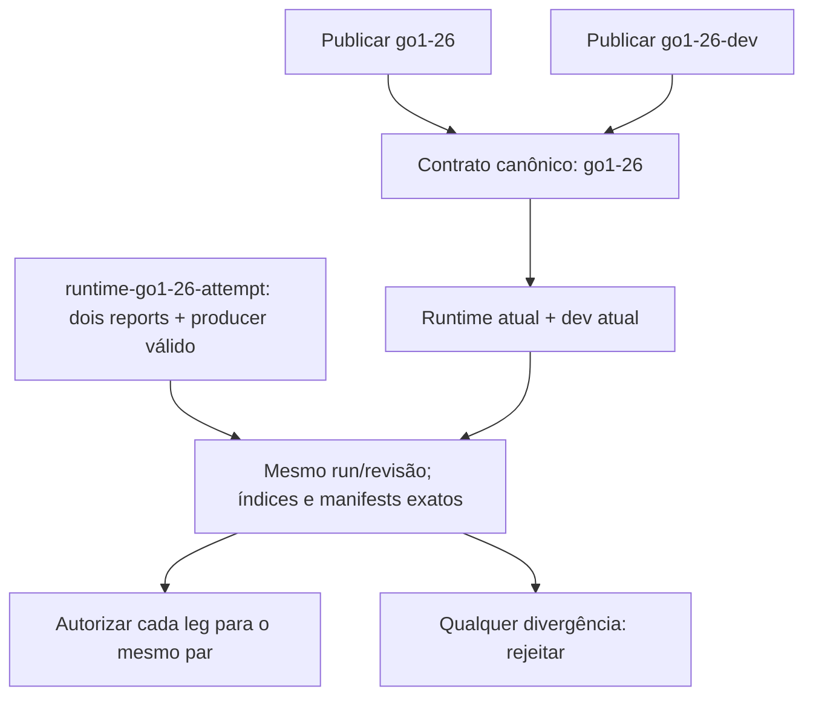
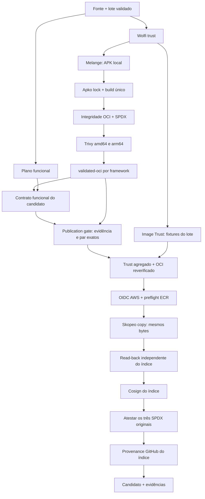
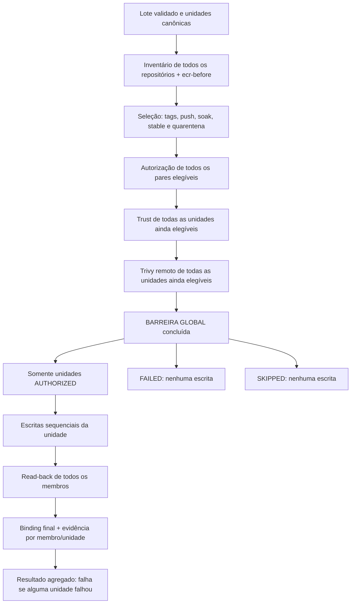
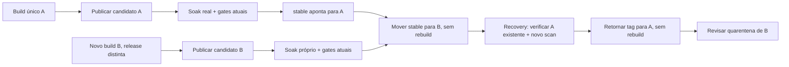
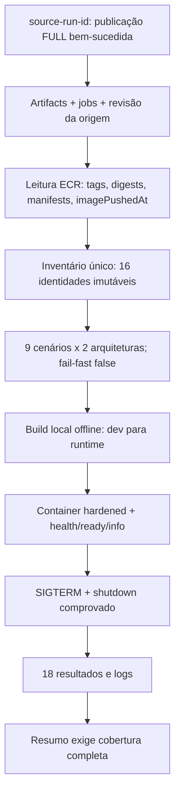

# alric-containers-image-base

## 1. Visão executiva e referência desta documentação

O `alric-containers-image-base` implementa uma fábrica governada de imagens base Distroless multi-arquitetura. O produto combina pacotes Wolfi, empacotamento Melange, composição Apko, execução em GitHub Actions, publicação em Amazon ECR, gates Trivy, assinatura Cosign/Sigstore, SBOM SPDX, provenance, infraestrutura Terraform e autenticação OIDC. Seu resultado é uma base verificável para aplicações; não é uma aplicação pronta, um serviço de deploy ou um admission controller.

O princípio que conecta as etapas é:

> **BUILD ONCE → VALIDAR O ARTEFATO REAL → PUBLICAR O MESMO ARTEFATO → PROMOVER POR DIGEST → RECUPERAR SEM REBUILD.**

O princípio vale para a identidade da **imagem base candidata**. Compilar as aplicações de teste, construir fixtures com CA sintética ou construir uma aplicação consumidora são operações distintas; nenhuma delas substitui o candidato que será publicado.



Esta leitura foi reconstruída em **21/09/2026**, após sincronizar `main` no commit **`f44b2edf84538b41bfb96dde68e0aa7ffb192d00`**. As fontes primárias são os YAMLs, módulos Python, receitas, políticas e testes desse checkout. Também foram examinados os executores compartilhados no **SHA efetivamente referenciado**, não no HEAD de outro repositório.

Há textos históricos no [README](../README.md), ADRs e runbooks que preservam estados anteriores: contagem de 17 definições, configuração/reparo de ECR pelo publicador e ausência de execução hospedada de alguns contratos. Esses trechos não prevalecem sobre o código atual. Este documento registra as diferenças relevantes sem alterar aqueles arquivos.

Os termos usados para qualificar conclusões são:

| Qualificação | Significado neste documento |
| --- | --- |
| Implementado | Há código e wiring atual para executar o comportamento. |
| Testado offline | Há testes locais de contrato, negativos e integração sem a infraestrutura real. Não equivale a publicação hospedada. |
| Testado em execução hospedada | Há run e evidência identificados, limitados àquela revisão, candidatos e ambiente. |
| LAB | Implementação e evidência do ambiente pessoal; não implica aceite corporativo. |
| Planejado | Direção futura, ainda não aplicada aos workflows atuais. |

Esta tarefa documental não executou build, publicação, promoção, recovery, Terraform apply ou mutação AWS. Estado de habilitação de workflow, variáveis GitHub, proteções de ambiente e estado atual do ECR não são inferidos apenas da presença de YAML.

## 2. Fronteira do produto e organização do repositório

O produto mantém **o que construir, quando executar e qual política autoriza publicação/release**. O repositório `alric-corp/alric-containers-reusable-workflows` fornece capacidades compartilhadas de execução, principalmente validação Melange/Apko/Trivy e execução de contratos runtime.

Essa separação não significa que todo o “como” saiu do produto. O engine de publicação, composição específica, testes funcionais, verificação de evidência, promoção e recovery continuam aqui. O executor compartilhado faz checkout do repositório consumidor e executa interfaces versionadas fornecidas por ele. Portanto, não é uma biblioteca que aceite qualquer produto sem adaptação ao contrato OCI.

| Local | Responsabilidade atual |
| --- | --- |
| [frameworks/](../frameworks/) | Catálogo declarativo: versão, pacotes e perfil runtime/dev. |
| [distroless/](../distroless/) | Composição comum, contas, diretórios, arquiteturas e integração de certificados. |
| [melange/](../melange/) | Receita do pacote adicional de CAs, manifesto de âncoras e chave pública Wolfi revisada. |
| [.github/workflows/](../.github/workflows/) | Entradas operacionais, orquestração, permissões e pontos de mutação. |
| [scripts/pipeline/artifacts/](../scripts/pipeline/artifacts/) | Build, referências, integridade OCI, plataformas, scan e medição de camadas. |
| [scripts/pipeline/runtime/](../scripts/pipeline/runtime/) | Planejamento, execução e autorização baseada em contratos funcionais/trust. |
| [scripts/pipeline/release/](../scripts/pipeline/release/) | ECR preflight, publicação verificada, SPDX, seleção, promoção e read-back. |
| [scripts/pipeline/consumer_apps/](../scripts/pipeline/consumer_apps/) | Inventário de uma publicação de origem, execução HTTP e consolidação da App Certification. |
| [scripts/pipeline/governance/](../scripts/pipeline/governance/) | Pins, dependências, escopo de PR, hardening e contratos de manutenção. |
| [scripts/pipeline/operations/](../scripts/pipeline/operations/) | Resumos, versões de ferramentas, métricas e saúde operacional. |
| [policies/](../policies/) | Identidades de assinatura, quarentena, escopo operacional, retenção e origem de executores. |
| [infra/](../infra/) | Backend, ECR, papéis IAM de Infra, planos e read-back de provisionamento. |
| [tests/runtime/](../tests/runtime/) | Probes e projetos mínimos do contrato interno da Factory. |
| [tests/consumer-apps/](../tests/consumer-apps/) | Aplicações HTTP que representam consumo downstream. |
| [docs/adr/](../docs/adr/) | Decisões, contexto e limites; o estado/data de cada ADR importa. |

Os dois callers de workflows remotos usam o commit completo **`7a9b055a462eeb8552d3404c26538b44e8ccd83f`**. A action compartilhada `setup-trivy` usada em promoção/recovery tem seu próprio pin, **`eea2d2f4c4102ded74204e4131c1417f444ae3fc`**. A [policy de reusable workflows](../policies/governance/reusable-workflows.json) e [workflow_dependencies.py](../scripts/pipeline/governance/workflow_dependencies.py) verificam origem aprovada, SHA completo, inputs esperados, `locked-build: true`, igualdade entre os dois callers e, separadamente, igualdade entre os pins da action de release. Actions externas também usam SHA completo; imagens de ferramentas usam digest.

O lint local não clona a biblioteca nem prova sua acessibilidade remota. A biblioteca testa sua própria implementação. Os adaptadores em [.github/scripts/](../.github/scripts/) permanecem por compatibilidade com executores publicados; a implementação canônica está em `scripts/pipeline/`. Um checkout local `.reusable-workflows/` não é requisito do produto. O repositório antigo `alric-containers-registry` não é dependência da arquitetura ativa.

Referência de fronteiras: [arquitetura do repositório](../docs/repository-architecture.md).

## 3. Catálogo: 16 artefatos, relações diferentes conforme o contrato

O catálogo atual é exatamente o conjunto de arquivos `frameworks/*.yaml`: **16 definições**, em cinco famílias. Não há uma definição `-dev` para Python neste catálogo.

| Família | Runtime | Dev | Tipo e relação implementada |
| --- | --- | --- | --- |
| .NET 10 | [dotnet10](../frameworks/dotnet10.yaml) | [dotnet10-dev](../frameworks/dotnet10-dev.yaml) | Par compilado: ASP.NET runtime / SDK .NET. |
| Go 1.25 | [go1-25](../frameworks/go1-25.yaml) | [go1-25-dev](../frameworks/go1-25-dev.yaml) | Par compilado: runtime mínimo / toolchain Go. |
| Go 1.26 | [go1-26](../frameworks/go1-26.yaml) | [go1-26-dev](../frameworks/go1-26-dev.yaml) | Par compilado: runtime mínimo / toolchain Go. |
| Java 21 | [java21](../frameworks/java21.yaml) | [java21-dev](../frameworks/java21-dev.yaml) | Par compilado: JRE / JDK. |
| Java 25 | [java25](../frameworks/java25.yaml) | [java25-dev](../frameworks/java25-dev.yaml) | Par compilado: JRE / JDK. |
| Node.js 22 | [nodejs22](../frameworks/nodejs22.yaml) | [nodejs22-dev](../frameworks/nodejs22-dev.yaml) | Dois contratos interpretados e duas unidades de promoção; dev serve como build stage na App Certification. |
| Node.js 24 | [nodejs24](../frameworks/nodejs24.yaml) | [nodejs24-dev](../frameworks/nodejs24-dev.yaml) | Mesma distinção do Node 22. |
| Python 3.13 | [python3-13](../frameworks/python3-13.yaml) | — | Runtime interpretado independente. |
| Python 3.14 | [python3-14](../frameworks/python3-14.yaml) | — | Runtime interpretado independente. |

`-dev` é uma imagem de build, não a recomendação para o estágio final de produção. Go dev contém `go-1.25` ou `go-1.26` e `busybox`; o runtime Go não contém o toolchain, pois executa o binário estático copiado pela aplicação. Java runtime usa `openjdk-21-jre`/`openjdk-25-jre`; dev usa o JDK correspondente e `busybox`. .NET usa `aspnet-10-runtime` no runtime e `dotnet-10-sdk` com `busybox` no dev.

Node runtime contém `nodejs-22` ou `nodejs-24`; dev acrescenta `npm` e `busybox`, inclusive `/usr/bin/env` para o shebang do npm. Essa relação de uso em Dockerfile não transforma Node em par compilado para autorização de release. Python usa `python-3.13`/`python-3.14`; as aplicações atuais são stdlib e não precisam de um estágio de preparação separado. Isso explica a cobertura presente, sem afirmar que toda aplicação Python dispensa ferramentas de build.

As versões nos nomes delimitam a linha de runtime. O patch exato vem dos pacotes resolvidos no build e deve ser observado no lock/SBOM/evidência; não é fixado pelo nome `go1-26`, por exemplo.

## 4. Composição Distroless: framework → pacotes → OCI

As bases são declarativas. O YAML do framework inclui [distroless/runtime.yaml](../distroless/runtime.yaml) ou [distroless/java.yaml](../distroless/java.yaml), que incluem [distroless/image-base.yaml](../distroless/image-base.yaml). A composição combina o repositório `https://packages.wolfi.dev/os`, keyring local revisado e repositório de APKs construídos por Melange.



A base comum instala `ca-certificates-bundle`, `image-base-ca-certificates` e `tzdata`. **Não inclui `wolfi-base`**, porque ele introduziria `apk-tools` e `busybox` em todos os runtimes. `wolfi-baselayout` chega transitivamente; o banco APK necessário à inspeção permanece. Distroless aqui significa minimizar o ambiente final e separar ferramentas de desenvolvimento, não prometer uma imagem sem bibliotecas, metadados de pacotes ou dependências transitivas.

Os perfis definem UID/GID **10000/10000**, usuário `appuser` nos runtimes comuns e `spring` no Java, `run-as: "10000"`, diretório `/app` pertencente a esse usuário e arquiteturas `amd64`/`arm64`. Java declara também `JAVA_HOME` e `PATH` apropriados. O aplicativo consumidor define seu comando/entrypoint.

Não há Dockerfile compondo as imagens base: Apko resolve pacotes e gera configuração, camadas, manifests e índice. Dockerfiles existem nos testes e nas aplicações derivadas, onde são apropriados para compilar/copiar a aplicação sobre as bases produzidas.

`layering.strategy: origin` com `budget: 10` agrupa pacotes pela origem. No Apko fixado, esse orçamento permite até **11 camadas finais**, incluindo configuração; [measure_layers.py](../scripts/pipeline/artifacts/measure_layers.py) mede os layouts reais e deduplica bytes por digest. Não é uma garantia universal de percentual de economia. Mais detalhes em [composição das imagens](../docs/image-composition.md).

## 5. Melange, certificados e três domínios de confiança

É necessário distinguir confiança nos pacotes APK, confiança TLS usada pela aplicação e confiança na identidade da imagem publicada. Uma assinatura não substitui a outra.

| Domínio | Material e finalidade |
| --- | --- |
| Pacotes Wolfi | Chave pública local e pin revisado validam os insumos APK; a política monitora drift da chave upstream. |
| Pacote Melange local | Chave de build efêmera assina o APK adicional, aceito por Apko via repositório/keyring adicional. |
| TLS da aplicação | CAs incorporadas ao PEM/JKS permitem validar servidores remotos; não assinam a imagem. |
| Cosign/Sigstore | Identidade GitHub certificada assina o digest publicado e attestations; não instala CAs de aplicação. |

### 5.1 Entrada e revisão das CAs

[certificados.sh](../scripts/certificates/certificados.sh) baixa os arquivos declarados, confere o manifesto [certificados.sha256](../scripts/certificates/certificados.sha256), valida parsing e janela temporal X.509 e prepara bundles. O modo `--pin` propõe outro baseline; ele não é uma rotação automaticamente confiável. Reexecutá-lo sem verificar o manifesto anterior pode incorporar silenciosamente uma mudança que deveria ser revisada.

[prepare_anchors.py](../scripts/certificates/prepare_anchors.py) acrescenta as validações de âncora: `basicConstraints CA:TRUE`, `notBefore`, expiração, `Certificate Sign` quando há `keyUsage`, rejeição de chave privada/conteúdo estranho e de certificados identificados como MOCK/TEST fora do teste isolado. Cada arquivo `.crt` contém exatamente uma CA, com nome derivado do SHA-256 do DER; o manifesto precisa corresponder aos arquivos. Validar checksum prova igualdade com o aprovado, não legitimidade da autoridade.

O [manifesto versionado atual](../melange/certificates/manifest.json) é **`profile: public`, com lista vazia**. As raízes públicas vêm de Wolfi. A fonte corporativa de exemplo contém material MOCK; a implementação não o trata como CA corporativa aprovada para release. Os perfis `corporate` e `test` existem, mas `test` só é aceito mediante opção explícita na fixture isolada.

### 5.2 Empacotamento e integração

A receita [image-base-ca-certificates.yaml](../melange/image-base-ca-certificates.yaml) instala o manifesto em `/usr/share/image-base/ca-certificates.json` e as âncoras individuais em `/usr/local/share/ca-certificates/`. Declara `provides: custom-ca-certificates`. Melange constrói APKs para `x86_64` e `aarch64`, assinados pela chave efêmera do build; o artifact `melange-repo` transporta pacotes e chave pública para a composição.

Apko recebe `--repository-append` e `--keyring-append` e encontra o provider declarado em `certificates.providers` da base. A integração acrescenta as âncoras ao PEM e, quando presente, ao truststore Java em código da própria ferramenta. Não é necessário adicionar shell ou executar `update-ca-certificates` dentro do runtime final.



`SSL_CERT_FILE` aponta para o bundle do sistema; `NODE_EXTRA_CA_CERTS` acrescenta esse bundle ao comportamento do Node. Java usa o store Java presente na imagem. Os testes de integração descritos adiante comprovam o caminho do provider com CA sintética; não homologam âncoras corporativas ainda não aprovadas.

### 5.3 Limite da chave Wolfi pinada

[wolfi_trust.py](../scripts/pipeline/governance/wolfi_trust.py), os [metadados da chave](../melange/keys/wolfi-signing-key.json) e [testes de trust](../tests/unit/pipeline/governance/test_wolfi_trust.py) vinculam o arquivo revisado ao hash esperado. O monitor remoto detecta drift, sem substituir automaticamente a chave.

Isso é defesa adicional, **não keyring exclusivamente controlado pelo produto**: o Apko atual pode acrescentar chaves por discovery/JWKS do repositório. O limite está documentado em [Wolfi signing key](../docs/wolfi-signing-key.md). Um mirror corporativo com egress restrito seria outra decisão; não está implicitamente implementado pelo pin local.

## 6. Build once, lock e identidade multi-arquitetura

[build_image.py](../scripts/pipeline/artifacts/build_image.py) valida o nome do framework, verifica a chave Wolfi e obtém revisão e timestamp do commit. Um build novo executa `apko lock`, salva `apko.lock.json` e passa **o mesmo lock** a `apko build`. Um replay pode receber lock existente, mas isso é uma operação de reprodução, não parte da publicação ou promoção.

A data do build vem do commit, não do relógio do runner. `build-inputs.json` registra revisão, `source_date_epoch`, data, annotations e hashes do lock/configuração. A versão OCI é `<framework>-<commit12>`; source, revision e vendor identificam a origem. `licenses: NOASSERTION` evita inventar uma licença global; as licenças dos pacotes permanecem nos SPDX.

O artefato principal é um **layout OCI**, com blobs e `index.json`, acompanhado de SPDX e metadados. [oci_artifact.prepare()](../scripts/pipeline/artifacts/oci_artifact.py) preserva os bytes do índice original do Apko como blob e cria um wrapper com referência `image`. Isso normaliza o transporte sem reconstruir pacotes ou mudar o digest do índice que será publicado.

| Identidade | O que identifica | Uso atual |
| --- | --- | --- |
| Digest do índice | Bytes do índice que reúne as duas plataformas | Identidade pública do candidato, assinatura de imagem, provenance, publicação e stable. |
| Digest do manifest | Manifest de uma plataforma, referenciando config e layers | Binding amd64/arm64, scan, contratos e SPDX por plataforma. |
| Digest do config | Configuração OCI de uma plataforma | Verificação da imagem carregada no Docker e coerência OS/arquitetura. |
| Docker image ID | Identificador observado no daemon | Evidência auxiliar; não é presumido como digest do índice nem substitui o cálculo do config. |

`verify()` percorre a cadeia de descriptors, confere SHA-256 e tamanho de cada blob, verifica config, layers e coerência de plataforma. Exige **exatamente** `linux/amd64` e `linux/arm64`, sem duplicatas ou plataformas adicionais. Conferir apenas que existe um índice multiarch não detectaria um config errado, layer alterada ou arquitetura ausente.

Os três documentos SPDX 2.3 precisam descrever os subjects corretos: índice, manifest amd64 e manifest arm64. Seus hashes e subjects entram em `validated-index.json`. Trocar, alterar ou remover um SPDX invalida a comparação posterior, mesmo que a imagem em si não tenha sido alterada. Ver [test_oci_artifact.py](../tests/unit/pipeline/artifacts/test_oci_artifact.py).

O modelo evita `build → scan → rebuild → publish`: um novo build poderia resolver patches diferentes de Wolfi e publicar bytes nunca testados. Aqui a publicação consome o OCI aprovado. Replay com lock depende também de APKs Melange, chave pública, configuração e disponibilidade dos pacotes originais; lock não garante retenção eterna no upstream.

## 7. Mapa dos workflows atuais

Os nomes abaixo vêm dos campos `name:` atuais. Nome de exibição, caminho do arquivo e job ID têm funções diferentes: políticas e métricas frequentemente dependem do caminho/job, não apenas do texto exibido.

| Workflow display name | Arquivo | Trigger | Finalidade | AWS write? | Stable write? |
| --- | --- | --- | --- | --- | --- |
| CI - Repository checks | [ci.yml](../.github/workflows/ci.yml) | PR; push em main; dispatch | Gate rápido de testes offline, sintaxe e governança | Não | Não |
| Distroless - Build & publish | [workflow.yml](../.github/workflows/workflow.yml) | Push main/PR filtrados; `23 3 * * *`; dispatch | Entrada operacional; PR valida, main pode publicar | Sim, pela chamada ao engine autorizada | Não |
| Distroless - Build engine | [build-base-images.yml](../.github/workflows/build-base-images.yml) | `workflow_call` | Validação, contratos, publicação, assinatura e attestations | Sim, em main e eventos permitidos | Não |
| Distroless - Validate base images | [validate-base-images.yml](../.github/workflows/validate-base-images.yml) | `workflow_call` | Wolfi trust, trust sintético e executor Apko/Trivy | Não | Não |
| Distroless - Image trust | [image-trust.yml](../.github/workflows/image-trust.yml) | `workflow_call` | Integração de CA padrão na composição por fixture | Não | Não |
| Distroless - Image trust regression | [image-trust-scope.yml](../.github/workflows/image-trust-scope.yml) | PR com filtros próprios | Regressão hospedada do escopo Go 1.26 runtime/dev | Não | Não |
| Distroless - Runtime contract | [test-runtime-images.yml](../.github/workflows/test-runtime-images.yml) | `workflow_call`; dispatch com framework e run de artifacts | Executar contrato sobre OCI candidato | Não | Não |
| Distroless - Catalog certification | [catalog-certification.yml](../.github/workflows/catalog-certification.yml) | Somente dispatch; job só main | FULL fixo no mesmo engine | Sim, candidatos/attestations | Não |
| Distroless - App certification | [app-certification.yml](../.github/workflows/app-certification.yml) | Somente dispatch; inventário só main | Aplicações reais sobre candidatos ECR por digest | Não; sessão AWS somente leitura | Não |
| Distroless - Promote stable | [promote-stable.yml](../.github/workflows/promote-stable.yml) | `workflow_call`; `17 * * * *`; dispatch | Soak, autorização por unidade, verificação e retag | Sim, quando guard permite | Sim |
| Distroless - Recover stable | [recover-stable.yml](../.github/workflows/recover-stable.yml) | Somente dispatch | Recuperação unitária para digest existente | Sim | Sim |
| Infra - PR plan | [infra-pr.yml](../.github/workflows/infra-pr.yml) | PR com filtros de Infra/catálogo | Testes Infra e plano; sem apply | Backend/lock podem escrever; não publica ECR | Não |
| Infra - Apply | [infra-apply.yml](../.github/workflows/infra-apply.yml) | Somente dispatch; jobs só main | Plano aprovado, apply do binário exato e read-back | Sim, Infra/backend | Não |
| Ops - Pipeline health | [pipeline-health.yml](../.github/workflows/pipeline-health.yml) | `40 5 * * *`; dispatch; job só main | Pins, cadência, freshness e evidência operacional | Não | Não |

`workflow_call` na promoção não elimina o guard: o job de mutação exige `main`, evento originador `schedule` ou `workflow_dispatch` e kill switch verdadeiro. Recovery tem uma fronteira diferente, detalhada adiante. O “Sim” na coluna AWS descreve capacidade/caminho do workflow, não uma execução autorizada por este documento.

## 8. Entrada normal, PRs e escopo operacional

### 8.1 Capacidade FULL não é agenda FULL

O build normal publica **somente `go1-26` e `go1-26-dev`**. O dispatch dessa entrada também tem lote fixo; não aceita seleção livre. O cron é **`23 3 * * *`**, 03:23 UTC, aproximadamente 00:23 em São Paulo. O deslocamento evita o início da hora, mas não garante horário exato de execução do scheduler.

A promoção agendada também conserva o par Go 1.26 como default. A existência de 16 repositórios ECR e de uma certificação FULL não amplia esses defaults automaticamente. A [policy de health](../policies/operations/health.json) registra o mesmo escopo operacional, com revisão prevista para `2026-09-30`; a justificativa histórica ali não deve ser usada como medição atual de CVEs.

### 8.2 Allow-list de impacto e classificador

`workflow.yml` recebe push em main ou PR quando o diff alcança `frameworks/**`, `distroless/**`, `melange/**`, os YAMLs de engine/validação/runtime/trust explicitamente listados, `.github/scripts/**`, `scripts/**`, `policies/**`, `tests/runtime/**` ou `Makefile`. Documentação isolada não dispara essa entrada. Alterar o próprio `workflow.yml` entra na allow-list e pode produzir candidato após merge em main, mesmo quando a alteração é cosmética.

Depois que um PR dispara a entrada, [pr_execution_scope.py](../scripts/pipeline/governance/pr_execution_scope.py) resolve:

| Perfil | Condição do classificador | Execução |
| --- | --- | --- |
| `P0_04` | Todos os paths pertencem ao conjunto restrito: os dois YAMLs Go 1.26, projeto runtime Go, `docs/**` ou `specs/**` | Validação e image trust do par Go 1.26. |
| `FULL` | Mudança compartilhada, outro framework, path desconhecido ou lista vazia/ambígua | Validação e image trust dos 16 frameworks. |

Se `git diff` não consegue reconstruir a lista, o workflow fornece um marcador desconhecido e escolhe FULL. Isso é fail-safe **dentro do classificador**; não significa que um arquivo fora da allow-list por si só dispare o workflow.

PRs chamam a validação sem AWS/publicação. Não passam pelo engine completo de publicação nem pela matriz separada de contratos dos candidatos, embora a validação inclua os contratos sintéticos de image trust. O CI rápido roda em todos os PRs, sem filtro de paths, para sempre produzir seus checks obrigatórios.

### 8.3 Concorrência

O job candidato da entrada normal e o da Catalog Certification compartilham **`factory-build-publish-${{ github.repository }}`**, com `cancel-in-progress: false`. A chamada mantém o slot durante validação, contratos, publicação, assinatura e attestations. Não se cancela um publicador ativo para iniciar outro.

Esse mecanismo não é uma fila FIFO ilimitada: jobs pendentes antigos podem ser substituídos pelo GitHub. Também não é um lock universal da capacidade reusable para callers externos. PRs não seguram o lock de publicação; a validação P0_04 possui grupo próprio por PR, e o CI rápido cancela checks obsoletos do mesmo PR/ref.

## 9. Validação de base e gate Trivy

[validate-base-images.yml](../.github/workflows/validate-base-images.yml) começa por `wolfi-trust`. Após esse gate comum, abre dois ramos: `image-trust` e o executor remoto `validate-apko-images.yml` no SHA aprovado. A integração de trust não é um passo posterior ao scan de cada candidato; é uma prova paralela, cujo resultado agregado será exigido pelo publicador.

No executor de composição, o pacote Melange e seu repositório precedem a matriz de frameworks. Cada leg constrói o OCI com lock, prepara/verifica seu índice, preserva os SPDX e inputs, instala Trivy pela capacidade governada e escaneia as duas arquiteturas. O OCI só entra no namespace `validated-oci-<framework>` depois dos gates de validação daquela leg. Relatórios de scan e de CVEs sem correção têm retenção separada do OCI pesado.

O executor fixado usa Melange em container privilegiado para construir os APKs e Apko extraído da imagem pinada para execução nativa. Esse privilégio de construção não é dado aos containers de aplicação testados. A instalação governada do scanner seleciona **Trivy v0.72.0**; não há cache persistente explícito de DB ou resultado de scan conectado a esse fluxo.

[scan_images.py](../scripts/pipeline/artifacts/scan_images.py) usa:

```text
trivy image --platform linux/<arquitetura>
  --severity CRITICAL,HIGH,MEDIUM,LOW
  --ignore-unfixed --exit-code 1 --scanners vuln,secret
```

Para layout local, `platform_view()` expõe um manifest por vez reutilizando os blobs originais. Para registry, exige referência por digest e `--image-src remote`. O JSON do scanner precisa indicar a arquitetura solicitada; exit zero sobre a arquitetura errada não passa. Relatórios antigos são removidos antes de cada scan, impedindo que um arquivo residual pareça prova da execução atual.

Falha em uma arquitetura ainda permite coletar o resultado da outra, mas o resultado final do scan falha. Erro de ferramenta, relatório ausente/malformado ou integridade OCI inválida também bloqueia: não se interpreta ausência de CVEs legíveis como aprovação.

**Vulnerabilidades com correção disponível** nas severidades configuradas bloqueiam. As **sem correção** são reportadas separadamente por [report_unfixed_cves.py](../scripts/pipeline/release/report_unfixed_cves.py), sem transformar o relatório informativo em autorização ou exceção. Não há aqui promessa de “zero CVE”; há uma política explícita, aplicada nas duas arquiteturas. Testes negativos: [test_scan_images.py](../tests/unit/pipeline/artifacts/test_scan_images.py).

## 10. Image Trust: integração da confiança padrão na composição

[trust_plan.py](../scripts/pipeline/runtime/trust_plan.py) recebe o lote real e deriva fixtures sem ampliar o conjunto de imagens construídas. Exige nomes válidos, lote não vazio e pares compilados completos. Node runtime/dev e Python têm fixtures individuais; Go, Java e .NET colapsam o par numa fixture identificada pelo runtime.

Assim, `['go1-26','go1-26-dev']` corresponde a uma fixture `go1-26`, mas ela constrói e executa **ambos os membros em ambas as arquiteturas**. FULL corresponde a **11 fixtures cobrindo 16 imagens**. Não se cria um contrato runtime artificial para cada dev compilado.

[certificate_contract.py](../tests/runtime/certificate_contract.py) cria workspace temporário, gera CA efêmera de teste, prepara o manifesto de teste e confirma que a mesma entrada seria rejeitada pelo verificador normal de release. Depois constrói o pacote Melange para as duas arquiteturas, compõe somente os frameworks daquela fixture e executa os clientes TLS.

Nesse caminho a CA está **incorporada à imagem**. O harness não monta o PEM de teste nem injeta os overrides TLS suplementares do contrato comum. A conexão ao servidor confiável precisa funcionar e a conexão assinada por outra CA precisa falhar. Isso prova a integração Melange → Apko → store padrão → cliente, inclusive Java/.NET. Nos pares compilados, os probes TLS/read-only/timezone executam na aplicação final sobre o **runtime**; o dev é exercitado por shell, identidade, toolchain e compilação. Não há um cliente TLS adicional diretamente no dev compilado. Node dev, por ser interpretado, recebe o probe completo.

As imagens sintéticas não são candidatas de publicação: as evidências são enviadas em artifacts `image-trust-*`, contendo reports `runtime-<framework>-<arch>.json`; os OCIs sintéticos não são enviados no namespace `validated-oci-*` consumido pelo publicador. O job final de `image-trust.yml` usa `always()` para exigir sucesso do planejamento e de toda a matriz; só então emite `result=success`.

**A consequência operacional é agregada:** falha em qualquer fixture desse gate comum bloqueia a publicação de todo o lote. Isso difere do isolamento por framework dos scans/candidatos. A [regressão hospedada de trust](../.github/workflows/image-trust-scope.yml) continua separada do CI rápido e chama o gate real com o par Go 1.26.

## 11. Runtime Contract: executar o candidato, não apenas inspecioná-lo

O wrapper [test-runtime-images.yml](../.github/workflows/test-runtime-images.yml) chama o executor compartilhado de runtime no SHA aprovado. Ele baixa o candidato e, quando necessário, o dev do **mesmo run/repositório**, instala QEMU para arm64 e executa [runtime_images.py](../scripts/pipeline/runtime/runtime_images.py). O produtor se chama `Runtime <framework> (both architectures)`.

Além de `workflow_call`, o wrapper aceita dispatch com `framework` e `artifact-run-id` obrigatório para diagnóstico de artifacts retidos de outro run do mesmo repositório. Isso não injeta evidência naquele run de publicação nem dispensa seu binding de execução/revisão.

### 11.1 Interpretados

Node 22/24, suas variantes dev e Python 3.13/3.14 executam [probe.cjs](../tests/runtime/probe.cjs) ou [probe.py](../tests/runtime/probe.py), montados read-only. O executável é o Node/Python contido no candidato. O harness seleciona o entrypoint do probe, mas não troca o usuário da base. Node dev acrescenta verificação de shell e identidade.

### 11.2 Compilados

Go, Java e .NET usam os projetos de [tests/runtime/projects/](../tests/runtime/projects/). Para cada arquitetura, o executor verifica os layouts, carrega os dois candidatos no Docker sem reconstruí-los e constrói uma aplicação mínima por Dockerfile multi-stage:

```text
OCI dev atual → SDK/compilador → aplicação
OCI runtime atual + aplicação copiada → execução do contrato
```

O build usa `--network none`. Go compila binário, Java usa o JDK e wrapper versionado, .NET usa `NuGet.config` sem feeds externos. Antes do build, o dev precisa executar shell como UID/GID 10000 e a ferramenta correspondente (`go version`, `javac -version` ou `dotnet --version`). O build da aplicação é a prova funcional adicional, não apenas o comando de versão.

Os Dockerfiles **declaram ENTRYPOINT da aplicação final**, que é executado sem override do harness e sem `--user`. A imagem final deriva do runtime, não do dev. O resultado registra também application image ID e duração do build.

### 11.3 Identidade efetivamente executada

Skopeo exporta cada plataforma do layout aprovado para Docker archive; Docker carrega e reexporta a imagem. O executor calcula o digest do config realmente observado e compara com o config da plataforma OCI, além de OS/arquitetura. Não presume que o `.Id` do Docker represente a identidade multiarch.

O relatório inclui `index_digest`, `manifest_digest`, config e identificador Docker. Contratos compilados acrescentam `dev_framework`, `dev_index_digest` e `dev_manifest_digest` por plataforma. São esses dados que posteriormente autorizam os dois membros do par.

### 11.4 Asserções e limites exatos

| Controle | Prova atual no contrato runtime |
| --- | --- |
| Versão | Família/versão esperada derivada do framework: major Node/Java/.NET, major.minor Python/Go. |
| Identidade | UID/GID numéricos 10000/10000, pelas APIs da linguagem ou `/proc/self/status`. |
| Root read-only | Escrita em `/app/runtime-test-write` precisa falhar por EROFS/read-only; mera falta de permissão não basta. |
| `/tmp` e `/app/work` | Escrever, ler de volta e remover arquivo. |
| Bundle CA | Parsing de certificados e conteúdo não vazio em `/etc/ssl/certs/ca-certificates.crt`. |
| TLS positivo | HTTP 200 e corpo esperado no servidor de teste confiável. |
| TLS negativo | Erro de certificado reconhecido para outra CA; timeout ou conexão recusada não substituem a prova. |
| Timezone | `America/Sao_Paulo` com UTC−3 em janeiro de 2026 e UTC−2 em janeiro de 2018. |
| Dev | Shell e toolchain, além de compilar a aplicação nos pares compilados. |
| Plataformas | Execução real de amd64 e arm64; report distingue `native`/`emulated` pelo daemon Docker. |

O `docker run` configura `--read-only`, `--cap-drop ALL`, `--security-opt no-new-privileges` e tmpfs de 16 MiB em `/tmp` e `/app/work`, com `rw,nosuid,nodev,noexec`. Os probes comprovam identidade, escrita e TLS, mas **não leem independentemente CapEff/NoNewPrivs nem todos os flags/limites dos mounts**. Configuração do harness e asserção do processo são camadas distintas; a App Certification acrescenta verificações dessas propriedades.

O contrato comum do candidato usa uma CA efêmera suplementar montada, com ambiente/configuração de cliente apropriados, identificado como `injected-runtime-ca`. Java usa store em memória e .NET usa `CustomRootTrust` nesse modo. Isso valida o mecanismo TLS do runtime; não substitui o modo `image` do Image Trust, que usa a confiança incorporada e clientes padrão.

Falha de uma arquitetura não evita tentar a outra quando a execução chegou ao loop de plataformas. Erros de setup dentro do bloco protegido produzem reports de falha; entrada inválida ou ausência inicial do dev pode falhar antes dessa criação. Não se promete artifact completo para toda interrupção possível.

## 12. Planejamento funcional não é autorização de publicação

`runtime_images.plan()` responde **quais contratos executar**. Um dev compilado fica em `skipped`, pois é exercitado dentro do contrato do runtime. Um compilado sem companion pode não ser planejado. Esses resultados de cobertura não concedem permissão para publicar.

`publication_contract()` resolve **qual contrato é obrigatório para o alvo publicável**. Para o catálogo atual, uma resolução válida exige contrato (`required: true`). Nos compilados, publicar qualquer membro exige o lote completo. `publication_gate()` organiza os layouts em runtime/dev e exige `passed is True` do gate de evidência.



| Situação | Decisão para publicação compilada |
| --- | --- |
| Evidência PASS de runtime A + dev A; candidatos A + A | Ambos podem passar pelo mesmo contrato. |
| Evidência A + A; candidatos runtime A + dev B | Ambos bloqueados. |
| Evidência A + A; candidatos runtime B + dev A | Ambos bloqueados. |
| Runtime sem dev no lote, ou dev sem runtime | Resolução falha antes de autorização. |
| Evidência ausente, falha, ambígua, de outro run/revisão ou de plataforma diferente | Publicação bloqueada. |

O CLI genérico `--gate` ainda pode emitir `status: not_required`, `passed: null`, com exit zero para descrever cobertura. **O publicador não usa esse caminho como autorização**; usa `--publication-gate`. A separação e a regressão do dev estão em [test_publication_gate.py](../tests/unit/pipeline/runtime/test_publication_gate.py).

### 12.1 Evidência e reuso de tentativa

[contract_evidence.py](../scripts/pipeline/runtime/contract_evidence.py) exige inventários completos e paginados de artifacts/jobs, IDs únicos, run/revisão corretos, artifacts não expirados e um produtor não ambíguo por tentativa. JSON malformado, chaves duplicadas, symlinks e números especiais são rejeitados.

Cada artifact relevante precisa conter os dois reports da mesma tentativa. Não se junta amd64 aprovado numa tentativa com arm64 de outra. A seleção compara os índices e manifests atuais; compilados incluem os dois índices e quatro manifests do par. O produtor mais recente precisa estar `completed/success`, não pending/skipped/cancelled. Os dois reports da tentativa compatível mais recente precisam estar `passed`, com seu produtor próprio bem-sucedido: não há fallback para esconder falha nova com um PASS antigo.

Uma tentativa anterior do **mesmo run** pode ser reutilizada se os bytes atuais continuam exatamente os testados e todas essas condições passam. A decisão registra artifact, attempt, hashes dos reports, identidades e `reused`. O gate não recompila nem reexecuta probes; confia no produtor bem-sucedido e na evidência estritamente vinculada. Também não revalida cada boolean interno do objeto `checks`; essa semântica pertence ao produtor versionado.

## 13. Engine e fronteira anterior às credenciais AWS

No [build-base-images.yml](../.github/workflows/build-base-images.yml), `validate` e `plan` são independentes. A matriz `runtime-contract` aguarda ambos, mas usa `always()` condicionado ao planejamento válido para não suprimir todos os contratos por uma falha agregada de outra validação.

`build-push` também usa `if: always()` e `fail-fast: false`, restrito a main e push/schedule/dispatch. Isso preserva isolamento, **não ignora gates**. Cada leg segue esta ordem:

1. Validar inputs e exigir seu `validated-oci-<framework>`.
2. Resolver o contrato de publicação e baixar o counterpart atual quando houver par.
3. Listar artifacts e todos os producer jobs do run, incluindo tentativas anteriores.
4. Baixar `runtime-<contract_framework>-[0-9]*`, no repositório/run atual, sem merge entre artifacts e com erro em digest mismatch.
5. Executar `publication_gate`, com layouts canônicos; no alvo dev, o counterpart é o runtime.
6. Exigir sucesso agregado de Image Trust e reverificar OCI/SPDX/plataformas.
7. Conferir Skopeo pinado, instalar Cosign e registrar ferramentas.
8. **Só então assumir a role AWS via OIDC**, validar o destino ECR e autenticar no registry.

`continue-on-error` no download serve para chegar a uma decisão explícita fail-closed, não para aceitar ausência de evidência. Os testes de wiring preservam `gate < AWS/publicação` e ausência de rebuild no publicador: [test_contract_evidence.py](../tests/unit/pipeline/runtime/test_contract_evidence.py).



O diagrama mostra dependências lógicas; os jobs de trust e composição são paralelos, e o relatório de unfixed é informativo. Não há recompilação da base entre `validated-oci` e ECR.

## 14. AWS/OIDC e contrato do destino ECR

### 14.1 Autenticação e responsabilidade

O caminho normal é **GitHub Actions → token OIDC → AWS STS → sessão temporária de role → ECR**. O publisher recebe `aws-region` e `aws-role-arn` dos callers, que usam `vars.AWS_REGION` e `vars.AWS_ROLE_ARN`. Não há chaves AWS estáticas introduzidas nesses workflows.

`id-token: write` permite solicitar o token; não concede, por si só, permissão AWS. A trust policy da role decide qual identidade pode assumi-la, e a identity policy limita as operações. A [trust policy de produto versionada](../policies/aws/github-actions-image-base-trust.json) restringe a origem a `refs/heads/main`. A configuração efetivamente aplicada deve ser conferida em auditoria de Infra, não presumida por existir um JSON no Git.

OIDC AWS e OIDC Sigstore compartilham a origem GitHub, mas têm audiences e finalidades diferentes. Assumir uma role ECR não torna a role o signer da imagem. Promoção e recovery usam hoje a mesma role de produto; não há segregação IAM por tag que impeça tecnicamente essa identidade de fazer `PutImage` em `stable` fora do caminho esperado. A exclusividade do workflow de promoção é um contrato de implementação/governança, não uma garantia independente do IAM atual.

### 14.2 Pré-provisionado, sem reparo pelo publicador

O publicador é **preprovisioned-only**. Obtém a conta da sessão por STS, consulta `describe-repositories` e chama [validate_ecr_repository.py](../scripts/pipeline/release/validate_ecr_repository.py). Repositório ausente ou configuração incompatível falha a leg; o job não cria ECR, não muda mutabilidade, não repara lifecycle/policy e não amplia IAM.

O preflight efetivamente verifica:

| Campo | Exigência executável |
| --- | --- |
| Identidade | Um único repositório, nome `image-base-<framework>`, ARN/URI coerentes com conta STS e região solicitada. |
| Mutabilidade | `IMMUTABLE_WITH_EXCLUSION`. |
| Exclusão | Exatamente um filtro `WILDCARD` com valor literal `stable`; não um padrão mais amplo. |
| Scan no push | `scanOnPush: true`. |
| Criptografia | `AES256`. |

O preflight **não lê lifecycle, repository policy, tags de ownership ou `force_delete`**. Lifecycle/policy/tags são conferidos no read-back de Infra; `force_delete=false` é validado no plano Terraform, não no descriptor AWS. Também não compara ali a conta STS com um valor fixo de `AWS_ACCOUNT_ID`; documentar a conta derivada da sessão é mais preciso do que atribuir ao gate uma allow-list inexistente.

### 14.3 Contrato completo declarado pelo Terraform

[infra/ecr/](../infra/ecr/) deriva um repositório para cada definição do catálogo. Hoje são **16 repositórios**, com 16 lifecycle policies e 16 repository policies — 48 recursos gerenciados nesse conjunto. O módulo ECR está fixado na versão `3.2.0`.

Além dos campos acima, a Infra declara `force_delete=false`, tags `ManagedBy=Terraform` e `Source=alric-corp/alric-containers-image-base`, e [policy de pull organizacional](../infra/ecr/policies/ecr-repository-org-pull.json), limitada a leitura de imagem/layer e condicionada à organização declarada. Provisionar 16 destinos não autoriza publicar os 16 na agenda normal.

A lifecycle **efetivamente referenciada** é [infra/ecr/policies/ecr-lifecycle-7-days.json](../infra/ecr/policies/ecr-lifecycle-7-days.json): uma regra de maior prioridade seleciona `stable` com limite de contagem alto, protegendo-a da regra subsequente; a segunda expira as demais imagens tagged após sete dias. Não há regra para untagged nesse arquivo.

[policies/operations/ecr-lifecycle.json](../policies/operations/ecr-lifecycle.json) tem outro conteúdo, mas **não é a lifecycle carregada pelo root Terraform atual**. Isso importa para recovery: artifacts GitHub por 30 dias não garantem que o digest antigo continue disponível no ECR por 30 dias.

`scanOnPush` é configuração de Infra, não evidência de que o serviço ECR cobriu todos os pacotes Wolfi. O gate de vulnerabilidades usado pela Factory é o Trivy explicitamente executado. Esta leitura não encontrou base suficiente para afirmar uma limitação específica atual do scanner ECR por distribuição; não se infere impossibilidade de pull de um aviso de scanning.

## 15. Tags, cópia ao ECR e read-back independente

### 15.1 Três referências com semânticas diferentes

O comando atual gera a tag:

```text
<ddmmaa>-<HHMM>-r<run_id>-a<run_attempt>
```

A parte de data usa `America/Sao_Paulo`; run e attempt eliminam dependência de unicidade por minuto. O horário é gerado em cada leg, portanto runtime e dev não precisam ter o mesmo prefixo de minuto: o binding de release compara `run_id` e `run_attempt`.

| Referência | Exemplo esquemático | Significado |
| --- | --- | --- |
| Build tag | `image-base-go1-26:210926-0430-r123456789-a1` | Referência humana/auditável imutável daquela publicação. Exemplo fictício. |
| Digest | `image-base-go1-26@sha256:<64-hex>` | Identidade exata do índice multiarch. |
| Stable | `image-base-go1-26:stable` | Referência móvel aprovada pelo fluxo de release daquele destino. |

Não se publica `latest`. A versão OCI baseada no commit e a tag ECR baseada no run são campos diferentes. O timestamp da tag não decide soak.

### 15.2 Transportar sem reconstruir

Skopeo é executado a partir da imagem pinada em `build-base-images.yml`:

```text
skopeo copy --all --preserve-digests
  oci:/work/image.oci:image
  docker://<registry>/image-base-<framework>:<build-tag>
```

`--all` copia o índice e suas plataformas; `--preserve-digests` exige preservar a identidade dos objetos. Não há resolução de pacotes nem Apko nessa etapa. A autenticação de Skopeo fica em arquivo temporário removido ao sair do step; tokens não são conteúdo de evidência.

[verify_publication.py](../scripts/pipeline/release/verify_publication.py) compara quatro identidades:

```text
digest validado localmente
  == digestfile produzido pela cópia
  == SHA-256 dos bytes do índice relido da tag no ECR
  == digest da referência publicada
```

Além disso, o índice remoto deve ter schema/media type esperados e os mesmos manifests amd64/arm64. O read-back lê a tag recém-publicada por Skopeo, independentemente do digestfile. Push bem-sucedido sozinho não autoriza os próximos passos.

## 16. Supply chain: assinatura, conteúdo e origem

O publicador executa, nesta ordem, **read-back → assinatura do índice → attestations dos SPDX originais → provenance do índice**. Os mecanismos se complementam:

| Evidência | Pergunta respondida | Subject e implementação |
| --- | --- | --- |
| Cosign image signature | **Quem assinou? Os bytes referenciados mantêm a identidade?** | `cosign sign --yes` sobre o digest do índice. |
| SPDX SBOM atestado | **O que está descrito dentro do artefato?** | Apko gera três SPDX; [publish_sboms.py](../scripts/pipeline/release/publish_sboms.py) atesta cada documento ao próprio subject, sem regenerá-lo. |
| Provenance | **Como/onde e a partir de qual origem o subject foi produzido/declarado?** | `actions/attest-build-provenance`, subject índice, `push-to-registry: true`. |

### 16.1 Identidade keyless

Cosign usa chave efêmera e certificado associado ao OIDC GitHub, sem chave privada duradoura do projeto. A identidade esperada é a do workflow **`build-base-images.yml` do produto**, em main:

```text
https://github.com/alric-corp/alric-containers-image-base/.github/workflows/build-base-images.yml@refs/heads/main
issuer: https://token.actions.githubusercontent.com
```

O caller `workflow.yml` e o executor remoto de validação não substituem essa identidade. A [policy signing-identities.json](../policies/release/signing-identities.json) vincula o nome atual e o alias histórico aprovado aos mesmos IDs imutáveis de repositório e owner. O alias não é um wildcard.

Sigstore/Fulcio associa identidade e chave; Rekor/CT fornecem material público de transparência; ECR armazena os objetos/referrers de distribuição. ECR não é o signer. Os comandos atuais não introduzem PKI Sigstore privada. O [ADR-0002](../docs/adr/0002-sigstore-trust-model.md) permanece **PROPOSED para decisão corporativa** e explica exposição de metadados/SPDX e diferenças entre Cosign direto e GitHub attestations. Repository privado não converte automaticamente Cosign público em assinatura privada.

### 16.2 SPDX preservado e autenticado

Os documentos `sbom-index.spdx.json`, `sbom-x86_64.spdx.json` e `sbom-aarch64.spdx.json` descrevem subjects diferentes. O publicador confere novamente OCI/SPDX contra `validated-index.json` e executa `cosign attest --type spdxjson` para cada digest correspondente.

Um SBOM do índice não é automaticamente o inventário detalhado de cada plataforma. Baixar/decodificar JSON também não verifica autenticidade. O consumidor deve verificar assinatura, identidade, tipo e subject antes de importar o predicate em inventário/AppSec.

### 16.3 Provenance e limites da verificação existente

[verify_promotion.py](../scripts/pipeline/release/verify_promotion.py) exige índice com as duas plataformas, sucesso de `cosign verify` e `gh attestation verify`, mesma identidade/digest, origem main e IDs certificados previstos na policy. O certificado verificado fornece os IDs; não se confia em um campo livre do predicate para provar ownership.

Esse gate **não verifica attestations SPDX**, não exige que assinatura e provenance tenham exatamente o mesmo run/commit entre si e não fixa uma revisão humana aprovada adicional. Também não filtra explicitamente o tipo dedicado `cosign/sign/v1` na saída Cosign: sucesso/lista não vazia da ferramenta é o controle atual. Esses limites são registrados no ADR, não devem desaparecer da descrição operacional.

O publicador produz signing/attestations, mas não acrescenta ali uma execução independente de todas as verificações criptográficas consumidoras após cada escrita. Promoção/recovery fazem seu gate de trust; consumo auditado tem contrato próprio. Formato SLSA provenance v1 não confere um SLSA level formal à plataforma.

### 16.4 Falha depois do push

A cópia ECR já ocorreu quando signing ou attestation começa. Uma indisponibilidade Sigstore/GitHub ou falha de SBOM/provenance faz o step falhar, mas pode deixar a build tag e evidência parcial no registry. Não há rollback automático dessa publicação. Por isso “tag existe” e “publicação completa autorizada” não são sinônimos.

## 17. Consumo verificado e estado do candidato

Após sucesso completo, existe uma build tag imutável apontando para o índice, seus manifests/layers, assinatura do índice, SPDX atestados, provenance e relatórios GitHub. **Ainda não existe aprovação `stable` decorrente desse build**. Publicação e aprovação posterior são decisões separadas.

O [contrato de verificação do consumidor](../docs/consumer-verification-contract.md) distingue conveniência por tag, reprodução por digest e consumo auditado. [scripts/verify-image.sh](../scripts/verify-image.sh) autentica, resolve a identidade e executa verificação de assinatura, SPDX do índice recebido e provenance, reportando falhas. Ele não percorre automaticamente as duas attestations SPDX de plataforma. O módulo `verify_promotion` acrescenta política de IDs/plataformas, mas não substitui o gate SPDX do consumidor.

Uma assinatura válida prova identidade/integridade dentro do modelo de confiança, não ausência de vulnerabilidades, execução correta da aplicação, aprovação humana ou segurança de todo o código. A aplicação precisa ser construída/testada com os digests aprovados. Alterar `stable` da base não altera automaticamente uma aplicação já construída a partir dela.

## 18. Soak: tempo real entre candidato e release

O piso da promoção em [promotion_batch.py](../scripts/pipeline/release/promotion_batch.py) é **seis horas**, validado antes de acessar AWS. Valores não finitos ou inferiores a seis são rejeitados. O seletor de baixo nível aceita outros valores por ser uma função genérica, mas o caminho de produção impõe o piso.

O relógio de elegibilidade é **`imagePushedAt` retornado pelo ECR**, com timezone. Não se calcula idade a partir da tag, horário do commit ou duração total do workflow. Para um conjunto fixo de candidatos, a primeira hora possível para todos terem completado o mínimo é:

```text
earliestPromotionAt = max(imagePushedAt dos candidatos solicitados) + 6 horas
```

Essa conta não autoriza release: o fluxo ainda aplica seleção contra stable anterior/quarentena e, depois, identidade e gates atuais. A janela permite que informações de vulnerabilidade posteriores ao build apareçam; a promoção faz um **scan remoto novo** antes do retag. Ela reduz exposição ao atraso de conhecimento, sem prometer que uma CVE não será divulgada depois.

O resultado sem candidato elegível pode ser um skip legítimo. Não é motivo para falsificar timestamp, reduzir o piso ou reconstruir a imagem para obter um PASS.

## 19. Promoção: seleção, unidades e barreira global

### 19.1 Entrada e kill switch

[promote-stable.yml](../.github/workflows/promote-stable.yml) tem cron **`17 * * * *`**, dispatch e interface `workflow_call`. O default efetivo continua Go 1.26 runtime/dev e soak de seis horas. Um dispatch pode fornecer lote explícito validado pelo catálogo, incluindo FULL, sem alterar o default agendado.

O job de mutação exige simultaneamente main, evento schedule/dispatch e **`STABLE_PROMOTION_AUTHORIZED == 'true'`**. Workflow ativo significa que o GitHub pode iniciá-lo; a variável é a autorização operacional adicional para escrever. Nem este documento nem o simples merge de um YAML altera o valor da variável.

O `--plan` de `promotion_batch` valida os pares e soak antes das credenciais. Depois o job assume a role, autentica no ECR, instala Cosign/Trivy, registra versões e executa um processo de lote. A conferência do contrato de mutabilidade ECR antes de ligar o kill switch é uma precondição operacional descrita no workflow; **não há chamada automática ao preflight `validate_ecr_repository` dentro do job de promoção**.

### 19.2 Seleção pelo estado real do ECR

[find_promotion_candidate.py](../scripts/pipeline/release/find_promotion_candidate.py) considera somente índices OCI/Docker multiarch com tag de build válida, digest fora da quarentena e push suficientemente antigo. Descarta o digest já apontado por stable e exige candidato mais novo que o push da stable atual. A ordenação principal usa o timestamp ECR.

Tags legadas de timestamp ainda podem passar na seleção genérica; os pares compilados exigem o sufixo moderno run/attempt no binding. Se houver várias tags válidas para o mesmo digest, o seletor resolve sua ordem de maneira determinística. Um candidato recente ainda em soak não esconde outro mais antigo elegível.

Há dois limites importantes: a seleção ocorre independentemente por repositório e depois o par é conferido; ela não busca automaticamente outra combinação histórica se os mais novos elegíveis não formarem par. Tampouco tenta o segundo candidato mais antigo quando o escolhido falha em trust ou scan. O resultado é bloqueio explícito, não fallback silencioso.

### 19.3 Unidades: 11 no catálogo completo

`promotion_units()` usa `publication_contract()` para distinguir:

| Unidade | Membros |
| --- | --- |
| Par compilado .NET | `dotnet10`, `dotnet10-dev` |
| Par compilado Go 1.25 | `go1-25`, `go1-25-dev` |
| Par compilado Go 1.26 | `go1-26`, `go1-26-dev` |
| Par compilado Java 21 | `java21`, `java21-dev` |
| Par compilado Java 25 | `java25`, `java25-dev` |
| Independentes interpretados | `nodejs22`; `nodejs22-dev`; `nodejs24`; `nodejs24-dev`; `python3-13`; `python3-14` — seis unidades distintas. |

O par é indivisível **para autorização e relato de sucesso**, não para uma transação ECR. Seu binding exige tags válidas com o mesmo `run_id` e `run_attempt`, além dos digests selecionados. O binding de promoção usa identidade de release das tags; o binding funcional anterior à publicação usou os índices/manifests exatos nos reports. Não são a mesma checagem repetida com outro nome.

### 19.4 Fases executadas antes de qualquer escrita



O processo primeiro inventaria todos os repositórios e salva `ecr-before.json`, depois seleciona, autoriza pares, verifica confiança e escaneia. Todos os gates prévios relevantes terminam antes do primeiro `write_stable()`. Uma unidade que falhou é retirada das fases seguintes, sem abortar a avaliação das independentes.

Estados explícitos incluem `PENDING`, `AUTHORIZED`, `FAILED` e `SKIPPED`. Ambos os membros sem candidato elegível produzem skip limpo; apenas um elegível produz falha do par. Quarentena, soak incompleto de um lado, tags de runs/tentativas diferentes ou trust/scan falho impedem qualquer escrita daquela unidade.

`prewrite_barrier_complete: true` significa que a avaliação global terminou, **não que todos passaram**. Unidades autorizadas podem prosseguir mesmo quando outra falhou. Os campos `unit_results`, `authorized_units`, `failed_units` e `skipped_units` tornam esse resultado auditável; o agregado permanece falho quando há falha. Erros pertencem somente aos membros da unidade afetada.

Seleção, trust, scan e mutação acontecem no mesmo processo. O JSON salvo é evidência para auditoria; não é um token booleano que outra fase possa importar para pular as verificações.

### 19.5 Escrita, read-back e ausência de transação

`write_stable()` usa `docker buildx imagetools create --tag <imagem>:stable <imagem>@<digest>`, primeiro runtime e depois dev na unidade compilada. Não executa Melange/Apko, não recompila aplicação nem reempacota a base como estratégia de release. O digest observado depois precisa continuar exatamente o candidato autorizado.

**ECR não oferece transação distribuída entre os dois repositórios.** Se a escrita runtime passar e a dev falhar, a stable runtime pode ter mudado. A mitigação atual é:

1. Exigir o par completo e todos os gates antes da primeira escrita.
2. Interromper as escritas restantes daquele par após erro.
3. Tentar ler novamente as duas tags, mesmo depois de escrita parcial.
4. Registrar erro, estados de escrita/read-back e snapshots anteriores.
5. Manter **`promoted: false` para ambos**, sem rollback automático.

[verify_stable.py](../scripts/pipeline/release/verify_stable.py) consulta `describe-images` por `imageTag=stable`, exige resposta única/completa, repositório/tag corretos, índice e digest esperado. `record_outcome()` só marca sucesso com escrita válida e read-back confirmado do mesmo digest. Outra unidade independente pode terminar; o lote retorna falha agregada para tornar o incidente visível.

O job separado `verify-pair` baixa a evidência da tentativa atual com digest mismatch tratado como erro e executa [verify_promotion_pairs.py](../scripts/pipeline/release/verify_promotion_pairs.py). Ele repete binding e exige ambas as escritas/read-backs; não é a primeira defesa contra par incorreto. Um skip limpo do par inteiro é aceito pela safety net.

### 19.6 Lock compartilhado com recovery

Promoção e recovery usam **`stable-mutation-<role>-<region>`**, com `cancel-in-progress: false`. A consistência do destino tem prioridade sobre latência de recovery: recuperação pode aguardar uma promoção ativa. O timeout de 60 minutos da promoção é um limite máximo configurado do job, não a espera normalmente esperada. Em incidente, o operador deve inspecionar o run que segura o lock.

O lock só coordena execuções com a mesma chave no repositório GitHub. Não impede um administrador, outro repositório ou outro cliente autorizado de mover tags fora desse caminho. Read-back confirma o instante observado, não congela o futuro.

## 20. O que `stable` significa para quem consome

`stable` é uma tag móvel no mesmo repositório ECR do framework, apontando para o **índice** aprovado. Não é uma terceira imagem recompilada:

```text
image-base-go1-26:stable
  → sha256:<índice aprovado>
      ├── linux/amd64 → sha256:<manifest amd64>
      └── linux/arm64 → sha256:<manifest arm64>
```

O mesmo digest pode ter uma build tag imutável e `stable` em `imageTags`. A URI que uma tela do console escolhe mostrar não altera essa semântica: `repository:stable` é uma referência válida quando a tag está presente naquele digest. Para auditoria, consulte a tag e preserve o digest resolvido; não use a aparência de uma linha da UI como evidência de binding.

Um consumidor que resolve `stable` em momentos diferentes pode obter versões diferentes. Fixar `repository@sha256:...` preserva a identidade exata. A política de quando atualizar essa referência no aplicativo pertence ao fluxo do consumidor.

## 21. Recovery atual: digest existente, operação unitária

[recover-stable.yml](../.github/workflows/recover-stable.yml) é manual e recebe **um framework, um digest e um motivo**. O fluxo atual:

```text
validar inputs/motivo
  → assumir role e autenticar
  → confirmar digest no repositório
  → registrar stable anterior
  → verificar plataformas + Cosign + provenance
  → novo Trivy remoto amd64/arm64
  → retag para o digest existente
  → read-back por stable
  → evidência e lembrete de quarentena
```

Recovery **não reconstrói** o alvo. O digest precisa continuar retido e passar nos controles atuais; uma vulnerabilidade nova pode impedir restaurar uma imagem que anteriormente era válida. Não há exceção emergencial geral ao scan.

As limitações atuais devem orientar o runbook:

- O workflow não recupera um par compilado de forma coordenada. Operações unitárias exigem cuidado adicional do operador com a coerência runtime/dev; a mesma garantia de autorização de par da promoção não está implementada no recovery.
- O YAML não contém o guard `STABLE_PROMOTION_AUTHORIZED` nem uma condição explícita de branch main. A trust policy AWS versionada restringe a role de produto a main; isso é uma camada diferente e depende da configuração aplicada.
- Embora a descrição peça digest anteriormente aprovado, o código não procura um registro de promoção anterior. Exige existência, trust e scan, sem comprovar aquele histórico.
- Não exige novo soak, não aplica a lista de quarentena ao alvo e não verifica binding runtime/dev.
- O read-back compara a tag ECR com o digest solicitado; é um caminho mais simples que `verify_stable.py` usado pelo lote de promoção.
- Os scans são preservados sob condição de não cancelamento. A evidência final de recovery é criada após read-back bem-sucedido; não é garantida quando escrita/read-back falha.
- Não há rollback automático de aplicativos consumidores nem alteração de deployments.

Essas diferenças são comportamento atual, não sugestões para contornar a promoção. A [ADR-0005](../docs/adr/0005-stable-lifecycle-realinhamento-rfc013.md) e o [runbook no README](../README.md) fornecem contexto; o YAML decide os controles realmente executados.

## 22. Quarentena e risco de repromoção

[promotion-quarantine.json](../policies/release/promotion-quarantine.json) mantém digests excluídos da seleção automática, separados por repositório, com razão/data. O arquivo atual contém uma entrada para `image-base-go1-26`; isso não significa que todo candidato Go ou todo o par esteja automaticamente bloqueado.

O caso operacional é simples: B era mais novo, stable foi recuperada para A e B continua retido. Sem quarentena de B, a próxima promoção pode selecioná-lo novamente. O recovery apenas imprime um aviso e exemplo para atualização por PR; **não altera a policy, não abre PR e não desliga a promoção automaticamente**.

O loader de quarentena devolve conjunto vazio se o arquivo estiver ausente. Portanto, não se deve atribuir-lhe rejeição fail-closed por ausência do arquivo que ele não implementa. A revisão/versionamento da policy e a execução correta do runbook fazem parte da fronteira de controle.



O desenho mostra o ciclo conceitual A → B → A. Na implementação atual, a **promoção** coordena pares compilados; o **recovery** retargeta uma imagem por dispatch. A seta de recovery não representa uma transação nem uma recuperação automática de par.

## 23. Catalog Certification: FULL pelo engine real

[Distroless - Catalog certification](../.github/workflows/catalog-certification.yml) é uma entrada **somente `workflow_dispatch`**, com execução em main e array FULL literal versionado. Não recebe texto livre para escolher frameworks e não tem push, PR ou schedule.

Sua chamada reutiliza `build-base-images.yml`, as mesmas variáveis AWS, permissões necessárias e lock `factory-build-publish-${{ github.repository }}` da entrada normal. Portanto, exercita o mesmo Melange/Apko, OCI, Trivy, trust, contrato funcional, autorização, ECR, read-back e supply chain. Não é uma segunda implementação da Factory.

O FULL atual envolve **16 artefatos e 11 contratos/unidades de promoção**: cinco pares compilados e seis interpretados independentes. A certificação publica candidatos; não move stable e não modifica a agenda Go 1.26. Um eventual dispatch FULL de promoção precisa ocorrer separadamente, após soak real, autorização e gates atuais.

O planejamento offline, sem AWS, pode ser reproduzido assim:

```bash
python3 -B -m scripts.pipeline.release.promotion_batch \
  '["dotnet10","dotnet10-dev","go1-25","go1-25-dev","go1-26","go1-26-dev","java21","java21-dev","java25","java25-dev","nodejs22","nodejs22-dev","nodejs24","nodejs24-dev","python3-13","python3-14"]' \
  --soak-hours 6 --plan
```

O resultado é o plano de 11 unidades, não uma consulta de elegibilidade ECR nem autorização de mutação. A governança em [test_catalog_certification.py](../tests/unit/pipeline/governance/test_catalog_certification.py) confere o catálogo exato, ausência de duplicatas, pares completos, engine/lock e ausência de stable nessa entrada. Referência operacional: [catalog-certification.md](../docs/catalog-certification.md).

## 24. App Certification: aplicações downstream contra ECR publicado

### 24.1 Contrato distinto do teste interno

[Distroless - App certification](../.github/workflows/app-certification.yml), implementado com [consumer_apps/](../scripts/pipeline/consumer_apps/), valida o uso real das bases já publicadas. Não baixa o OCI local `validated-oci-*` como fonte das aplicações, não resolve “mais novo” e não depende de stable.

| Aspecto | Runtime Contract | App Certification |
| --- | --- | --- |
| Origem da base | OCI candidato preservado dentro do run Factory | ECR remoto, por digest resolvido de um run de publicação específico. |
| Momento | Antes da publicação | Depois da publicação. |
| Prova principal | Contrato técnico do runtime/toolchain, TLS, filesystem e identidade | Construir aplicação downstream, iniciar servidor HTTP e atender requisições reais. |
| Projetos | `tests/runtime/projects/` e probes internos | `tests/consumer-apps/`, serviços HTTP separados. |
| Cobertura FULL | 11 contratos sobre 16 imagens | Nove cenários, 18 execuções, 16 imagens participantes. |
| Poder de mutação | Sem ECR | Apenas leitura ECR; imagens derivadas ficam no runner. |

A App Certification não substitui image trust, scan ou assinatura. Tampouco sua existência adiciona automaticamente uma dependência ao job de promoção: o encadeamento candidato → app certification → soak → promoção é operacional; a promoção atual não consulta um PASS de App Certification como novo gate obrigatório.

### 24.2 Inventário de origem fail-closed

O único input manual é **`source-run-id`**, obrigatório e sem run default hardcoded. O [resolver inventory.py](../scripts/pipeline/consumer_apps/inventory.py) exige que o run de origem seja do mesmo repositório, `catalog-certification.yml`, main, evento `workflow_dispatch`, concluído com sucesso e **tentativa exatamente 1**. A implementação atual não oferece suporte genérico a outras tentativas; rejeitá-las evita seleção ambígua.

O resolver não aceita digests fornecidos livremente pelo operador. Ele reconstrói as identidades usando:

1. Metadados do run e SHA completo da fonte.
2. Inventário paginado completo de artifacts e producer jobs.
3. Exatamente os 16 artifacts `publication-<framework>-1` e produtores correspondentes, com os passos indispensáveis concluídos.
4. ZIP de evidência com tamanho/hash conferidos; paths perigosos, duplicados, links e arquivos inválidos são rejeitados.
5. `validated-index`, read-back da publicação, `build-inputs`, resultado do gate funcional e binding exato dos pares compilados.
6. Leitura ECR do repositório esperado, tag imutável vinculada ao run/attempt, digest e manifests correspondentes, além de `imagePushedAt` com timezone.
7. Nova leitura do run ao final, recusando mudança de tentativa durante a resolução.

Não há fallback para stable, latest, tag mais nova ou catálogo parcial. Uma inconsistência impede produzir inventário aprovado. O [model.py](../scripts/pipeline/consumer_apps/model.py) revalida o inventário na fronteira de execução, inclusive conjunto exato de 16 nomes, um único registry, referências ECR por digest, dois manifests distintos e run/attempt nas tags.

Os archives têm limites explícitos de tamanho; o resolver não executa conteúdo arbitrário dos artifacts. A revisão/source SHA registrada pertence ao run de origem, que pode ser anterior à revisão do workflow de App Certification. Essa diferença é intencional: a aplicação testa candidatos existentes, não os recompõe no HEAD atual.

### 24.3 Nove cenários e 18 execuções

| Cenário | Build stage real | Estágio final | Execuções |
| --- | --- | --- | --- |
| `dotnet10` | `dotnet10-dev`: restore/publish ASP.NET | `dotnet10` | amd64 e arm64 |
| `go1-25` | `go1-25-dev`: compilar serviço Go | `go1-25` | amd64 e arm64 |
| `go1-26` | `go1-26-dev`: compilar serviço Go | `go1-26` | amd64 e arm64 |
| `java21` | `java21-dev`: compilar com javac | `java21` | amd64 e arm64 |
| `java25` | `java25-dev`: compilar com javac | `java25` | amd64 e arm64 |
| `nodejs22` | `nodejs22-dev`: npm ci/build offline | `nodejs22` | amd64 e arm64 |
| `nodejs24` | `nodejs24-dev`: npm ci/build offline | `nodejs24` | amd64 e arm64 |
| `python3-13` | Sem dev; copiar fonte stdlib | `python3-13` | amd64 e arm64 |
| `python3-14` | Sem dev; copiar fonte stdlib | `python3-14` | amd64 e arm64 |

São **sete imagens dev exercitadas em build e nove imagens runtime finais**, cobrindo todas as 16 definições. Para Node, o pareamento existe apenas no cenário consumidor; seus contratos e unidades de promoção continuam independentes.

Os projetos em [tests/consumer-apps/](../tests/consumer-apps/) usam `net/http` em Go, servidor HTTP do JDK em Java, ASP.NET Core em .NET, módulo `http` nativo do Node e stdlib Python. Não exigem Go module proxy, npm registry, NuGet remoto, Maven/Gradle repositories ou PyPI.

### 24.4 Build e execução por plataforma

[runner.py](../scripts/pipeline/consumer_apps/runner.py) exige daemon Linux, faz pull/inspeção da plataforma correta e usa `docker buildx build --load --pull --no-cache --network none --platform linux/<arch>`. Os argumentos `BUILD_IMAGE` e `RUNTIME_IMAGE` são referências de índice **`repository@sha256:...`** do inventário; a seleção de plataforma resolve os manifests correspondentes.

O bloqueio de rede vale para a execução dos passos da aplicação durante build; pulls ECR, autenticação e ferramentas do workflow continuam precisando de rede. Node usa package/lock sem dependências externas, `npm ci --offline --ignore-scripts` e build local. .NET limpa fontes NuGet e usa assets do SDK. Go desabilita proxy/download de toolchain. Python só copia o projeto.

O harness confere arquitetura, usuário herdado e prefixo das camadas da imagem final em relação ao runtime esperado. Não basta o Dockerfile parecer correto: a execução precisa derivar do runtime candidato, não permanecer no dev. Nenhum shell/toolchain é acrescentado ao estágio final para facilitar inspeção; o harness opera pelo host.

QEMU/binfmt governado habilita arm64 quando necessário. `execution_mode` distingue nativo de emulado em relação ao daemon. Contar manifests não conta como execução: cada um dos 18 containers precisa iniciar e responder HTTP.



### 24.5 HTTP, segurança e término gracioso

O serviço expõe `/health`, `/ready` e `/info`. Todos precisam responder HTTP 200 com objeto JSON e `status: ok`. `/info` precisa declarar família, versão compatível com o catálogo e arquitetura efetivamente executada. O harness limita tamanho de resposta e não envia tráfego local de readiness por proxy configurado.

Readiness usa polling limitado a 90 segundos, com tentativas curtas, e registra `startup_seconds`; não é um `sleep 10` que presume sucesso. `build_seconds` mede a construção. Timeout produz falha identificada por cenário/plataforma.

O container final recebe:

```text
--read-only
--cap-drop=ALL
--security-opt=no-new-privileges
tmpfs /tmp e /app/work: rw,nosuid,nodev,noexec,size=64m,mode=1777
```

Não há override de usuário, modo privilegiado, host PID/network ou bind de socket Docker. A porta HTTP é publicada somente no loopback do runner. O harness inspeciona a configuração Docker e a aplicação fornece prova do processo: UID/GID 10000/10000, `CapEff` zero, `NoNewPrivs`, erro EROFS no root e escrita real nas áreas explicitamente graváveis. A inspeção não é uma prova de todos os limites possíveis do kernel; por exemplo, não executa um teste de esgotamento dos 64 MiB de tmpfs.

O shutdown usa `docker stop` com 15 segundos de graça e SIGTERM. Para passar, o processo deve encerrar, não sofrer OOM, emitir marcador após a conclusão de sua rotina de shutdown e retornar código admitido: 0 nas famílias usuais, 0 ou 143 em Java. Saída 137/encerramento forçado não passa. Cada linguagem implementa fechamento do servidor; não basta imprimir o marcador no início do handler de sinal.

### 24.6 Isolamento, AWS somente leitura e evidência

A matriz usa `fail-fast: false`: falha Java não cancela Node/Python. Falha no inventário comum impede iniciar a matriz inteira, pois não existem identidades confiáveis para distribuir.

Os jobs de inventário e aplicações assumem via OIDC a role existente `AWS_ROLE_ARN`, mas aplicam **inline session policy somente leitura**, com token ECR e leitura de repositório/imagem/layer nos destinos `image-base-*`. O summary não recebe OIDC/AWS. Não há upload de layers, `PutImage`, criação/deleção de repositório, push de aplicação derivada ou retag. Uma role dedicada de consumidor read-only continua sendo o alvo corporativo preferido, não recurso criado por esse workflow.

O lock próprio é `app-certification-<repository>-<source-run-id>`, sem cancelamento do ativo. Não ocupa o lock de mutação do publisher ou de stable: depois da resolução, digests imutáveis tornam desnecessário bloquear novas publicações. O lock também não impede lifecycle ou deleção externa; se o conteúdo deixar de existir, o consumo falha.

O inventário fica em `reports/app-certification/candidate-inventory.json`; cada execução gera `<framework>-<arch>.json` e logs. Os resultados contêm schema, run/attempt/SHA de origem, referências e digests runtime/dev, manifests, plataforma/modo, tempos, respostas HTTP, campos de segurança, shutdown e status/erro.

[summary.py](../scripts/pipeline/consumer_apps/summary.py) exige exatamente um resultado válido para cada uma das 18 combinações e revalida identidade/semântica. Arquivo ausente, duplicado, cenário desconhecido, erro no download ou PASS sem provas HTTP/hardening impede aprovação. O Step Summary mostra tabela por framework. Não confundir esse resultado com o resumo informativo genérico do build.

### 24.7 Evidência hospedada observada nesta reconstrução

Em leitura GitHub feita em 21/09/2026, foi confirmado o [run de Catalog Certification 35571871638](https://github.com/alric-corp/alric-containers-image-base/actions/runs/35571871638), tentativa 1, fonte `3b68b8b4613f91796ce18285263c9c6216a894eb`, com sucesso e 16 producer jobs de publicação aprovados nos passos exigidos pelo resolver.

Também foi confirmado o [run de App Certification 35597166325](https://github.com/alric-corp/alric-containers-image-base/actions/runs/35597166325), tentativa 1, workflow na revisão `f44b2edf84538b41bfb96dde68e0aa7ffb192d00`, consumindo aquela origem. Inventário e resumo foram lidos, seus archives conferidos contra os hashes da API e os objetos revalidados pelos validadores atuais: **18/18 PASS, nove cenários, 16 bases, nove execuções amd64 nativas e nove arm64 emuladas**.

Esse é um registro pontual de **teste hospedado no LAB**, não afirmação de ARM nativo, benchmark, estado atual de stable ou homologação corporativa. Não houve nova leitura ECR nem nova verificação criptográfica remota nesta tarefa documental. A comprovação registrada não estende a retenção dos artifacts. Referência funcional: [consumer-app-certification.md](../docs/consumer-app-certification.md).

## 25. Infraestrutura: estados, papéis e limites do fluxo atual

### 25.1 Dois roots e um backend com bootstrap próprio

[infra/README.md](../infra/README.md) descreve o root ECR e o root IAM independentes. `infra/ecr` usa backend S3 com encryption e lockfile nativo. Bucket, key e região entram no init; região do backend e região do ECR são configurações distintas.

[infra/backend.py](../infra/backend.py) garante o backend antes do init. Se o bucket está corretamente configurado, apenas lê/reutiliza. Se a ausência é inequívoca, pode criar o bucket exato e configurar criptografia AES256, versioning, ownership e bloqueios de acesso público, relendo os controles. Bucket existente inseguro, conta/região errada, colisão ou erro ambíguo falham sem reparo automático. O bucket não pertence aos states ECR/IAM. O script rejeita criação de bucket ausente em `us-east-1` para evitar a ambiguidade do comportamento legado S3 nessa operação.

[infra/iam/](../infra/iam/) usa state de bootstrap separado e gerencia duas roles de Infra e suas policies. Não cria o provider OIDC compartilhado nem incorpora a role Build existente ao state. A trust das roles Infra usa audiência, repository ID, owner ID e subject exatos: contexto `pull_request` para plan e environment `lab-image-base-infra` para apply.

### 25.2 Plan e apply não são o publisher

| Identidade/caminho | Responsabilidade | Limite importante |
| --- | --- | --- |
| Produto Build | Publicar/ler imagens e supply chain | Sem Terraform ou administração ECR pelo caminho de publicação. |
| Infra Plan | Ler ECR/state, garantir backend, adquirir/liberar lock | Não aplica recursos ECR; pode criar/configurar o backend exato quando ausente. |
| Infra Apply | Gerenciar catálogo ECR e state aprovado | Sem publicação de imagens; configuração atual permite apenas plano create/no-op. |
| App Certification | Ler os candidatos | Sessão restringida a leitura, apesar de reutilizar a role de produto. |

`Infra - PR plan` roda testes offline/fmt e, apenas em PR do mesmo repositório, assume a role de plan. Forks não recebem a sessão AWS. `Infra - Apply` é manual, restrito a main e usa environment nos dois jobs. O código referencia a proteção; aprovação/reviewer reais são configuração GitHub externa.

O apply preserva plano binário e SHA-256, vincula plano à revisão e aplica **aquele binário**, não um plano recalculado silenciosamente. O plano posterior precisa sair com zero e ser semanticamente no-op. Ambos os workflows usam lock `image-base-infra-state` sem cancelar o ativo; Terraform está fixado em `1.15.8` nesses workflows.

Dois limites permanecem no baseline documentado:

1. [verify_plan.py](../infra/ecr/verify_plan.py), mesmo com `--allow-noop`, aceita somente **create/no-op** do grafo esperado e rejeita update/delete/replace/import/move. O workflow não é um reconciliador genérico autorizado a alterar infraestrutura existente.
2. `infra-apply.yml` ainda chama [readback.py](../infra/readback.py) com **`--expect-empty`**. Depois de publicações, esse passo pode falhar embora o Terraform esteja convergido. Não se deve recomendar redispatch do apply para “validar imagens publicadas”.

### 25.3 Drift e read-back completo

Um `terraform plan -detailed-exitcode` no backend/conta corretos tem semântica operacional clara: **0 = sem diferenças; 2 = diferenças; 1 = erro**. Um erro não é no-drift. A leitura de drift não exige apply; init/locking podem acessar ou escrever metadados de backend, o que deve ser separado de mutação de recursos ECR.

O read-back Infra confere conta STS, conjunto exato de `image-base-*`, descritores, lifecycle e repository policy semanticamente, tags de ownership e inventário de imagens. Ele pode exigir vazio conforme flag. Isso é mais amplo que o preflight do publisher.

Publicar imagem ou mover tag não deve alterar os recursos declarados no Terraform, mas **nenhum build/promotion atual executa automaticamente esse plano final por conta própria**. As verificações de no-drift nos ensaios são operações explícitas/fluxo Infra. Esta documentação não atesta um novo `No changes` ao ambiente ao vivo.

O [contrato IAM documental](../docs/iam-permission-contract.md) contém também histórico/propostas; entradas antigas sobre create/repair pelo publisher não descrevem o caminho atual. Para autorização efetiva, consultar [build-publication-policy.json](../infra/iam/build-publication-policy.json), os roots Infra e os comandos presentes no workflow.

## 26. Saúde operacional e governança de retenção

### 26.1 O que o monitor consulta

[pipeline-health.yml](../.github/workflows/pipeline-health.yml) roda em main no cron **`40 5 * * *`** e por dispatch. Não assume role AWS. Consulta GitHub, verifica pins e executa [operational_health.py](../scripts/pipeline/operations/operational_health.py), preservando relatórios antes de falhar o job se um gate não passou.

A política em [health.json](../policies/operations/health.json) declara:

| Item | Valor atual | Interpretação |
| --- | --- | --- |
| Janela de observação | 7 dias | Histórico consultado para saúde/cadência. |
| Idade de publicação | 30 horas | Limite interno de alerta, não SLA. |
| Idade de stable | 48 horas | Proxy pela última movimentação confirmada em evidência GitHub. |
| Gap do build diário | 30 horas | Cron `23 3 * * *`. |
| Gap da promoção | 12 horas | Cron `17 * * * *`. |
| Gap do próprio health | 30 horas | Cron `40 5 * * *`. |
| Queue delay p90 | 900 segundos declarados | Métrica/limiar declarado; `evaluate()` não o usa hoje para disparar alerta. |
| PR de atualização antigo | 7 dias declarados | Checker usa default próprio de sete dias e sinalização informativa, sem falhar apenas por idade. |

Os textos explicativos da policy não mudam a matemática: 30 horas sem publicação é o limiar, não uma prova de dois ciclos completos de 24 horas perdidos. O job health de 05:40 UTC pode ocorrer antes do soak de um candidato do build de 03:23 UTC; ele não é um gatilho para reduzir soak.

### 26.2 Publicação, stable e resultados mistos

Publicação é observada pelo produtor `Build & push <framework>` bem-sucedido, não apenas pela conclusão agregada do run. Para promoção em lote, o coletor lê o artifact único da tentativa, valida barreira, unidade, gates, binding e read-backs. Uma unidade promovida num lote que terminou falho pode renovar sua série; um par parcialmente escrito ou skip não pode.

Stable é **proxy de movimentação confirmada no GitHub**, usando conclusão do job. O monitor não consulta ECR e não calcula diretamente a idade real do `imagePushedAt` de stable. Evidência faltante, ambígua ou expirada resulta em estado desconhecido/manutenção da observação anterior, não em aprovação presumida.

O coletor filtra os workflows declarados em `schedules`. Por isso recovery e a entrada manual de Catalog Certification não são séries equivalentes automaticamente incorporadas ao monitor atual. Não se deve usar o health como inventário completo de toda atividade manual possível.

### 26.3 Escopo, exceções e scheduler

`execution_scope.current` contém apenas Go 1.26/runtime+dev. Framework fora desse escopo é `out_of_scope`, não falha por ausência de publicação/stable. `exceptions` está vazio no baseline. Exceções, quando declaradas, são reconhecidas como estado conhecido e precisam de revisão; não relaxam Trivy. Expiração/ausência de data de revisão gera alerta específico. A data de revisão do escopo é `2026-09-30`.

Crons são atribuídos por workflow/job efetivamente executado, porque a API não oferece diretamente o valor de `github.event.schedule` em todos os dados usados. O monitor inclui **seu próprio cron** na policy atual. Contudo, depende do mesmo scheduler GitHub que monitora: ausência global do scheduler pode impedir o próprio alerta. Não há observador externo independente implementado.

O histórico documentado registra atrasos de agendamento significativos, inclusive horas. Cron é cadência nominal; atraso não deve ser confundido automaticamente com falha de scan. Os limites de coleta também importam: quantidade máxima de páginas/runs/jobs e orçamento de inspeção por framework podem reduzir a visão. O campo `truncated` não é prova universal de paginação completa, e falta de dados deve permanecer distinguível de PASS.

### 26.4 Canal e pins

O canal implementado é o run/Step Summary e falha de job GitHub. `external_destination` está nulo; não existe integração corporativa de alerta implícita.

[pin_inventory.py](../scripts/pipeline/governance/pin_inventory.py) separa lint offline de verificações de existência remota e idade de PRs. [workflow_dependencies.py](../scripts/pipeline/governance/workflow_dependencies.py) verifica o contrato local dos reusable callers. [lint_workflow_hardening.py](../scripts/pipeline/governance/lint_workflow_hardening.py) exige, entre outros controles, permissions declaradas, timeouts de executores, checkout sem credencial persistida, pins SHA e ausência de interpolação insegura de inputs em `run`.

Retenção e correspondência exata entre crons reais e policy são verificadas pelo lint. A biblioteca reusable governa os artifacts que ela própria sobe; o lint do produto não finge auditar sua implementação interna. O helper [verify_cache_integrity.py](../scripts/pipeline/governance/verify_cache_integrity.py) é preparação para eventual cache, não um gate já conectado à cadeia atual. Referência de operação: [m11-m04-operational-health.md](../docs/m11-m04-operational-health.md).

## 27. Evidências: o que preservar e como interpretá-las

Os nomes e retenções são parte do contrato entre workflows. Reports pequenos duram mais que layouts OCI pesados. Ter evidência de um build não implica que o conteúdo ainda esteja disponível para retry ou recovery.

| Artifact/padrão | Conteúdo principal | Retenção declarada |
| --- | --- | --- |
| `melange-repo` | APKs, chave pública efêmera e versão Melange; sem chave privada | 30 dias |
| `sbom-<framework>-<attempt>` | SPDX, Apko lock, build inputs e índice validado | 30 dias |
| `build-scans-<framework>-<attempt>` | Trivy por arquitetura, evidence e relatório unfixed | 30 dias |
| `validated-oci-<framework>` | Layout candidato completo para runtime/publicação/retry | **3 dias** |
| `image-trust-<fixture>-<attempt>` | Contratos da composição com CA de teste | 30 dias |
| `image-trust-gate-<attempt>` | Resultado agregado do trust com run/revisão | 30 dias |
| `runtime-<framework>-<attempt>` | Reports de ambas as arquiteturas, incluindo digests dev quando aplicável | 30 dias |
| `publication-<framework>-<attempt>` | Índice validado/remoto, digestfile, gate runtime/inventários, SPDX, lock, preflight ECR e versões | 30 dias |
| `pipeline-summary-<attempt>` | Resumo por framework de build/publicação ou promoção | 30 dias |
| `promotion-scans-batch-<attempt>` | Trust, scans remotos e ferramentas das unidades | 30 dias |
| `promotion-batch-<attempt>` | `promotion-batch.json`, evidência individual e `ecr-before.json` | 30 dias |
| `promotion-pair-binding-<attempt>` | Verificação final de pares na promoção | 30 dias |
| `recovery-scans-<framework>-<attempt>` | Trust e scans do alvo de recovery | 30 dias |
| `recovery-evidence-<framework>-<attempt>` | Anterior/novo digest, motivo, ator, run, tentativa e tempo | 30 dias |
| `app-certification-inventory-<attempt>` | Inventário dos 16 candidatos de origem | 30 dias |
| `app-certification-result-<framework>-<arch>-<attempt>` | Resultado HTTP/hardening/shutdown e logs | 30 dias |
| `app-certification-summary-<attempt>` | Resumo validado de todas as 18 execuções | 30 dias |
| `pipeline-health-*` | Métricas, gaps, alertas, pins e contexto operacional | 30 dias |
| `infra-apply-plan-*` | Plano binário e vínculo à revisão/checksum | 1 dia |
| `infra-apply-evidence-*`, `infra-pr-plan-*` | Evidência Infra e plano/read-back conforme workflow | 5 dias |

O executor sobe `sbom-*` **antes do scanner**. Portanto, existência do artifact SBOM não significa scan aprovado. O `validated-oci-*` é upload final condicionado ao sucesso dos passos anteriores, com `overwrite: true` e sem compressão; o nome estável no run permite retry. Uma tentativa de validação que falha antes desse upload não apaga, por esse YAML, o artifact aprovado anterior. O gate funcional ainda precisa provar compatibilidade com a tentativa/artifact efetivamente selecionados.

Muitos uploads de diagnóstico usam `!cancelled()` e `if-no-files-found: warn`; outros contratos usam ausência como erro. Cancelamento, falha precoce ou erro de upload podem deixar evidência incompleta. Recovery final só gera seu registro após read-back. “Retenção 30 dias” é configuração de armazenamento, não promessa de que todo run produziu todos os arquivos.

O [pipeline_summary.py](../scripts/pipeline/operations/pipeline_summary.py) ajuda o operador a localizar digest, plataformas, scan, contrato e publicação; não substitui os gates nem prova todo re-scan de promoção. O resumo de App Certification, diferentemente, valida cobertura e semântica dos 18 resultados para decidir seu próprio PASS.

Para reconstruir uma release, preserve conjuntamente repositório/tag/digest, source SHA, run/attempt, manifests por arquitetura, evidência dos gates, identities verificadas, timestamp ECR de push e read-backs. Não versionar layouts OCI gigantes nem credenciais no Git.

## 28. Fronteiras de segurança e modelo de falha

### 28.1 Propriedades implementadas

As principais barreiras são pins imutáveis de actions/imagens/reusables; permissões explícitas; checkout sem persistência de credenciais; inputs validados; OIDC temporário; gates locais antes de AWS no publisher; publicação sem rebuild; comparação de digests e plataformas; vínculo funcional runtime/dev; ECR preprovisionado; build tags imutáveis; read-back; soak mínimo de seis horas; kill switch de promoção; e evidência por tentativa/unidade.

Nenhuma dessas propriedades transforma o runner ou mantenedor autorizado em entidade incapaz de produzir código malicioso. A confiança depende também de revisão, proteções GitHub, IAM aplicado, disponibilidade de ferramentas e serviços de assinatura. Os aceites corporativos de PKI, rede, scanner, IAM e Sigstore não são inferidos de sucesso no LAB.

O CI autoritativo é **Linux**, hoje `ubuntu-latest`. Windows/Git Bash é suporte opcional para desenvolvimento local, não matriz GitHub-hosted obrigatória. Runners Linux efêmeros em Kubernetes via ARC são direção corporativa, não a infraestrutura usada por esses YAMLs atuais.

### 28.2 Alcance das falhas

| Falha | Efeito atual e evidência esperada |
| --- | --- |
| Chave Wolfi/configuração comum inválida | Bloqueia validação/trust dependentes; sem candidato autorizado. |
| Trivy de um framework falha | Sem novo OCI aprovado daquela leg; parceiro compilado não pode publicar sem evidência do par atual. Outras legs podem prosseguir se seus gates e trust global passarem. |
| Contrato funcional falha | Publicação do alvo interpretado ou dos dois membros compilados bloqueada; não há fallback por `not_required`. |
| Counterpart ausente/par incompleto | Resolução/autorização falha; trust planner também rejeita lote compilado incompleto. |
| Image Trust falha | Resultado agregado impede **todas** as publicações do lote. |
| Read-back de publicação diverge | Falha antes de assinatura; cópia pode já existir, mas não é aceita como identidade validada. |
| Cosign/SPDX/provenance falha na publicação | Step falha; candidato pode permanecer parcialmente publicado, sem rollback automático. |
| Seleção/trust/Trivy de promoção falha | Unidade inteira falha antes de escrever; independentes autorizadas podem escrever depois da barreira global. |
| Nenhum candidato elegível em unidade completa | Skip limpo; não ganha idade de promoção confirmada e não recebe erro de outra unidade. |
| Uma escrita do par falha | As duas evidências ficam `promoted: false`; read-back tenta observar ambas; pode haver estado ECR parcial. |
| Read-back stable diverge | Unidade falha; não se infere que a tag foi desfeita. Investigar snapshots e estado real. |
| Uma unidade falha, outra promove | Sucesso individual preservado, lote/workflow retorna falha agregada. |
| Inventário App Certification inválido | Matriz inteira não começa; sem seleção de candidato alternativo. |
| Um cenário/arquitetura de aplicação falha | Outras legs continuam; resumo não passa com menos de 18 provas válidas. |
| Recovery falha em trust/scan | Não retargeta; falha após escrita/read-back requer inspeção porque não há transação. |

Não existe uma regra universal “falha de um framework só afeta ele”: trust comum, insumos comuns e inventário de origem são barreiras agregadas. O isolamento é deliberado onde a autorização é independente.

## 29. Como validar e navegar pelos testes

O [Makefile](../Makefile) oferece os mesmos gates rápidos usados pelo CI:

```bash
make test-unit
make test-integration
make lint-local
make lint-workflows
make check
git diff --check
```

`make check` reúne testes e lint; `lint-workflows` executa actionlint. Integrações offline não exigem publicar imagem ou assumir AWS. Não há linter Markdown dedicado configurado nesses alvos no baseline examinado.

| Área | Testes úteis para entender os negativos |
| --- | --- |
| OCI/scan/SPDX | [test_oci_artifact.py](../tests/unit/pipeline/artifacts/test_oci_artifact.py), [test_scan_images.py](../tests/unit/pipeline/artifacts/test_scan_images.py) |
| Trust/certificados | [test_trust_plan.py](../tests/unit/pipeline/runtime/test_trust_plan.py), [test_certificate_trust_scope.py](../tests/unit/pipeline/runtime/test_certificate_trust_scope.py), [integrações certificates](../tests/integration/certificates/) |
| Runtime/publicação | [test_runtime_images.py](../tests/unit/pipeline/runtime/test_runtime_images.py), [test_contract_evidence.py](../tests/unit/pipeline/runtime/test_contract_evidence.py), [test_publication_gate.py](../tests/unit/pipeline/runtime/test_publication_gate.py) |
| Publicação ECR | [test_verify_publication.py](../tests/unit/pipeline/release/test_verify_publication.py), [test_publisher_preprovisioned_ecr.py](../tests/unit/pipeline/governance/test_publisher_preprovisioned_ecr.py) |
| Promoção/recovery | [test_promotion_batch.py](../tests/unit/pipeline/release/test_promotion_batch.py), [test_find_promotion_candidate.py](../tests/unit/pipeline/release/test_find_promotion_candidate.py), [test_verify_promotion_pair.py](../tests/unit/pipeline/release/test_verify_promotion_pair.py), [test_verify_stable.py](../tests/unit/pipeline/release/test_verify_stable.py) |
| Catálogo/escopo/concurrency | [test_default_batch.py](../tests/unit/pipeline/catalog/test_default_batch.py), [test_pr_execution_scope.py](../tests/unit/pipeline/governance/test_pr_execution_scope.py), [test_factory_serialization.py](../tests/unit/pipeline/governance/test_factory_serialization.py), [test_catalog_certification.py](../tests/unit/pipeline/governance/test_catalog_certification.py) |
| Aplicações consumidoras | [unit consumer_apps](../tests/unit/pipeline/consumer_apps/), [test_app_certification.py](../tests/unit/pipeline/governance/test_app_certification.py), [test_http_apps.py](../tests/integration/consumer_apps/test_http_apps.py) |
| Saúde e retenção | [test_health_promotion_batch.py](../tests/unit/pipeline/operations/test_health_promotion_batch.py), [test_operational_health.py](../tests/unit/pipeline/operations/test_operational_health.py), [test_retention_policy.py](../tests/integration/pipeline/operations/test_retention_policy.py) |
| Infra | [infra/tests/](../infra/tests/), [testes Terraform ECR](../infra/ecr/tests/), [testes IAM](../infra/iam/tests/) |

Testes unitários com mocks provam decisões e falhas de autorização, não resposta ao vivo do ECR. A integração HTTP local de App Certification substitui somente o probe de segurança para portabilidade; testa HTTP e SIGTERM reais, mas não prova sozinha hardening de container ou as 18 combinações. Para esses últimos, usar a evidência hospedada identificada.

## 30. Exemplo completo: Go 1.26

Considere um run fictício `123456789`, tentativa 1, com `['go1-26','go1-26-dev']`. O lote gera um contrato funcional/trust `go1-26`; seu dev não tem contrato separado.

1. Melange prepara o pacote CA aprovado; Apko constrói um OCI multiarch para runtime e outro para dev, cada um com lock e SPDX.
2. Cada OCI passa pelo Trivy amd64/arm64. Image Trust compõe o par com CA sintética em fixtures separadas dos candidatos; executa TLS pela aplicação no runtime e usa o dev na compilação.
3. O contrato carrega os candidatos atuais. `go1-26-dev` compila o projeto mínimo e `go1-26` executa o binário. Reports ligam os dois índices e quatro manifests ao mesmo run/revisão.
4. O publisher runtime e o publisher dev baixam a mesma evidência `runtime-go1-26-1`. Ambos exigem o par exato. Não basta o dev conter `go` ou o runtime iniciar.
5. Skopeo publica os índices aprovados, por exemplo sob tags fictícias `210926-0430-r123456789-a1` e `210926-0431-r123456789-a1`. A diferença de minuto não quebra o run/attempt comum.
6. Read-back confirma digests, Cosign assina, SPDX é atestado e provenance é publicada. São dois candidatos imutáveis; stable ainda não foi movida.
7. A App Certification pode consumir os digests a partir de um run FULL válido. Depois de ambos completarem seis horas segundo ECR, a promoção autorizada seleciona/verifica o par e move as duas stable com read-back.
8. Se for necessário recuperar, o mecanismo atual opera digest unitário, sem rebuild; o operador precisa manter a coerência do par e tratar quarentena conforme os limites descritos.

Uma versão nova de pacote Wolfi pode mudar o digest sem mudar o nome do framework. A identidade a preservar entre validação e publicação é `@sha256:...`, não a string `go1-26` ou a hora da tag.

## 31. Exemplo de aplicação consumidora por digest

O exemplo abaixo é esquemático; substitua `<registry>` e os digests pelos valores de uma release verificada. Não representa digest transitório do LAB. Assume `go.mod`/`main.go` stdlib no contexto, como a [fixture Go real](../tests/consumer-apps/go/Dockerfile).

```dockerfile
FROM <registry>/image-base-go1-26-dev@sha256:<digest-dev-de-64-hex> AS build
ENV HOME=/tmp GOCACHE=/tmp/gocache GOMODCACHE=/tmp/gomodcache \
    GOPATH=/tmp/gopath GOPROXY=off GOTOOLCHAIN=local CGO_ENABLED=0
WORKDIR /app
COPY --chown=10000:10000 go.mod main.go ./
RUN go build -trimpath -buildvcs=false -o /app/server .

FROM <registry>/image-base-go1-26@sha256:<digest-runtime-de-64-hex>
COPY --from=build --chown=10000:10000 /app/server /app/server
EXPOSE 8080
ENTRYPOINT ["/app/server"]
```

O primeiro FROM usa o dev como ferramenta de construção; o último herda a base mínima e seu usuário, contendo apenas o binário adicional da aplicação. Não copia SDK/toolchain para o runtime. O build por plataforma deve usar `--network none --platform linux/amd64` ou `linux/arm64`, com autenticação/pulls preparados no ambiente consumidor.

Para reproduzir os controles de execução, fornecer root read-only, capabilities removidas, no-new-privileges e somente os tmpfs necessários. Não adicionar `--user root` para contornar escrita de cache; a compilação usa diretórios graváveis e o processo final precisa seguir non-root.

Usar `<registry>/image-base-go1-26:stable` é uma alternativa de referência móvel aprovada naquele destino. É conveniente para descobrir atualização, mas resolve outra versão ao longo do tempo. **Digest pinning fixa a identidade; stable indica a referência aprovada atual.** Para release auditada, resolva/verifique e registre o digest usado pela aplicação, inclusive o dev correspondente quando houver contrato de par.

## 32. Glossário

| Termo | Definição no contexto do produto |
| --- | --- |
| Artefato / Artifact | Resultado preservado de uma etapa. Pode ser imagem OCI, APK, relatório JSON ou artifact GitHub; o tipo precisa ser explicitado. |
| OCI Image | Manifest, config e layers que descrevem uma imagem para uma plataforma. |
| OCI Image Index | Documento que reúne descriptors dos manifests das plataformas; identidade multiarch oficial dos candidatos. |
| Manifest | Documento de imagem por plataforma que referencia configuração e camadas. |
| Digest | Hash de conteúdo, aqui SHA-256, que identifica bytes exatos. Não é uma tag. |
| Candidate | Imagem publicada sob build tag imutável, com gates/evidências de publicação; ainda sujeita à aprovação de release. |
| Stable | Tag móvel para o índice aprovado no destino, escrita por promoção/recovery conforme seus controles. |
| Runtime image | Base final que executa a aplicação sem o conjunto de ferramentas de desenvolvimento correspondente. |
| Dev image | Base com SDK/toolchain/npm/shell necessários ao estágio de preparação ou compilação. |
| Promotion unit | Unidade independente de autorização: par compilado inteiro ou imagem interpretada única. |
| Pair binding | Prova de coerência runtime/dev: digests/manifests nos contratos e identidade run/attempt na promoção. |
| Soak | Janela mínima real desde `imagePushedAt` antes de considerar o candidato para promoção. |
| Quarantine | Exclusão versionada de digests da seleção automática de promoção. |
| SBOM | Inventário de conteúdo/componentes, aqui SPDX; responde o que está descrito no artefato. |
| Provenance | Declaração autenticada sobre origem/produção de um subject, incluindo contexto de workflow/revisão. |
| Attestation | Declaração assinada sobre um subject; SPDX e provenance são predicates distintos. |
| Cosign | Cliente usado para assinar/verificar imagens e attestations no modelo Sigstore. |
| OIDC | Federação de identidade por token; permite sessões AWS e identidade de assinatura sem segredo estático duradouro. |
| Read-back | Leitura independente depois de copiar/mover referência, confrontada com a identidade esperada. |
| Distroless | Estratégia de base final mínima e separação de ferramentas; não ausência de toda dependência de sistema. |
| Melange | Ferramenta que constrói/assina APKs, usada aqui para o pacote adicional de certificados. |
| Apko | Ferramenta declarativa que resolve pacotes e compõe OCI/SBOM sem Dockerfile de base. |
| Wolfi | Origem dos pacotes utilizados na composição; patches são resolvidos e registrados por lock. |
| Fail-closed | Ausência, ambiguidade ou falha de prova exigida não concede autorização. Deve ser atribuído ao gate concreto, não presumido para todo helper. |
| Build once | A base validada é a mesma publicada; promoção/recovery reutilizam digest em vez de reconstruir. |

## Evolução corporativa prevista

**FUTURO / TARGET DESIGN — não é o comportamento dos workflows atuais.** A [estratégia futura de ambientes](FACTORY-DISTROLESS-ENVIRONMENTS.md) propõe `develop` como DEV/default branch, `staging` como HOM e `main` como PROD futuro, com build apenas em DEV e promoção do mesmo digest entre destinos. Cada ambiente teria seu próprio stable; aprovar uma release fixa impediria que uma movimentação posterior da stable DEV alterasse o objeto autorizado para HOM.

Hoje main ainda é a origem de build, assinatura, certificação e promoção do LAB. Não existem neste fluxo implementado promoção DEV→HOM→PROD, manifesto de promoção entre ambientes ou troca automática das identidades OIDC/Cosign por branch. O documento de ambientes contém checklist de implementação, não prova de que essas migrações ocorreram.

A evolução exige decisões explícitas de Cloud/IAM, PKI, rede/mirror, scanners, Sigstore, proteções GitHub, destinos ECR, alertas e SLA; runners Linux efêmeros via ARC são parte desse alvo. [Corporate production readiness](../docs/corporate-production-readiness.md), [ADR-0002](../docs/adr/0002-sigstore-trust-model.md) e [ADR-0003](../docs/adr/0003-controles-seguranca-workflows-federados.md) registram fronteiras de aceite. O sucesso hospedado do catálogo e das aplicações no LAB é evidência técnica útil para reproduzir esse desenho, sem substituir a primeira execução e aprovação no ambiente corporativo.
