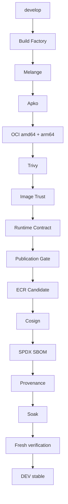
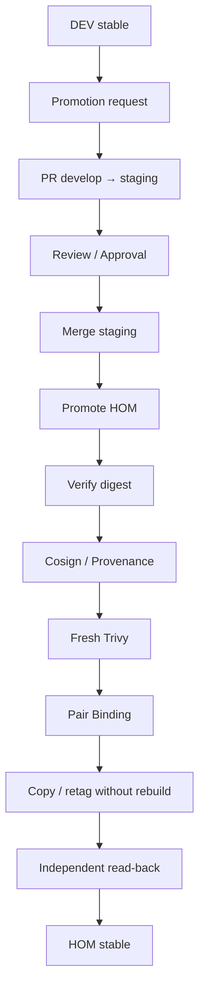
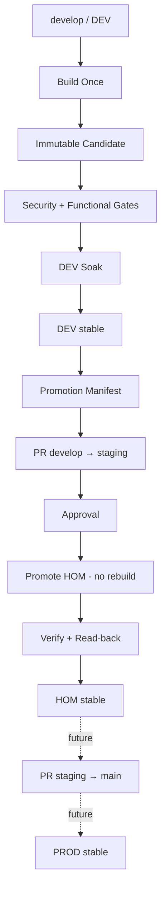

# Factory Distroless — Estratégia de Ambientes, Branches e Promoção por Digest

## Objetivo

Este documento descreve o modelo de execução da **Factory Distroless** para os ambientes corporativos, considerando a estratégia inicial:

| Branch | Ambiente | Papel |
|---|---|---|
| `develop` | DEV | Ambiente interno do time e branch default |
| `staging` | HOM | Ambiente de homologação onde usuários finais testarão |
| `main` | PROD futuro | Reservada para uma futura produção real; inicialmente fora do fluxo |

A regra arquitetural central é:

> **Cada ambiente possui seu próprio `stable`; apenas DEV constrói novas imagens, enquanto HOM e futuros ambientes promovem exatamente a mesma release por digest, sem rebuild.**

---

# 1. Princípios da arquitetura

A Factory Distroless deve preservar estes invariantes:

1. **Build once**
   - A imagem é construída uma única vez em DEV.
   - HOM não executa Apko/Melange novamente.
   - PROD futuro também não deve rebuildar a imagem.

2. **Promote by digest**
   - A identidade real da imagem é o digest OCI: `sha256:<digest>`.
   - Tags de ambiente são apenas aliases móveis.

3. **Stable por ambiente**
   - DEV possui seu próprio `stable`.
   - HOM possui seu próprio `stable`.
   - PROD futuro também possuirá seu próprio `stable`.

4. **Mesma release entre ambientes**
   - O digest promovido para HOM deve ser exatamente o digest aprovado em DEV.
   - Nenhuma resolução de pacote ou rebuild deve ocorrer durante promoção.

5. **Supply chain preservada**
   - Cosign, SBOM, provenance, Trivy, pair binding e demais evidências continuam vinculados ao mesmo artifact.

6. **Ambientes posteriores não são produtores**
   - `develop` produz artifacts.
   - `staging` aceita/promove artifacts.
   - `main`, quando ativada futuramente, também aceitará/promoverá artifacts.

---

# 2. Modelo de branches

## 2.1 `develop` — DEV

`develop` será a **default branch** do repositório corporativo.

Responsabilidades:

- executar os schedules da Factory;
- construir novas imagens;
- validar o catálogo;
- executar contratos funcionais;
- publicar candidates imutáveis;
- assinar;
- gerar SBOM;
- gerar provenance;
- aguardar soak;
- promover o candidate aprovado para o `stable` de DEV.

Fluxo conceitual:

```text
develop
   │
   │ push / schedule / workflow_dispatch autorizado
   ▼
Build
   │
   ├── Melange
   ├── Apko
   ├── amd64 + arm64
   ├── Trivy
   ├── Image Trust
   ├── Runtime Contract
   ├── Publication Gate
   ├── Cosign
   ├── SPDX SBOM
   └── Provenance
   │
   ▼
Candidate imutável
   │
   │ soak + fresh verification
   ▼
DEV :stable
```

## 2.2 `staging` — HOM

`staging` representa o ambiente de **Homologação**.

Responsabilidades:

- receber somente releases já aprovadas em DEV;
- executar nova verificação antes da promoção;
- promover a mesma release por digest;
- não rebuildar;
- expor o `stable` de HOM para testes dos usuários finais.

```text
DEV stable
sha256:AAA
     │
     │ promotion
     ▼
HOM stable
sha256:AAA
```

O digest deve permanecer idêntico.

## 2.3 `main` — PROD futuro

Inicialmente, `main` ficará fora do lifecycle operacional.

```text
main
→ sem build
→ sem schedule da Factory
→ sem promoção automática
→ reservada para PROD futuro
```

No futuro:

```text
HOM stable
     │
     │ promotion
     ▼
PROD stable
```

Sem necessidade de redesenhar a Factory.

---

# 3. Stable é local ao ambiente

`stable` não significa "produção global".

Ele significa:

> **release atualmente aprovada naquele ambiente.**

Exemplo:

```text
DEV
image-base-go1-26:stable
→ sha256:AAA

HOM
image-base-go1-26:stable
→ sha256:AAA
```

No futuro:

```text
PROD
image-base-go1-26:stable
→ sha256:AAA
```

---

# 4. Isolamento físico dos ambientes

Para existir um `stable` independente por ambiente, os ambientes precisam ter destinos separados.

## Opção preferencial — contas AWS separadas

```text
AWS DEV
└── image-base-go1-26:stable

AWS HOM
└── image-base-go1-26:stable

AWS PROD
└── image-base-go1-26:stable
```

Vantagens:

- isolamento de IAM;
- blast radius menor;
- políticas independentes;
- auditoria por ambiente;
- `stable` pode existir com o mesmo nome em cada conta.

## Alternativa — mesma conta, repositórios separados

```text
image-base-dev-go1-26:stable
image-base-hom-go1-26:stable
```

ou:

```text
dev/image-base-go1-26:stable
hom/image-base-go1-26:stable
```

A identidade continua sendo o digest.

---

# 5. Fluxo completo DEV → HOM

## 5.1 Construção em DEV

Apenas `develop` constrói.



## 5.2 Solicitação de promoção

Depois que a release estiver em `DEV stable`, inicia-se a promoção para HOM.

Sugestão:

```text
PR develop → staging
```

O PR representa a **change request da promoção**.

Ele não deve disparar rebuild da imagem.

## 5.3 Promoção para HOM



---

# 6. Não consultar apenas o DEV stable atual no momento do merge

Existe uma race condition importante.

```text
10:00
DEV stable = Candidate A

10:10
PR develop → staging aberto para A

11:00
Candidate B vira DEV stable

12:00
PR é aprovado
```

Se o workflow perguntar apenas:

```text
"qual é o DEV stable agora?"
```

ele promoveria B, e não A.

Isso deve ser evitado.

---

# 7. Promotion Manifest / Release Identity

A promoção deve estar vinculada a uma release exata.

Sugestão:

```json
{
  "source_environment": "dev",
  "target_environment": "hom",
  "source_branch": "develop",
  "source_sha": "abc123",
  "build_run_id": "123456",
  "run_attempt": 1,
  "runtime_digest": "sha256:AAA",
  "dev_digest": "sha256:BBB"
}
```

Nome sugerido:

```text
promotion-manifest.json
```

O PR aprova os digests exatos registrados nesse manifesto.

---

# 8. Release compilada é um par

Para frameworks compilados, uma release não é somente o runtime.

```text
go1-26
+
go1-26-dev
```

A identidade da release é:

```text
Run ID
+
Run Attempt
+
Runtime Digest
+
Dev Digest
```

Nunca aceitar:

```text
runtime do Candidate A
+
dev do Candidate B
```

---

# 9. Regras de promoção HOM

Antes da primeira escrita em HOM, exigir:

- release existe em DEV;
- source digest é exato;
- candidate foi aprovado em DEV;
- runtime/dev pertencem ao mesmo run/attempt quando compilados;
- Cosign válido;
- provenance válida;
- amd64 + arm64 presentes;
- fresh Trivy aprovado;
- candidate não está em quarentena;
- promotion manifest válido;
- target environment permitido;
- destination ECR validado;
- nenhuma reconstrução.

Só depois:

```text
PRE-WRITE AUTHORIZED
```

e então:

```text
write HOM stable
→ independent read-back
→ evidence
```

---

# 10. GitHub Environments

Sugestão:

```text
Environment: DEV
Environment: HOM
Environment: PROD
```

Inicialmente:

```text
DEV
HOM
```

Cada GitHub Environment pode possuir:

- `AWS_ROLE_ARN`
- `AWS_REGION`
- account / registry
- reviewers
- protection rules
- environment-specific variables

---

# 11. IAM / OIDC

Recomendação:

```text
DEV
→ build/publish role

HOM
→ promotion role

PROD futuro
→ production promotion role
```

A role de HOM deve ter somente as permissões necessárias para promover o artifact autorizado.

---

# 12. Schedules

## DEV / `develop`

Todos os schedules principais da Factory ficam em `develop`.

Exemplos:

```text
daily build
promotion DEV
operational health
dependency / tool checks
```

## HOM / `staging`

Não executar schedule de build.

Pode existir schedule independente para:

```text
HOM health
HOM stable re-scan
operational monitoring
```

Mas nunca:

```text
Apko rebuild
Melange rebuild
new candidate
```

## PROD / `main`

Inicialmente:

```text
inactive
```

---

# 13. Workflows sugeridos

## Entry points

```text
Distroless - Build DEV
Distroless - Promote DEV
Distroless - Promote HOM
Distroless - Recover DEV
Distroless - Recover HOM
```

## Engines / workflows internos

```text
Distroless - Build engine
Distroless - Promotion engine
Distroless - Image trust
Distroless - Runtime contract
Distroless - Validate base images
```

---

# 14. Branch protection

## `develop`

- default branch;
- PR obrigatório;
- schedules ativos;
- build permitido;
- publish candidate permitido;
- stable DEV permitido.

## `staging`

- direct push bloqueado;
- PR obrigatório;
- promoção esperada a partir de `develop`;
- sem build de imagem;
- apenas promotion HOM.

Governance check sugerido:

```text
base = staging
head = develop
```

## `main`

- protegida;
- sem uso operacional inicialmente;
- reservada para PROD futuro.

---

# 15. Branch não é a identidade do artifact

```text
branch != artifact identity
```

A identidade continua:

```text
sha256:<digest>
```

A branch apenas controla qual ambiente recebe a mudança.

---

# 16. Build provenance e mudança de branch

Hoje o LAB possui várias premissas em:

```text
refs/heads/main
```

Na migração corporativa, revisar:

- build source identity;
- OIDC subject/ref;
- Cosign certificate identity;
- provenance source-ref;
- signing identities;
- promotion verification;
- IAM trust;
- GitHub Environments;
- branch protections;
- release policies;
- governance tests.

A origem de build futura deve refletir:

```text
refs/heads/develop
```

HOM deve verificar a provenance original de DEV, não fingir que o artifact foi construído em `staging`.

---

# 17. O que staging NÃO deve fazer

Nunca:

```text
staging
→ Melange
→ Apko
→ rebuild
→ novo digest
```

Nem resolver pacotes Wolfi novamente.

O correto:

```text
DEV artifact sha256:AAA
→ HOM artifact sha256:AAA
```

---

# 18. Stable em DEV e HOM

Exemplo:

```text
DEV ECR

image-base-go1-26:210926-1234-r100-a1
image-base-go1-26:stable
                    │
                    └── sha256:AAA
```

Depois da promoção:

```text
HOM ECR

image-base-go1-26:stable
                    │
                    └── sha256:AAA
```

DEV pode continuar avançando depois:

```text
DEV stable = Candidate B
HOM stable = Candidate A
```

Isso é esperado.

---

# 19. Recovery

Cada ambiente precisa possuir recovery independente.

```text
DEV:
stable B → recover A

HOM:
stable B → recover A
```

Recovery significa:

```text
RETARGET EXISTING DIGEST
```

e nunca:

```text
REBUILD OLD VERSION
```

Para pares compilados, runtime + dev devem ser tratados como uma unidade de recovery.

---

# 20. Quarentena

Depois de recovery:

```text
B → retirado de stable
```

B precisa entrar em quarentena para evitar repromoção automática futura.

A quarentena pode precisar de escopo ambiental.

---

# 21. Modelo operacional completo



---

# 22. Modelo resumido

```text
DEVELOP / DEV
────────────────────────────
BUILD
VALIDATE
PUBLISH CANDIDATE
SOAK
STABLE DEV

            │
            │ promote digest
            ▼

STAGING / HOM
────────────────────────────
NO BUILD
VERIFY RELEASE
PROMOTE
STABLE HOM

            │
            │ future
            ▼

MAIN / PROD
────────────────────────────
NO BUILD
VERIFY RELEASE
PROMOTE
STABLE PROD
```

---

# 23. Regra final

> **Cada ambiente mantém seu próprio `stable`. A branch `develop` é a única produtora de artifacts. `staging` e futuros ambientes apenas promovem releases previamente aprovadas, preservando os mesmos digests OCI, assinaturas, SBOMs e provenance.**

```text
DEV  = BUILD + STABLE
HOM  = PROMOTE + STABLE
PROD = PROMOTE + STABLE

BUILD ONCE
PROMOTE BY DIGEST
NO REBUILD BETWEEN ENVIRONMENTS
```

---

# 24. Checklist para a migração corporativa

- [ ] definir `develop` como default branch;
- [ ] criar/proteger `staging`;
- [ ] manter `main` reservada para PROD futuro;
- [ ] mover schedules da Factory para `develop`;
- [ ] alterar source identity de `main` para `develop` onde aplicável;
- [ ] revisar OIDC trust;
- [ ] revisar Cosign certificate identity;
- [ ] revisar provenance source-ref;
- [ ] revisar signing identities;
- [ ] criar GitHub Environment `DEV`;
- [ ] criar GitHub Environment `HOM`;
- [ ] separar roles AWS de DEV e HOM;
- [ ] definir registries/repositories por ambiente;
- [ ] garantir `stable` independente por ambiente;
- [ ] implementar `promotion-manifest.json`;
- [ ] implementar promoção DEV → HOM sem rebuild;
- [ ] exigir promoção por digest;
- [ ] preservar runtime/dev pair binding;
- [ ] executar fresh Trivy na promoção;
- [ ] executar Cosign/provenance verification na promoção;
- [ ] executar independent ECR read-back;
- [ ] criar evidence da promoção;
- [ ] implementar recovery independente por ambiente;
- [ ] implementar quarentena após recovery;
- [ ] impedir build em `staging`;
- [ ] deixar `main` fora do fluxo até PROD ser oficialmente ativado.

---

# 25. Estado inicial esperado

```text
DEFAULT_BRANCH = develop

DEV_BRANCH = develop
HOM_BRANCH = staging
PROD_BRANCH = main

PROD_ENABLED = false

BUILD_ENVIRONMENTS =
- DEV

PROMOTION_ENVIRONMENTS =
- HOM

STABLE_PER_ENVIRONMENT =
- DEV
- HOM

BUILD_ONCE = true
PROMOTE_BY_DIGEST = true
REBUILD_ON_HOM = false
```
