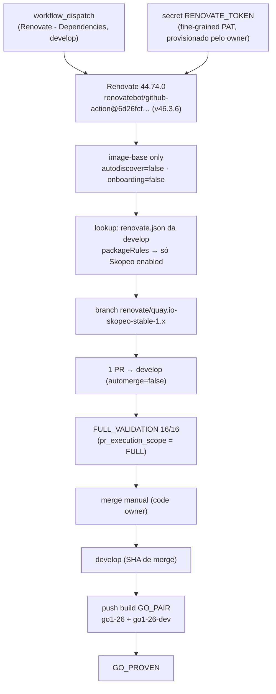

# Renovate Skopeo POC

> LAB only (`alric-corp/alric-containers-image-base`, `develop`). Nenhuma
> conclusão deste POC se aplica automaticamente ao ambiente corporativo.

## Objective

Provar, com um único update real, que o Renovate funciona como mecanismo
operacional de atualização controlada de tooling no LAB:

Renovate detecta o update do Skopeo → abre exatamente 1 PR → FULL_VALIDATION
16/16 → revisão e merge humanos → build pós-merge do GO_PAIR → runtime,
publicação e read-back → GO_PROVEN.

## Scope

- Único update permitido: `quay.io/skopeo/stable` (tag `vX.Y.Z-immutable` + digest).
- Repositório: somente `alric-corp/alric-containers-image-base`.
- Classe da mudança: **A** (executor Renovate + Skopeo; o Skopeo é usado no carregamento de candidates dos contratos e na cópia/read-back para o ECR, caminhos agnósticos de linguagem).
- Modelo operacional do LAB: [ADR-0008](../docs/adr/0008-modelo-operacional-lab-golden-path.md) (GO_PAIR + FULL_VALIDATION fail-safe + FULL_CERTIFICATION sob demanda).

## Architecture



## Authentication model

- Renovate **self-hosted** via GitHub Actions (`.github/workflows/renovate.yml`). Nenhum GitHub App é instalado.
- O token é lido **somente** do secret `RENOVATE_TOKEN`. O primeiro passo do job falha explicitamente se ele estiver ausente.
- **Sem fallback** para `github.token`/`secrets.GITHUB_TOKEN`:
  - PR aberto pelo `GITHUB_TOKEN` não dispara workflows, então não haveria FULL_VALIDATION;
  - o `GITHUB_TOKEN` não pode alterar `.github/workflows/`, onde está uma das duas ocorrências do Skopeo.
- O workflow declara `permissions: {}`: o `GITHUB_TOKEN` do job não recebe nenhum escopo.
- A action passa o token ao container por variável de ambiente. O GitHub mascara secrets nos logs; o valor nunca é gravado em arquivo ou artifact por este workflow.

## Token requirements

Fine-grained personal access token. **Não criado nesta tarefa.**

| Campo | Valor |
|---|---|
| Resource owner | `alric-corp` |
| Repository access | Only select repositories → `alric-containers-image-base` |
| Expiração | Curta, definida pelo owner (POC) |

Permissões de repositório:

| Permissão | Acesso | Por quê |
|---|---|---|
| Metadata | Read | Obrigatória em todo fine-grained PAT |
| Contents | Read and write | Clonar, criar a branch `renovate/*` e o commit |
| Pull requests | Read and write | Criar/atualizar o PR |
| Workflows | Read and write | Alterar `.github/workflows/build-base-images.yml` |
| Issues | Read and write | Recomendado: o Renovate abre issue de erro de configuração (o Dependency Dashboard está desligado) |
| Commit statuses | Read and write | Recomendado pela documentação do Renovate para PATs |
| Dependabot alerts | — | Não necessário: `vulnerabilityAlerts.enabled=false` |
| Administration, Actions, Secrets, Environments | — | Não conceder |

O conjunto mínimo efetivamente suficiente deve ser **confirmado no primeiro
run** (EXTERNAL_INPUT_REQUIRED): a org precisa permitir fine-grained PATs e
pode exigir aprovação do administrador.

Operação:

```text
Secret: RENOVATE_TOKEN
Value:  <configured manually by repository/org administrator>
```

O PR do Skopeo será **de autoria do usuário dono do PAT**. Esse usuário não
pode aprovar o próprio PR: a aprovação de code owner (obrigatória na
`develop`) precisa vir de outro owner (`.github/CODEOWNERS`).

## Repository restrictions

Configuração self-hosted (env do workflow):

- `RENOVATE_PLATFORM=github`
- `RENOVATE_REPOSITORIES=alric-corp/alric-containers-image-base`
- `RENOVATE_AUTODISCOVER=false`: nenhum outro repositório da org é descoberto
- `RENOVATE_ONBOARDING=false` e `RENOVATE_REQUIRE_CONFIG=required`: sem PR de onboarding; sem `renovate.json`, nada acontece
- Job restrito a `refs/heads/develop`; `concurrency: renovate-dependencies-<repo>` sem cancelamento; `timeout-minutes: 30`
- Sem `schedule`: disparo exclusivamente manual
- Imagem do Renovate fixada: `ghcr.io/renovatebot/renovate:44.74.0@sha256:6d08f288…` (a mesma versão do preflight local). Sem `renovate-image`, a action usaria a tag flutuante `44`
- O repo reusable **não** é tocado nesta fase

## Renovate config changes

`renovate.json`:

| Chave | Antes | Depois | Motivo |
|---|---|---|---|
| `prConcurrentLimit` | 4 | 1 | No máximo 1 PR |
| `branchConcurrentLimit` | (= prConcurrentLimit) | 1 | No máximo 1 branch |
| `prHourlyLimit` | (default 2) | 1 | |
| `dependencyDashboard` | (default off) | `false` explícito | Sem issue extra |
| `vulnerabilityAlerts.enabled` | (default) | `false` | Sem PRs de alerta; não exige a permissão Dependabot alerts |
| `schedule` | `before 6am on monday` | **removido** | A cadência passa a ser do gatilho do workflow. Com o schedule, um dispatch fora de segunda antes das 6 h não criaria o PR |
| `packageRules` | — | catch-all `enabled:false` + Skopeo `enabled:true` | Isolamento auditável |
| `customManagers` | 4 | 5 (os 4 preservados + imagem do Renovate) | O `pin_inventory` reprova pin de imagem sem gerenciador |

`automerge: false`, `enabledManagers: ["custom.regex"]` e `timezone` permanecem.

Também no PR de setup (fechamento mínimo do SCOPE-GAP-01): ADR-0008 e
`execution_scope.reason`/`adr` em `policies/operations/health.json`, além de
comentários em `default_batch.py`, `workflow.yml` e no docstring do teste
P0-04. `review_by` permanece `2026-09-30` (limitação documentada no ADR-0008:
o health exige o campo, e nenhuma data foi inventada).

## Skopeo-only rule

| Dependência | Estado no POC |
|---|---|
| `cgr.dev/chainguard/apko` | disabled |
| `cgr.dev/chainguard/melange` | disabled |
| `rhysd/actionlint` | disabled |
| `hashicorp/terraform` | disabled |
| `docker.io/tonistiigi/binfmt` | disabled |
| `ghcr.io/renovatebot/renovate` (novo pin) | disabled |
| `quay.io/skopeo/stable` | **enabled** |

O contrato do Skopeo não muda: o manager atualiza **tag `-immutable` +
digest** nas duas ocorrências existentes (`.github/workflows/build-base-images.yml`,
`scripts/pipeline/runtime/runtime_images.py`). Nunca `latest`, digest-only ou
tag sem digest.

Limitação: `pin_inventory lint` considera "coberto" todo pin casado por um
custom manager, mesmo desabilitado por `packageRules`. Durante o POC,
"gerenciador declarado" não significa "update ativo".

## Preflight evidence

Executado em 2026-10-04, no branch `feat/renovate-skopeo-poc`, com Renovate
44.74.0 já presente localmente (nada instalado), `--platform=local`, sem
token real:

| Verificação | Comando | Resultado |
|---|---|---|
| Config | `renovate-config-validator --strict --no-global renovate.json` | OK |
| Dry-run | `RENOVATE_DRY_RUN=lookup`, `LOG_LEVEL=debug`, `GITHUB_COM_TOKEN=<valor fictício>` | 10 arquivos, 13 ocorrências; **2 updates (Skopeo × 2 ocorrências) em 1 branch** `renovate/quay.io-skopeo-stable-1.x`; demais `skipReason: disabled` |
| Lookup Skopeo | — | `v1.22.2-immutable → v1.22.3-immutable`, `sha256:c0ee1f4e…` (patch) |
| Unit | `python3 -B -m unittest discover -s tests/unit …` | 637 OK (1 skipped), igual à linha de base |
| Integração | `… -s tests/integration …` | 39 OK |
| Lints locais | `make lint-local` | OK (102 pins em 74 arquivos; lote 16/0; origem reusable; retenção/agendamento em 16 workflows) |
| Hardening | `lint_workflow_hardening` | OK |
| Workflows | `actionlint .github/workflows/*.yml` | OK |
| Links | `doc_links` | OK |
| Perfil de PR | `pr_execution_scope` (setup e Skopeo) | `FULL` nos dois |

Sobre o token fictício: sem nenhum token, o Terraform aparecia como
`github-token-required`, o que não prova a desabilitação. Com um valor
fictício ele aparece `disabled` e nenhuma chamada autenticada ocorre. O
aviso local `Unsupported node environment` (Node 26 vs. engine Node 24) não
afeta o executor do CI, que roda a imagem oficial.

O valor real do update será determinado pelo lookup **no momento da
execução**.

## Expected PR

| Item | Esperado |
|---|---|
| Branch | `renovate/quay.io-skopeo-stable-1.x` |
| Base | `develop` |
| Autor | usuário dono do `RENOVATE_TOKEN` |
| Arquivos | exatamente 2: `.github/workflows/build-base-images.yml` (`SKOPEO_IMAGE`) e `scripts/pipeline/runtime/runtime_images.py` (`SKOPEO`) |
| Mudança | tag `-immutable` e digest, nas duas linhas, para os mesmos valores |
| Automerge | não |
| Outros PRs/branches/issues | nenhum |

## Expected FULL_VALIDATION

- `Resolve PR execution profile` → `profile=FULL`.
- `Validate full catalog for shared-impact PR` → 16/16 validate, image-trust e wolfi-trust PASS.
- Required checks da `develop`: `Unit & integration tests` e `Repository & workflow lint`.
- **Atenção:** a FULL_VALIDATION **não** é required check da `develop`. O revisor precisa confirmá-la manualmente antes do merge.
- A `develop` exige branch atualizada (`strict`): cada rebase do Renovate dispara uma nova FULL_VALIDATION.
- A FULL_VALIDATION não exercita o Skopeo. Quem exercita é o build pós-merge.

## GO_PROVEN criteria

No push build de `develop` disparado pelo merge (SHA de merge registrado):

- [ ] FULL_VALIDATION do PR = PASS (16/16)
- [ ] Validate go1-26 / go1-26-dev = PASS (melange, apko, Trivy × 2 arquiteturas)
- [ ] Image trust go1-26 = PASS
- [ ] Runtime contract go1-26 (both architectures) = PASS (usa `SKOPEO` de `runtime_images.py`)
- [ ] Build & push go1-26 e go1-26-dev = PASS (Skopeo copy + read-back)
- [ ] Cosign, SBOM e provenance presentes
- [ ] `skopeo-version.txt` no artifact `publication-*` mostra a versão nova
- [ ] digest publicado == digest validado (preservado)
- [ ] `tool-versions.json` sem mudança não relacionada; diff do PR com só as 2 linhas

Não são critério: `stable` (DEV em hold desde 2026-10-01; o Skopeo não é usado em `stable`/promoção, que usam ORAS), HOM e recovery.

## What is explicitly out of scope

Apko, melange, binfmt, actionlint, Terraform, GitHub Actions, imagem do
Renovate, repo reusable, Wolfi. Também ficam de fora:

- schedule do Renovate;
- `stable`, HOM e recovery (incluindo o hold DEV atual);
- AWS, ECR e Terraform;
- `execution_scope.current`, catálogo, lote FULL;
- `promote-dev.json`/`promote-hom.json`;
- FULL_CERTIFICATION e App Certification;
- qualquer conclusão corporativa.

## Manual steps

1. Revisar o PR de setup.
2. Aguardar os checks e a FULL_VALIDATION 16/16.
3. Merge manual por code owner.
4. Criar o fine-grained PAT (seção "Token requirements").
5. Salvar como Actions secret `RENOVATE_TOKEN` no repositório.
6. Pedir a continuação (fase 2): dispatch manual de `Renovate - Dependencies` e observação.
7. Revisar o PR do Skopeo, conferir a FULL_VALIDATION e fazer merge manual (fase 3).

## Success criteria

```text
POC_PROVEN = RENOVATE_EXECUTOR = PASS
         AND SINGLE_SKOPEO_PR   = PASS
         AND FULL_VALIDATION    = PASS
         AND MANUAL_MERGE       = PASS
         AND GO_PROVEN          = PASS
```

Significa apenas que o Renovate funciona como mecanismo operacional de
atualização controlada de tooling no LAB.

**Não** significa: apko, melange, binfmt, Wolfi ou Terraform validados;
FULL_PROVEN; READY_FOR_CORPORATE_PROPOSAL; homologação corporativa.

STOP na fase 2 se aparecer:
- 0 PR (inesperadamente);
- mais de 1 PR;
- outro dependency update;
- erro de autenticação;
- alteração fora das 2 ocorrências.

## Rollback

- **Setup problemático:** reverter somente o PR de setup e revogar o PAT/remover o secret. Nenhuma ação em `stable`, ECR ou AWS.
- **PR do Skopeo com falha:** não mergear; fechar o PR (o Renovate não recria um PR fechado para a mesma versão); preservar logs e evidência; diagnosticar.
- **Nunca** substituir o update manualmente para "fazer o POC passar".

## Evidence template

```text
Setup PR:                 <url> · merge SHA <sha> · merged by <user> · <date>
RENOVATE_TOKEN:           configured by <role> on <date> (value never recorded)
Renovate run:             <run url> · conclusion <...> · image 44.74.0@sha256:6d08f288…
Branches created:         <list> (expected: renovate/quay.io-skopeo-stable-1.x)
PRs created:              <list> (expected: 1)
Skopeo update:            <from> → <to> · digest <sha256>
Files changed:            <list> (expected: 2)
FULL_VALIDATION:          <run url> · 16/16 <PASS/FAIL>
Required checks:          <PASS/FAIL>
Manual merge:             <sha> · approver <user>
GO_PAIR push build:       <run url> · head_sha <sha>
  go1-26 / go1-26-dev:    validate · trust · runtime · publish · read-back
  skopeo-version.txt:     <content>
  published digests:      <go1-26> <go1-26-dev>
GO_PROVEN:                <PASS/FAIL>
POC_PROVEN:               <PASS/FAIL>
```

## Status (Fase 1)

| Campo | Valor |
|---|---|
| SETUP_STATUS | Implementado no branch `feat/renovate-skopeo-poc` |
| CONFIG_VALIDATION | PASS (`--strict`) |
| DRY_RUN | PASS: somente Skopeo (1 branch, 2 ocorrências) |
| EXPECTED_UPDATE | `quay.io/skopeo/stable` `v1.22.2-immutable → v1.22.3-immutable` (lookup de 2026-10-04; o run real refaz o lookup) |
| TOKEN_STATUS | NOT CONFIGURED: aguardando o owner |
| PR_SETUP | https://github.com/alric-corp/alric-containers-image-base/pull/105 (aberto; aguardando revisão e FULL_VALIDATION) |
| NEXT_MANUAL_ACTION | Revisar o PR de setup → FULL_VALIDATION → merge manual → criar o PAT → secret `RENOVATE_TOKEN` → pedir a fase 2 |
| POC_PROVEN | NO |
