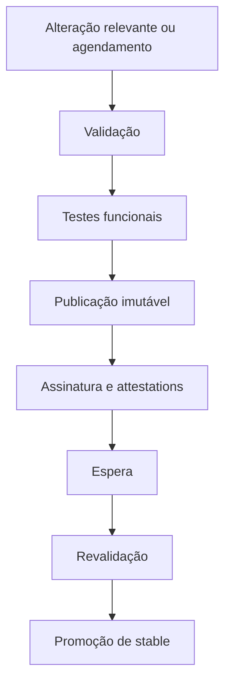
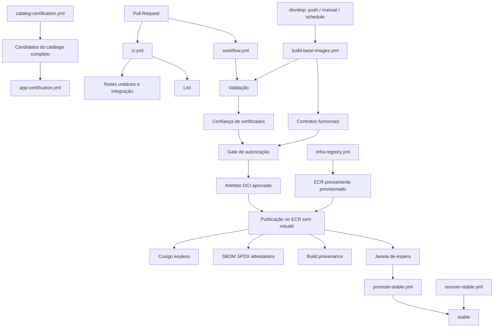

# Análise dos workflows da fábrica de imagens

## Visão geral

A análise considera os **13 workflows** presentes na branch padrão `develop`, no commit `2801363`, além de uma amostra das execuções recentes.

> **Limites da análise:** foram examinadas as definições dos workflows e suas chamadas, mas não toda a implementação dos scripts Python nem dos workflows corporativos externos. Por isso, é importante distinguir o que o YAML efetivamente executa do que depende desses executores externos.

A pesquisa por agente não ficou disponível porque o **Copilot coding agent** não está habilitado no repositório. A análise foi feita por leitura direta.

Nenhum arquivo foi alterado e nenhum workflow foi disparado durante a análise.

---

# 1. Escopo da análise

O objetivo é entender como os workflows se relacionam para formar o ciclo de:

1. validação;
2. testes;
3. provisionamento de infraestrutura;
4. publicação de imagens;
5. assinatura e geração de evidências;
6. promoção da referência `stable`;
7. recuperação da referência `stable`, quando necessário.

Um ponto importante é que a presença desses componentes no repositório **não significa, por si só, que todo o ciclo corporativo — provisionar, publicar e promover — já esteja operacionalmente comprovado de ponta a ponta**.

---

# 2. Como o fluxo se organiza

Existem quatro processos relacionados, porém separados:

| Processo | Responsabilidade |
|---|---|
| **CI do repositório** | Testar os scripts e verificar contratos e qualidade dos workflows. |
| **Infraestrutura** | Delegar o provisionamento dos repositórios ECR ao executor corporativo. |
| **Fábrica de imagens** | Validar candidatos, executar contratos funcionais, publicar e assinar imagens imutáveis. |
| **Ciclo de `stable`** | Avaliar candidatos após uma espera, promover ou recuperar a referência de consumo. |

A sequência principal pode ser representada assim:

```text
Alteração relevante ou agendamento
        ↓
Validação
        ↓
Testes funcionais
        ↓
Publicação imutável
        ↓
Assinatura e attestations
        ↓
Espera
        ↓
Revalidação
        ↓
Promoção de stable
```

## 2.1 Fluxo em Mermaid



## 2.2 Imutabilidade do artefato

Um detalhe essencial do desenho é que o publicador **não recompila a imagem depois da aprovação**.

O comportamento esperado é:

1. obter o artefato OCI já validado;
2. copiar esse artefato para o ECR;
3. preservar os digests;
4. ler o resultado de volta;
5. confirmar que o conteúdo publicado corresponde ao artefato validado.

Isso reduz o risco de existir diferença entre:

```text
artefato validado
        ≠
artefato publicado
```

A referência observada para essa parte do fluxo é:

```text
build-base-images.yml
linhas 234–358
```

---

# 3. Inventário dos workflows

Todos os workflows estão em:

```text
.github/workflows/
```

| Workflow | Acionamento | Função |
|---|---|---|
| `ci.yml` | Todo PR; push em `develop`; manual | Testes unitários, integração sem AWS e lint. |
| `workflow.yml` | PR e push com filtros de arquivos; diário; manual | Entrada principal da fábrica. |
| `validate-base-images.yml` | Reutilizável | Verifica confiança Wolfi e coordena validação e confiança de certificados. |
| `image-trust.yml` | Reutilizável | Executa contratos de confiança de certificados nas duas arquiteturas. |
| `image-trust-scope.yml` | PR com alterações específicas de confiança | Regressão do escopo Go 1.26. |
| `build-base-images.yml` | Reutilizável | Coordena validação, testes, publicação, assinatura e evidências. |
| `test-runtime-images.yml` | Reutilizável e manual | Delega testes funcionais sobre artefatos validados. |
| `catalog-certification.yml` | Manual em `develop` | Publica candidatos do catálogo completo de 16 variantes. |
| `app-certification.yml` | Manual em `develop` | Testa aplicações consumidoras contra candidatos publicados por digest. |
| `infra-registry.yml` | PR e push com filtros de arquivos | Delega Terraform: `plan` no PR e `apply` de DEV em `develop`. |
| `promote-stable.yml` | Horário, manual e interface reutilizável | Autoriza candidatos e movimenta `stable`. |
| `recover-stable.yml` | Manual | Recupera `stable` para um digest informado. |
| `pipeline-health.yml` | Diário e manual | Monitora execução da fábrica, dependências e indicadores operacionais. |

---

# 4. O que acontece em um Pull Request

## 4.1 CI obrigatório

O `ci.yml` executa **sem filtro de caminhos**.

Isso evita que uma mudança no repositório deixe de produzir o resultado desse check.

O workflow possui dois jobs paralelos.

### Job 1 — Unit & integration tests

Responsabilidades:

```text
Instalar dependências de desenvolvimento
        ↓
make test-unit
        ↓
make test-integration
```

### Job 2 — Repository & workflow lint

Executa:

```bash
actionlint
make lint-local
```

Ambos os jobs possuem **timeout de cinco minutos**.

Também há controle de concorrência: um novo commit cancela a execução anterior do mesmo grupo.

### O que esse fluxo não faz

O `ci.yml`:

- não publica imagens;
- não assume a role AWS de publicação;
- não aplica Terraform.

Referência observada:

```text
ci.yml
linhas 11–70
```

---

# 4.2 Validação das imagens no PR

Quando o PR altera arquivos relevantes, o `workflow.yml` executa a seguinte sequência:

1. faz checkout do histórico;
2. compara os SHAs de `base` e `head`;
3. chama `pr_execution_scope`;
4. seleciona o perfil de validação.

Os perfis observados são:

### `P0_04`

Valida:

```text
go1-26
go1-26-dev
```

### `FULL`

Valida o catálogo completo.

## 4.3 Comportamento fail-safe do escopo

Se o diff não puder ser obtido, o fluxo passa um caminho desconhecido ao classificador.

A intenção explícita é encaminhar a análise para o **escopo completo**, em vez de assumir um escopo menor.

Em outras palavras:

```text
Não foi possível determinar o impacto
              ↓
Tratar como alteração potencialmente ampla
              ↓
Executar validação completa
```

Esse comportamento é conservador e reduz a possibilidade de uma alteração relevante escapar da validação.

---

# 4.4 PR valida, mas não publica

O caminho de Pull Request chama a **validação**, e não o motor de publicação.

Isso significa que os contratos funcionais do job `runtime-contract`, pertencentes ao motor de publicação, **não são acionados por esse caminho**.

O contrato de certificados, por outro lado, continua fazendo parte da validação.

Referência observada:

```text
workflow.yml
linhas 54–123
```

---

# 5. Build e publicação — funcionamento detalhado

## 5.1 Entrada e seleção

O fluxo principal publica somente em `develop`.

Ele pode ser acionado por:

- push com alteração relevante;
- execução manual;
- agendamento diário.

O agendamento observado é:

```text
03:23 UTC
00:23 em São Paulo
```

A seleção está fixa em:

```text
go1-26
go1-26-dev
```

inclusive no acionamento manual.

Não existe, nesse entrypoint, um input para ampliar o lote.

## 5.1.1 Filtros de arquivos

Os filtros incluem, entre outros:

- `frameworks`;
- `distroless`;
- `melange`;
- scripts;
- políticas;
- testes de runtime.

Alterações apenas em documentação **não acionam esse build** pelos filtros observados.

---

# 5.2 Validação e confiança

O wrapper `validate-base-images.yml` executa inicialmente:

```text
wolfi-trust
```

Esse estágio verifica:

- material de confiança Wolfi;
- keyrings locais.

Após essa etapa, duas validações são executadas em paralelo:

```text
                    ┌─> image-trust.yml
wolfi-trust ────────┤
                    └─> validate-apko-images.yml
                        locked-build: true
```

O workflow corporativo externo observado está fixado no SHA:

```text
1e516411f32821e17ec4a5b61dfa3c1b15c546aa
```

A referência observada para essa coordenação é:

```text
validate-base-images.yml
```

---

# 5.2.1 `image-trust.yml`

O `image-trust.yml`:

1. planeja os fixtures necessários;
2. executa `certificate_contract.py`;
3. suporta ARM64 por meio de QEMU;
4. exige sucesso agregado dos contratos de confiança.

Esse controle verifica a **confiança dos certificados dentro da imagem**.

Ele **não é a assinatura da imagem com Cosign**.

São controles distintos:

```text
Confiança de certificados internos
        ≠
Assinatura criptográfica da imagem
```

Referência observada:

```text
image-trust.yml
linhas 19–100
```

---

# 5.3 Contratos funcionais e autorização

O motor planeja os contratos executáveis para o lote.

Para variantes compiladas, o desenho exige que o par `runtime` / `-dev` esteja no mesmo lote.

Exemplo conceitual:

```text
<framework>
<framework>-dev
```

Antes de publicar cada framework, o motor:

1. exige seu artefato:

   ```text
   validated-oci-<framework>
   ```

2. obtém o artefato correspondente do par, quando necessário;
3. consulta os artefatos e jobs do `run`;
4. baixa as evidências do contrato funcional;
5. chama um **gate** com:
   - layouts;
   - relatórios;
   - metadados;
6. exige sucesso do **gate global de confiança de certificados**.

## 5.3.1 Isolamento entre frameworks

A matriz usa:

```yaml
fail-fast: false
```

O objetivo é permitir que um framework aprovado prossiga mesmo que outro framework falhe.

Isso **não transforma a falha de scan de outro framework em aprovação**. Em vez disso, evita que uma falha independente interrompa automaticamente toda a matriz.

Exemplo:

```text
Framework A ── aprovado ────────────────> pode prosseguir
Framework B ── falha no contrato/scan ──> bloqueado
```

Há, porém, uma exceção importante ao isolamento:

> A confiança de certificados é um requisito agregado do lote e é exigida por todas as publicações.

Ou seja, algumas verificações são avaliadas individualmente por framework, enquanto a confiança global de certificados funciona como um requisito compartilhado.

**Fonte observada:**

```text
build-base-images.yml
linhas 37–232
```

---

# 5.4 Publicação e rastreabilidade

Depois dos gates, o job de publicação executa uma sequência voltada a preservar integridade, identidade e rastreabilidade do artefato.

## 5.4.1 Sequência de publicação

1. Verifica a **integridade** e as **plataformas** do OCI.
2. Assume a role AWS via **OIDC**.
3. Confirma que o ECR:

   ```text
   image-base-<framework>
   ```

   já existe e atende à validação esperada.

4. Cria uma tag contendo timestamp, `run` e tentativa:

   ```text
   ddmmaa-hhmm-r<RUN_ID>-a<ATTEMPT>
   ```

5. Copia o artefato OCI com **Skopeo**, usando:

   ```bash
   --all --preserve-digests
   ```

6. Confere o digest publicado e realiza uma leitura independente do índice.
7. Assina o artefato **por digest** com **Cosign keyless**.
8. Publica attestations dos **SBOMs SPDX**.
9. Publica **provenance** com:

   ```text
   actions/attest-build-provenance
   ```

10. Preserva as evidências por **30 dias**.

## 5.4.2 O publicador não provisiona infraestrutura

Se o repositório ECR não estiver previamente provisionado, o job **falha**.

Ele não:

- cria o repositório;
- corrige a infraestrutura;
- executa um provisionamento implícito;
- altera a referência `stable`.

Isso reforça a separação entre:

```text
Provisionar infraestrutura
        ≠
Publicar artefato
        ≠
Promover stable
```

**Fonte observada:**

```text
build-base-images.yml
linhas 252–380
```

---

# 6. Promoção e recuperação de `stable`

A publicação de uma imagem candidata e a movimentação de `stable` são processos diferentes.

```text
Imagem candidata publicada
        ↓
Período de espera
        ↓
Revalidação
        ↓
Autorização
        ↓
stable aponta para o digest aprovado
```

---

## 6.1 Promoção

O `promote-stable.yml` possui cron no **minuto 17 de cada hora** e uma espera padrão de **seis horas**.

Para que o job de promoção execute efetivamente, são necessários:

- branch:

  ```text
  develop
  ```

- evento efetivo:

  ```text
  schedule
  ```

  ou:

  ```text
  workflow_dispatch
  ```

- variável:

  ```text
  STABLE_PROMOTION_AUTHORIZED == "true"
  ```

Sem essa variável, o workflow pode concluir com sucesso apenas resolvendo os defaults, **sem promover nenhuma imagem**.

## 6.1.1 `promotion_batch`

O workflow chama `promotion_batch` para:

1. selecionar candidatos;
2. autorizar candidatos;
3. aplicar a quarentena;
4. verificar confiança;
5. executar/verificar scans antes das escritas;
6. movimentar as referências autorizadas.

Depois, é feita uma verificação independente do vínculo:

```text
runtime
runtime-dev
```

e o workflow gera um resumo da execução.

## 6.1.2 Ausência de transação atômica entre repositórios ECR

O desenho reconhece que não existe uma transação atômica abrangendo vários repositórios ECR.

Isso significa que, em uma promoção envolvendo múltiplos repositórios, pode ocorrer:

```text
ECR A ── escrita concluída
ECR B ── falha
```

Uma escrita parcial precisa, portanto, ser **registrada e tratada**.

**Fonte observada:**

```text
promote-stable.yml
linhas 59–220
```

## 6.1.3 A espera não é um canário

A espera de seis horas é usada como uma janela para **reavaliar vulnerabilidades**.

Ela não representa um canário com tráfego real de aplicações consumidoras.

Portanto:

```text
Janela de espera para reavaliação
        ≠
Canary deployment com tráfego real
```

---

## 6.2 Recuperação

O `recover-stable.yml` recebe:

```text
framework
digest
reason
```

O workflow:

1. valida os inputs;
2. confirma que o digest existe no ECR;
3. verifica as plataformas;
4. verifica assinatura;
5. verifica provenance;
6. reescaneia as duas arquiteturas;
7. move `stable` **sem rebuild**;
8. confirma o digest por uma leitura independente;
9. registra:
   - operador;
   - motivo;
   - estado anterior.

O ponto central é que a recuperação trabalha sobre um artefato já existente e identificado pelo digest.

```text
Digest existente
      ↓
Verificações
      ↓
Movimentação de stable
```

Não há recompilação da imagem no processo.

## 6.2.1 Quarentena após recuperação

A quarentena do digest retirado **não é automatizada**.

O workflow imprime um lembrete para a criação de um PR.

Sem essa etapa operacional, um ciclo posterior pode selecionar novamente o candidato que havia sido retirado.

**Fonte observada:**

```text
recover-stable.yml
```

---

# 7. Infraestrutura e certificações

## 7.1 Infraestrutura

O `infra-registry.yml` delega a execução para o `registry.yml` corporativo.

### Pull Request

No PR:

```text
execution-mode: plan
ambiente: dev
```

### Push em `develop`

Em push para `develop`:

```text
execution-mode: apply
ambiente: dev
```

Para o `apply`, também é passado:

```text
expected-ref: refs/heads/develop
```

O caller utiliza:

```yaml
secrets: inherit
```

## 7.1.1 Escopo atual

Não há `apply` de **HOM/PROD** implementado nesse caller.

Portanto, pelo YAML analisado:

```text
DEV ── plan/apply implementado
HOM ── sem apply nesse caller
PROD ─ sem apply nesse caller
```

## 7.1.2 Infraestrutura e build são independentes

Infraestrutura e build são workflows independentes.

Uma alteração em:

```text
frameworks/**
```

pode acionar ambos.

Entretanto, não existe uma dependência entre eles que garanta:

```text
Provisionamento concluído
        ↓
Somente depois iniciar publicação
```

Consequentemente, o primeiro build de um novo destino pode tentar publicar antes de o provisionamento terminar.

A defesa do publicador é **falhar caso o destino ainda não esteja pronto**.

**Fonte observada:**

```text
infra-registry.yml
```

---

## 7.2 Catálogo completo

O `catalog-certification.yml` executa manualmente o mesmo motor sobre **16 variantes** das seguintes famílias:

- .NET;
- Go;
- Java;
- Node.js;
- Python.

Apesar do nome `certification`, esse workflow **publica candidatos no ECR**.

Ele também compartilha o bloqueio de concorrência utilizado pelo publicador normal.

Isso evita que duas execuções incompatíveis tentem publicar simultaneamente dentro do mesmo domínio de concorrência.

**Fonte observada:**

```text
catalog-certification.yml
```

---

## 7.3 Aplicações consumidoras

O `app-certification.yml` recebe um:

```text
source-run-id
```

referente à publicação do catálogo completo.

A partir dele, resolve as imagens por digest e executa:

```text
9 runtimes × 2 arquiteturas = 18 execuções
```

O workflow utiliza uma sessão AWS restrita a **leitura** e exige todos os resultados no resumo.

### O que ele não faz

O `app-certification.yml`:

- não publica imagens-base;
- não é, no YAML analisado, conectado como pré-requisito explícito da promoção.

Em outras palavras:

```text
Certificação das aplicações consumidoras
        ≠
Gate explícito de promoção, segundo o YAML analisado
```

**Fonte observada:**

```text
app-certification.yml
linhas 23–224
```

---

# 8. Controles e pontos de atenção

## 8.1 Controles positivos observados

Foram observados os seguintes controles:

- Actions e executores corporativos fixados por **SHA**;
- imagens importantes de ferramentas fixadas por **digest**;
- checkout sem credenciais Git persistidas;
- validação de inputs antes das operações AWS;
- publicação do artefato aprovado, **sem rebuild**;
- vínculo dos testes aos candidatos por digest;
- separação entre **publicação** e **promoção**;
- bloqueio compartilhado entre promoção e recuperação;
- evidências e resumos preservados por **30 dias**.

Esses controles contribuem para reduzir problemas como:

```text
Dependência mutável
Artefato diferente após validação
Credencial persistida
Promoção sem evidência rastreável
Corrida entre operações concorrentes
```

---

## 8.2 Pontos que merecem validação operacional

| Ponto | Impacto |
|---|---|
| **Recovery sem guard explícito de branch ou kill switch no job** | Diferentemente da promoção, sua restrição efetiva depende também da trust policy AWS e das proteções externas. |
| **Recovery opera um framework por vez** | Não apresenta a mesma coordenação explícita de pares usada na promoção; merece atenção ao recuperar `runtime` e `-dev`. |
| **Plan de infraestrutura solicita permissões GitHub de escrita** | “Sem apply” não significa “token GitHub somente leitura”: há permissões de escrita para `contents`, `actions`, `issues`, `checks` e PRs. |
| **Build e infraestrutura sem ordenação entre workflows** | O primeiro build de um destino novo pode ocorrer antes do provisionamento. |
| **Certificação de aplicações é separada** | Um resultado dessa certificação não aparece como gate explícito na promoção examinada. |
| **Dependências do runner** | Os jobs usam variáveis `RUNNER_EKS_OD_*` e pressupõem ferramentas como Python, Docker, Buildx, `gh` e utilitários disponíveis. |
| **Comentários parcialmente desatualizados** | Há referência a hosted Linux onde o YAML usa variáveis de runners, e comentário de recovery menciona `main` enquanto os fluxos principais usam `develop`. |

> Esses pontos não comprovam exploração ou falha em produção; são limites e diferenças observáveis na configuração.

## 8.3 Monitoramento da pipeline

O monitoramento também faz parte do desenho observado.

O `pipeline-health.yml`:

- roda às **05:40 UTC**;
- verifica **pins** e **métricas**;
- preserva evidências;
- falha ao final se houver problemas.

O canal de alerta descrito é o próprio **GitHub**, sem um destino externo explicitamente definido no YAML analisado.

**Fonte observada:**

```text
pipeline-health.yml
```

---

# 9. Visão consolidada do fluxo



---

# 10. Separação de responsabilidades

A arquitetura analisada separa responsabilidades importantes.

| Etapa | Responsabilidade principal |
|---|---|
| **CI** | Qualidade do código, testes e lint. |
| **Validação** | Determinar se os artefatos atendem aos requisitos técnicos e de confiança. |
| **Infraestrutura** | Garantir que os repositórios ECR de destino existam. |
| **Publicação** | Copiar exatamente o artefato aprovado para o ECR, preservando digests. |
| **Assinatura e attestations** | Adicionar assinatura, SBOM e provenance ao artefato publicado. |
| **Promoção** | Alterar a referência `stable` para um candidato autorizado. |
| **Recuperação** | Reposicionar `stable` para um digest previamente existente e validado. |
| **Certificação de aplicações** | Exercitar aplicações consumidoras contra imagens identificadas por digest. |

A distinção mais importante pode ser resumida assim:

```text
Build
  ≠
Validação
  ≠
Publicação
  ≠
Promoção
  ≠
Recovery
```

---

# 11. Fluxo resumido de ponta a ponta

```text
Alteração relevante
        │
        ├── PR
        │    ├── CI
        │    └── Validação
        │
        └── develop
             │
             ├── Validação e confiança
             │
             ├── Contratos funcionais
             │
             ├── Gate
             │
             ├── Verificação OCI
             │
             ├── OIDC → AWS
             │
             ├── Verificação do ECR
             │
             ├── Cópia com Skopeo preservando digests
             │
             ├── Verificação independente do digest
             │
             ├── Cosign keyless
             │
             ├── SBOM SPDX
             │
             └── Build provenance
                      │
                      ▼
                 Candidato
                      │
                 espera 6h
                      │
                      ▼
              revalidação/scans
                      │
                      ▼
                 promoção
                      │
                      ▼
                   stable
```

---

# 12. Conclusão

Os workflows analisados implementam um desenho em que **o artefato validado é o artefato publicado**, evitando um rebuild entre aprovação e publicação.

A rastreabilidade é reforçada pelo uso de:

- digests;
- tags com identificação de execução;
- assinatura Cosign;
- SBOMs;
- provenance;
- evidências preservadas;
- leitura independente do digest publicado.

O desenho também separa claramente a publicação da promoção de `stable`.

Ao mesmo tempo, existem pontos que precisam de validação operacional além da simples leitura dos YAMLs, principalmente:

- garantias externas do fluxo de recovery;
- coordenação de `runtime` / `-dev` durante recuperação;
- permissões efetivas dos workflows de infraestrutura;
- corrida possível entre provisionamento e primeiro build;
- relação da certificação de aplicações com o gate real de promoção;
- dependências existentes nos runners corporativos.

Portanto, a leitura dos workflows demonstra uma arquitetura bem segmentada e com vários mecanismos de supply-chain security, mas **a comprovação operacional completa do ciclo depende também dos executores corporativos, trust policies, runners e proteções externas que não estão integralmente definidos nesses YAMLs**.

---

# 13. Readiness corporativa para DEV

A análise complementar indica que, para o caminho DEV, **a implementação principal já está substancialmente presente no repositório**. Os itens ainda pendentes são majoritariamente configurações externas — IAM, OIDC, GitHub Settings, runners e valores corporativos — e não novos componentes centrais de código.

## 13.1 Corporate Environment Inventory

| Componente | Status |
|---|---|
| 13 workflows (`build`, `validate`, `trust`, `promote`, `recover`, `health`, `ci`, `infra`, `cert`, `app-cert`, `catalog-cert`) | Implementado |
| 16 frameworks; `go1-26` / `go1-26-dev` no escopo V1 | Implementado |
| Pipeline schedule em `develop` | Implementado |
| Corporate ARC runners (`RUNNER_EKS_OD_*`) | Migrado |
| Reusable workflows fixados por SHA | Implementado |
| Terraform ECR em `infra/ecr/` com 16 repositórios via loop | Implementado |
| `infra-registry.yml` chamando reusable corporativo por SHA | Implementado |
| `.iupipes.yml` com contas DEV/HOM/PROD reais | Configurado |
| Scripts `promotion_batch`, `verify_promotion`, `runtime_images`, `certificados.sh`, `prepare_anchors.py` | Presentes |
| OIDC trust policy template | Template com sentinelas |
| `signing-identities.json` | Template com sentinelas |
| Hardening M16, lint e provenance engine | Implementado |
| Suite de testes unitários + integração | Implementado |
| Políticas de quarantine, retention, health e reusable workflows | Implementado |
| `develop` como default branch no GitHub | Verificar settings |
| GitHub Environment `dev` com variáveis AWS | Não criado |
| IAM roles DEV (`build` / `infra`) | Não provisionadas |
| OIDC IDs corporativos reais | `EXTERNAL_INPUT_REQUIRED` |
| Repositórios ECR aplicados em DEV | Terraform ainda não executado |
| `STABLE_PROMOTION_AUTHORIZED` | Não configurado |

---

# 14. Gaps vs. Reference Implementation

| Capability | Estado corporativo atual | Reference LAB | Ação |
|---|---|---|---|
| Build engine — Melange + Apko, multi-arch | Idêntico | Presente | Nenhuma |
| Trivy gate blocking | Idêntico | Presente | Nenhuma |
| Functional contracts — Go, Java, Node, .NET | Idêntico | Presente | Nenhuma |
| Cosign keyless + SBOM + provenance | Idêntico | Presente | Nenhuma |
| Candidate → `stable` com soak de 6h | Idêntico | Presente | Nenhuma |
| Recovery + quarantine | Idêntico | Presente | Nenhuma |
| ECR Terraform — 16 repos, `IMMUTABLE WITH EXCLUSION` | Código equivalente; source tag atualizado | Presente | Executar Terraform apply em DEV |
| Runners | `RUNNER_EKS_OD_*` | `RUNNER_K8S_OD_LOW` | Confirmar labels ativos com Infra |
| OIDC trust | Template com sentinelas | IDs reais do LAB | Preencher `repository_id`, `owner_id` e account |
| GitHub Environments | Não existe | Environment de LAB | Criar `dev` com vars |
| IAM roles | Não provisionadas | Roles de LAB | Cloud/IAM provisionar para DEV |
| `STABLE_PROMOTION_AUTHORIZED` | Não configurado | `true` após ECR aplicado | Setar após primeiro Terraform apply |
| Default branch | Verificar settings | `main` no LAB | Confirmar/alterar para `develop` |
| HOM promotion | Não implementado | Não existia no LAB | Deferred — fora do escopo atual |
| PROD | Não implementado | Não existia no LAB | Deferred — fora do escopo atual |
| Certificate refactor — sem Mozilla bundle | Pendente em `adjust-certificates.md` | Não realizado no LAB | Não é bloqueador para DEV golden path |

A principal diferença entre o estado atual e o LAB de referência, portanto, não está no motor da fábrica, mas no **binding com o ambiente corporativo real**.

---

# 15. Arquitetura DEV proposta

O fluxo descrito nas evidências está estruturado da seguinte forma:

```text
develop (default branch)
│
├── push
│   └── escopos relevantes:
│       frameworks/
│       scripts/
│       policies/
│       tests/runtime/
│
│       └── workflow.yml
│           └── build-base-images.yml
│               ├── validate-base-images.yml
│               │   └── Wolfi trust + Apko lint
│               │
│               ├── build matrix
│               │   ├── go1-26
│               │   └── go1-26-dev
│               │       x
│               │      amd64 / arm64
│               │
│               │   ├── Melange package build
│               │   ├── Apko OCI build
│               │   ├── Trivy BLOCKING gate
│               │   ├── test-runtime-images.yml
│               │   │   └── functional contracts
│               │   ├── ECR preflight
│               │   │   └── repositório deve existir
│               │   ├── candidate publish
│               │   │   └── tag imutável
│               │   ├── remote digest read-back
│               │   ├── Cosign keyless sign
│               │   ├── SPDX SBOM
│               │   └── SLSA provenance
│               │
│               └── image-trust.yml
│                   └── certificate trust
│
├── schedule: 23 3 * * *
│   └── daily build
│       └── mesmo fluxo acima
│
├── schedule: 17 * * * *
│   └── promote-stable.yml
│       ├── resolve-defaults
│       ├── promote
│       │   └── soak >= 6h + Trivy re-scan
│       │       se STABLE_PROMOTION_AUTHORIZED=true
│       ├── verify-pair
│       └── summary
│
├── schedule: 40 5 * * *
│   └── pipeline-health.yml
│
└── push em paths de infra
    └── infra-registry.yml
        └── registry.yml@SHA
            └── Terraform apply DEV
```

> Observação: os screenshots complementares apresentam o cron do build como `23 3 * * *`. Caso o Markdown anterior tenha sido produzido a partir de uma revisão diferente do workflow, vale confirmar o cron diretamente no YAML atual antes da execução operacional.

---

# 16. Arquivos a portar ou preencher

A análise complementar indica que **não há um novo conjunto de arquivos centrais de código a criar** para o golden path DEV.

O que falta é preencher valores reais e substituir fixtures/templates de integração corporativa.

| Arquivo / diretório | Estado | Ação |
|---|---|---|
| `policies/release/signing-identities.json` | `EXTERNAL_INPUT_REQUIRED` | Preencher `repository_id` e `owner_id` do repositório corporativo |
| `policies/aws/github-actions-image-base-trust.json` | `EXTERNAL_INPUT_REQUIRED` | Preencher account ID, repository ID e owner ID |
| `infra/ecr/policies/ecr-repository-org-pull.json` | Org ID hardcoded | Confirmar se é o Organizations ID corporativo correto; trocar se necessário |
| `melange/certificates/` | Fixture de teste / Mock CA | Executar `make certificates` usando os buckets S3 corporativos reais |

Em outras palavras:

```text
Código principal
      ↓
já implementado

Integrações reais
      ↓
ainda precisam de identidade, IAM, OIDC,
GitHub Environment, runners e certificados corporativos
```

---

# 17. Decisões externas necessárias

Apenas os itens que realmente dependem de outros times ou de configurações fora do repositório devem bloquear a ativação do golden path DEV.

| Decisão / informação necessária | Owner | Bloqueador para DEV? |
|---|---|---|
| `repository_id` e `owner_id` do repositório no GitHub Enterprise | Time GitHub/Platform | Sim — Cosign keyless + `signing-identities` |
| AWS account ID DEV já referenciado na configuração | Cloud/AWS | Sim — confirmar |
| IAM role ARN para build/publish em DEV | Cloud/IAM | Sim — usado por `AWS_ROLE_ARN` |
| IAM role ARN para infra plan/apply em DEV | Cloud/IAM | Sim — usado pelo fluxo de infraestrutura |
| OIDC provider `token.actions.githubusercontent.com` configurado no account DEV | Cloud/IAM | Sim |
| Labels reais dos runners ARC `RUNNER_EKS_OD_*` ativos e apontando para o cluster correto | Infra/Kubernetes | Sim |
| Buckets S3 corporativos de certificados | Segurança/PKI | Sim — necessários ao pacote de CAs |
| GitHub Environment `dev` com `AWS_ROLE_ARN`, `AWS_REGION`, `AWS_ACCOUNT_ID` | Time GitHub/Platform | Sim |
| `develop` como default branch nas settings | Admin do repositório | Sim |
| Organizations ID usado pela policy de ECR org-pull | Cloud/AWS | Confirmar |
| HOM / PROD / staging | — | Não neste momento — deferred |

---

# 18. Riscos identificados

| Risco | Probabilidade | Impacto | Mitigação já presente / prevista |
|---|---|---|---|
| Labels `RUNNER_EKS_OD_*` inexistentes ou diferentes | Média | Total — CI não inicia | Variáveis do repositório isolam os labels; troca pode ser feita sem PR |
| OIDC trust com IDs errados | Alta se IDs não forem verificados | Total — sem AWS | Policy usa identidade numérica do repositório; falha é explícita |
| ECR ainda não provisionado | Certa antes do primeiro apply | Parcial — bloqueia publish, não o build | Preflight do ECR falha explicitamente |
| `STABLE_PROMOTION_AUTHORIZED` ausente | Certa inicialmente | Baixo — promoção é skip, não falha | Kill switch por design; ausência é segura |
| CVE do Wolfi / zlib bloqueando `go1-26` via Trivy | Baixa, podendo já estar corrigida | Alto — bloqueia golden path | Escopo V1 fixo e mecanismos de health/re-scan |
| Bundle de certificados corporativos ainda é mock | Certa enquanto usar fixture | Alto para produção; nulo para CI de fixture | `make certificates` substitui antes do primeiro build real |
| SHA fixo do reusable divergir após correção no reusable | Baixa | Médio — não quebra, mas também não recebe correção | Processo de atualização do pin / Dependabot pode abrir PR |

---

# 19. Plano de execução

A ativação deve ser feita por **gates sequenciais**: não avançar enquanto o gate anterior não estiver concluído.

## Gate 0 — Configurações do repositório

Owner principal: administração do repositório.

1. Confirmar/setar `develop` como default branch nas settings do GitHub.
2. Confirmar branch protection em `develop`, exigindo:
   - Pull Request;
   - status checks.
3. Criar GitHub Environment `dev` com as variáveis:
   - `AWS_ROLE_ARN`;
   - `AWS_REGION`;
   - `AWS_ACCOUNT_ID`;
   - `EXPECTED_ACCOUNT_ID`, quando aplicável.
4. Confirmar as variáveis de repositório `RUNNER_EKS_OD_*` com os labels reais dos runners.

## Gate 1 — OIDC e IAM

Owner principal: Cloud/IAM.

5. Obter `repository_id` e `owner_id` numéricos do repositório no GitHub Enterprise.
6. Preencher:
   - `signing-identities.json`;
   - `github-actions-image-base-trust.json`.
7. Provisionar a role DEV de **build/publish** e aplicar a trust policy.
8. Provisionar a role DEV de **infra plan/apply**.

## Gate 2 — ECR

Objetivo: aplicar o Terraform de DEV somente após o Gate 1.

9. Fazer push da alteração de infraestrutura para disparar:

   ```text
   infra-registry.yml
       ↓
   Terraform apply DEV
   ```

10. Verificar a criação dos **16 repositórios ECR** previstos, incluindo os pares do escopo V1.
11. Depois da validação do ECR, configurar:

   ```text
   STABLE_PROMOTION_AUTHORIZED=true
   ```

## Gate 3 — Certificados

Owner principal: Segurança/PKI.

12. Executar:

   ```bash
   make certificates
   ```

   usando os buckets S3 corporativos reais.

13. Atualizar/commitar os artefatos gerados em `melange/certificates/`, incluindo os manifests/hash files previstos pelo repositório.

## Gate 4 — Primeiro build manual

14. Executar `workflow_dispatch` em `workflow.yml` para:

   ```text
   go1-26
   go1-26-dev
   ```

15. Acompanhar cada etapa do golden path na UI do GitHub Actions.
16. Critério de aceite: **todos os passos esperados do golden path devem terminar em PASS**.

## Gate 5 — Schedule automático

Janela de observação sugerida: **24–48 horas**.

17. Aguardar o cron do build diário executar em `develop`.
18. Aguardar a execução do `promote-stable.yml`, incluindo o soak de 6h.
19. Confirmar `pipeline-health.yml` sem alertas.

---

# 20. Arquivos TODO

## 20.1 Candidatos a remoção

| Arquivo TODO | Motivo |
|---|---|
| `TODO/adjust-branches.md` | O branch model com `develop` já foi implementado; deve ser validado contra as settings reais antes da remoção definitiva. |
| `TODO/ITAU-XJ7-CONTAINER-IMAGE-BASE-FLOW.md` | Documentação histórica do LAB; o estado corrente está representado pelos workflows e policies do repositório. |

## 20.2 Manter por enquanto

| Arquivo TODO | Motivo |
|---|---|
| `TODO/FACTORY-DISTROLESS-ENVIRONMENTS.md` | O desenho DEV → HOM → PROD ainda não está implementado e permanece referência para fase futura. |
| `TODO/adjust-certificates.md` | Refactor do bundle Mozilla ainda precisa ser feito antes de HOM; não bloqueia o golden path DEV. |

---

# 21. Resumo executivo de prontidão

A evidência complementar aponta para a seguinte leitura:

```text
Implementação de código do golden path DEV
                ↓
        substancialmente pronta

Bloqueadores atuais
                ↓
GitHub settings
IAM roles
OIDC identities
runners
GitHub Environment
ECR provisionado
certificados corporativos
```

Assim, o próximo marco não é desenvolver um novo motor de build/publicação. É **conectar com segurança a implementação já existente ao ambiente corporativo DEV** e executar os gates em ordem.

O caminho operacional recomendado é:

```text
Gate 0 — Repo / GitHub settings
        ↓
Gate 1 — OIDC + IAM
        ↓
Gate 2 — Terraform / ECR
        ↓
Gate 3 — Certificados corporativos
        ↓
Gate 4 — Primeiro build manual
        ↓
Gate 5 — Observação do schedule + promoção + health
```

O escopo HOM/PROD permanece fora dessa primeira ativação e deve ser tratado como fase posterior.

