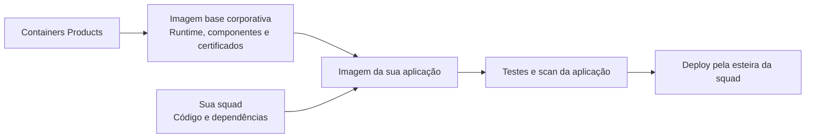
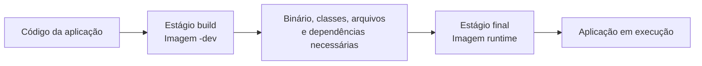
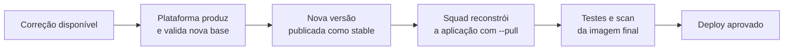
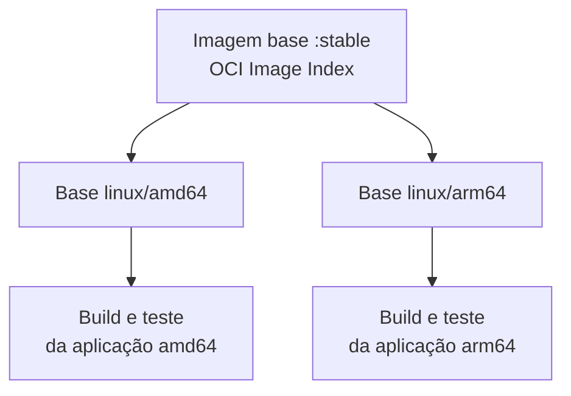

# Imagens base corporativas — Guia do desenvolvedor

O destino consumidor desta Factory é **HOM**, na conta `248908662184`, região
`sa-east-1`: `248908662184.dkr.ecr.sa-east-1.amazonaws.com/image-base-<framework>:stable`.
A incorporação de uma nova base exige novo build da aplicação. Detalhes de
promoção e recovery ficam no [runbook da Factory](docs/dev-hom-promotion.md).

> **Menos manutenção da base. Mais foco na sua aplicação.**
>
> Containers Products mantém a imagem base. Sua squad acrescenta a aplicação, valida o resultado e controla seu deploy.

**Público:** desenvolvedores e squads que vão consumir as imagens.\
**Escopo:** benefícios, responsabilidades e uso das imagens no Dockerfile da sua aplicação.\
**Atualizado em:** 28/09/2026.

> **Imagens base disponíveis para consumo.**
> As imagens são distribuídas pelo registry corporativo de Image Base.
> Utilize a tag `stable` nos exemplos de Dockerfile deste guia.

**Comece por aqui:** [Começar agora](#quick-start) · [Ver catálogo](#catalogo) · [Exemplos](#exemplos) · [Troubleshooting](#troubleshooting)

## Navegação

| Entenda a proposta | Comece a usar | Mantenha sua aplicação |
| --- | --- | --- |
| [1. O que é a solução?](#visao-geral) | [6. Qual imagem devo usar?](#catalogo) | [10. Atualizações e CVEs](#atualizacoes) |
| [2. Por que usar?](#por-que-usar) | [7. Runtime × `-dev`](#runtime-dev) | [11. Certificados](#certificados) |
| [3. Glossário rápido](#glossario) | [8. Quick Start](#quick-start) | [12. amd64 × arm64](#arquiteturas) |
| [4. O que você ganha?](#beneficios) | [9. Exemplos por linguagem](#exemplos) | [13. Troubleshooting](#troubleshooting) |
| [5. Matriz RACI](#responsabilidades) | | [14. FAQ](#faq) · [15. Suporte](#suporte) |

Atalhos por linguagem: [Java](#exemplo-java) · [Go](#exemplo-go) · [.NET](#exemplo-dotnet) · [Node.js](#exemplo-nodejs) · [Python](#exemplo-python)

---

<a id="visao-geral"></a>
## 1. O que é a solução?

As imagens base corporativas são a **fundação do container da sua aplicação**: fornecem o ambiente de execução, as bibliotecas essenciais e a integração de certificados prevista para a base.

**Containers Products** constrói essas bases, executa verificações e testes e as distribui pelo **Amazon ECR**, o registro de imagens usado pelo produto. Sua squad consome uma base no `FROM` do Dockerfile e acrescenta seu código ou artefato compilado.



**As imagens base não são uma plataforma de deploy.** O produto não implanta seu serviço, não administra seus secrets e não atualiza automaticamente aplicações já construídas.

---

<a id="por-que-usar"></a>
## 2. Por que usar as imagens corporativas?

**Porque manter uma aplicação não deveria exigir que cada squad mantenha, sozinha, toda a base do seu container.**

Ao partir de uma distribuição genérica, o time também precisa decidir quais pacotes instalar, como disponibilizar o runtime, como tratar certificados e como acompanhar atualizações dessa base. As imagens corporativas centralizam essa fundação e reduzem a repetição dessas decisões entre squads.

| Sem uma base comum | Com a imagem base corporativa |
| --- | --- |
| Cada squad escolhe e adapta sua fundação. | Existe um catálogo comum de runtimes e variantes. |
| Certificados e componentes básicos podem seguir estratégias diferentes. | A plataforma mantém o contrato da base e sua integração de confiança. |
| Ferramentas de compilação podem acabar no container final. | O modelo separa construção da aplicação e execução. |
| A origem e o conteúdo da base exigem controles próprios. | A base vem com identidade e evidências verificáveis. |

Isso **não significa que imagens externas sejam necessariamente inseguras**, nem que migrar seja apenas trocar uma linha. O ganho é consumir um produto de plataforma com responsabilidades, testes e distribuição padronizados.

**Distroless** descreve o perfil mínimo do runtime, sem shell ou gerenciador de pacotes no perfil final previsto. **Hardened** acrescenta controles de segurança, manutenção e verificabilidade a essa base. Uma imagem Distroless não é automaticamente Hardened, e imagem pequena, sozinha, não é garantia de segurança. Veja o [glossário rápido](#glossario).

---

<a id="glossario"></a>
## 3. Glossário rápido

| Termo | Significado |
| --- | --- |
| **Hardened** | Imagem mantida com foco em redução de superfície de ataque, conteúdo controlado, tratamento de vulnerabilidades, manutenção e evidências verificáveis de supply chain. |
| **Distroless** | Imagem orientada ao runtime, sem ferramentas gerais desnecessárias à execução, como shell e gerenciador de pacotes no perfil final. |
| **Slim** | Variante reduzida de uma imagem convencional. O termo indica redução de conteúdo, mas não define sozinho controles de segurança, manutenção ou supply chain. |
| **Scratch** | Ponto de partida vazio para uma imagem OCI. Tudo o que a aplicação precisa para executar deve ser fornecido explicitamente. |
| **Runtime** | Imagem destinada à execução da aplicação, sem o toolchain de desenvolvimento. |
| **`-dev`** | Variante destinada ao estágio de construção, contendo ferramentas como SDK, JDK, compilador ou npm conforme a família. |
| **`stable`** | Referência atualmente disponibilizada pelo Containers Products para consumo daquela família e versão. |
| **SBOM** | Inventário dos componentes presentes no artefato publicado. |
| **Assinatura** | Evidência verificável associada à identidade que assinou o artefato. |
| **Provenance** | Evidência verificável sobre a origem e o processo utilizado para produzir o artefato. |
| **CVE** | Identificador de uma vulnerabilidade conhecida. |
| **Multiarch** | Disponibilização da mesma referência de imagem para diferentes arquiteturas, neste produto `linux/amd64` e `linux/arm64`. |

Distroless e Hardened não são sinônimos. Distroless descreve principalmente o perfil mínimo do runtime. Hardening acrescenta controles sobre conteúdo, manutenção, vulnerabilidades, testes e verificabilidade do artefato.

Uma imagem slim pode ter menos componentes, mas tamanho reduzido, sozinho, não define uma postura de segurança.

---

<a id="beneficios"></a>
## 4. O que você ganha?

| Benefício | O que muda para sua squad |
| --- | --- |
| **Manutenção centralizada da base** | Você não precisa repetir a composição do runtime e dos componentes básicos em cada projeto. |
| **Menos componentes desnecessários** | Compiladores, shells e ferramentas de desenvolvimento ficam fora do estágio final quando não são necessários à execução. |
| **Correções disponibilizadas pela plataforma** | Novas bases podem incorporar patches disponíveis; sua aplicação passa a usá-las ao ser reconstruída a partir da tag `stable`. |
| **Certificados padronizados** | A integração de confiança da base deixa de ser uma solução improvisada em cada Dockerfile. |
| **Duas arquiteturas** | As bases do catálogo contemplam `linux/amd64` e `linux/arm64`; sua aplicação também precisa ser construída e testada para a arquitetura de destino. |
| **Testes além do scan** | Os contratos verificam execução, versão, identidade do processo, filesystem e confiança TLS conforme a família. |
| **Conteúdo e origem verificáveis** | A base é publicada com assinatura, SBOM e provenance, que registram o que foi publicado e sua origem. |
| **Um padrão de consumo** | Java, Go, .NET, Node.js e Python compartilham a mesma convenção de uso no Dockerfile. |

### Os termos de segurança, sem complicação

**CVE** é um identificador de vulnerabilidade conhecida. **Trivy** é o scanner: identifica vulnerabilidades e segredos segundo a política configurada; não aplica correções. **SBOM** é o inventário de componentes. **Assinatura** permite verificar a identidade de quem assinou o artefato. **Provenance** é uma declaração verificável sobre sua origem e produção.

**Não há promessa de zero CVE, compatibilidade universal ou prazo de correção não formalizado.** A base reduz componentes e centraliza controles, mas não substitui código seguro, scan da imagem final ou configuração segura do ambiente. Ganhos de tamanho, desempenho e quantidade de findings devem ser medidos na aplicação migrada.

---

<a id="responsabilidades"></a>
## 5. Responsabilidades — matriz RACI

**R:** executa a atividade. **A:** responde pelo resultado. **C:** é consultado. **I:** é informado. **R/A** reúne execução e responsabilidade pelo resultado.

A matriz abaixo resume as responsabilidades no consumo das imagens base. Não substitui as atribuições formais de Segurança, PKI, Cloud ou dos responsáveis pelo ambiente de execução.

| Atividade | Containers Products | Squad da aplicação |
| --- | :---: | :---: |
| Manter o catálogo e a composição das bases | **R/A** | I |
| Atualizar runtimes e pacotes da base, incorporando correções disponíveis | **R/A** | I |
| Integrar CAs aprovadas ao contrato técnico da base, em conjunto com PKI | **R/A** | I |
| Executar o scan e tratar findings dos componentes da base | **R/A** | C |
| Testar e publicar novas versões da base | **R/A** | I |
| Produzir assinatura, SBOM e provenance da base | **R/A** | I |
| Disponibilizar a tag `stable` e comunicar mudanças relevantes da base | **R/A** | I |
| Escolher a base compatível com a aplicação | C | **R/A** |
| Manter código e dependências da aplicação | C | **R/A** |
| Escanear e tratar vulnerabilidades da imagem final da aplicação | C | **R/A** |
| Incorporar a base atualizada e reconstruir a aplicação | I | **R/A** |
| Testar compatibilidade, funcionalidade e desempenho após a atualização | C | **R/A** |
| Fazer deploy e rollback da aplicação | I | **R/A** |
| Configurar secrets e permissões do workload | C | **R/A** |
| Operar a aplicação e comunicar falhas reproduzíveis relacionadas à base | C | **R/A** |

> **Plataforma cuida da base; squad cuida da aplicação.** Uma correção disponibilizada na base só chega ao serviço quando a aplicação incorpora essa base, é reconstruída, testada e implantada.

A plataforma integra certificados aprovados; não se torna a autoridade emissora das CAs. Exceções de segurança e prazos de correção seguem a governança corporativa aplicável.

---

<a id="catalogo"></a>
## 6. Qual imagem devo usar?

Escolha primeiro a **família e a versão compatíveis com sua aplicação**. Depois, verifique se precisa de um estágio de compilação/preparação ou somente do runtime.

| Aplicação | Imagem de execução | Imagem de construção/preparação |
| --- | --- | --- |
| Java 21 | `image-base-java21:stable` | `image-base-java21-dev:stable` |
| Java 25 | `image-base-java25:stable` | `image-base-java25-dev:stable` |
| Go 1.25 | `image-base-go1-25:stable` | `image-base-go1-25-dev:stable` |
| Go 1.26 | `image-base-go1-26:stable` | `image-base-go1-26-dev:stable` |
| .NET 10 / ASP.NET Core | `image-base-dotnet10:stable` | `image-base-dotnet10-dev:stable` |
| Node.js 22 | `image-base-nodejs22:stable` | `image-base-nodejs22-dev:stable` |
| Node.js 24 | `image-base-nodejs24:stable` | `image-base-nodejs24-dev:stable` |
| Python 3.13 | `image-base-python3-13:stable` | Sem variante `-dev` neste catálogo |
| Python 3.14 | `image-base-python3-14:stable` | Sem variante `-dev` neste catálogo |

O catálogo reúne **16 imagens: nove runtimes e sete variantes `-dev`**.

Para cada framework disponível no catálogo, a tag `stable` identifica a versão atualmente disponibilizada pelo Containers Products para consumo. Os exemplos deste guia utilizam essa tag.

Para a primeira migração, preserve a linha de runtime que sua aplicação já suporta. Trocar a imagem base e a versão principal da linguagem ao mesmo tempo dificulta identificar a causa de incompatibilidades.

---

<a id="runtime-dev"></a>
## 7. Entendendo runtime × `-dev`

**Runtime** é o ambiente necessário para executar a aplicação. **`-dev`** contém ferramentas para construí-la ou prepará-la: JDK, SDK .NET, compilador Go ou Node com npm, conforme a família.



**Multi-stage** é um Dockerfile com mais de um estágio. Você compila no primeiro e copia somente a saída necessária para o último. O SDK não precisa acompanhar o aplicativo no container final.

**Atenção: `-dev` não é um ambiente.** É uma variante de imagem usada no estágio de construção do Dockerfile; o estágio final usa sempre a variante runtime.

Use o `-dev` e o runtime **da mesma família e versão** — por exemplo, `image-base-java21-dev:stable` no build e `image-base-java21:stable` no estágio final.

Python não ter `-dev` não significa que qualquer biblioteca Python possa ser instalada sem preparação. Dependências externas e extensões nativas exigem uma estratégia de build compatível com o runtime.

---

<a id="quick-start"></a>
## 8. Quick Start — uma aplicação funcionando

Este exemplo usa **Python 3.13 e biblioteca padrão**, sem instalar pacotes. É um servidor HTTP demonstrativo para testar o consumo da base, não um servidor recomendado para tráfego de produção.

### 8.1 Pré-requisitos e acesso

Você precisa de:

- **Docker com Buildx**, executando containers Linux, e um terminal **Bash/Git Bash** para os comandos abaixo;
- **AWS CLI** e uma sessão AWS obtida pelo mecanismo corporativo de autenticação, com **acesso de leitura ao registry corporativo de Image Base**;
- conectividade ao registry;
- o **código da aplicação e seu Dockerfile**.

Na esteira, use os runners e a autenticação aprovados pela empresa. Não use credenciais estáticas.

Defina as variáveis do registry corporativo de Image Base e a arquitetura do seu destino:

```bash
export AWS_REGION='sa-east-1'
export REGISTRY='758421218117.dkr.ecr.sa-east-1.amazonaws.com'
export PLATFORM='linux/amd64' # use linux/arm64 se for seu destino
```

`REGISTRY` é o host do ECR corporativo de Image Base, sem `https://`.

Com sua sessão AWS já autenticada, faça login no registry:

```bash
set -euo pipefail
aws ecr get-login-password --region "$AWS_REGION" \
  | docker login --username AWS --password-stdin "$REGISTRY"
```

Esse é o login documentado pela AWS. Ele não concede permissões que sua identidade não possua, e o token tem validade limitada. [Documentação AWS](https://docs.aws.amazon.com/AmazonECR/latest/userguide/registry_auth.html).

Confirme o acesso baixando a base do exemplo:

```bash
docker pull --platform "$PLATFORM" "$REGISTRY/image-base-python3-13:stable"
```

### 8.2 Crie os arquivos

Em um diretório de teste, crie `app.py`:

```python
import json
import platform
import signal
import threading
from http.server import BaseHTTPRequestHandler, ThreadingHTTPServer


class Handler(BaseHTTPRequestHandler):
    def do_GET(self):
        known = self.path in ("/", "/health", "/ready", "/info")
        body = json.dumps({
            "status": "ok" if known else "not_found",
            "runtime": "python",
            "version": platform.python_version(),
            "architecture": platform.machine(),
        }).encode("utf-8")
        self.send_response(200 if known else 404)
        self.send_header("Content-Type", "application/json")
        self.send_header("Content-Length", str(len(body)))
        self.end_headers()
        self.wfile.write(body)


server = ThreadingHTTPServer(("0.0.0.0", 8080), Handler)


def stop_server(_signum, _frame):
    threading.Thread(target=server.shutdown, daemon=True).start()


signal.signal(signal.SIGTERM, stop_server)
try:
    server.serve_forever()
except KeyboardInterrupt:
    pass
finally:
    server.server_close()
```

Crie `Dockerfile`:

```dockerfile
ARG REGISTRY
FROM ${REGISTRY}/image-base-python3-13:stable

WORKDIR /app
COPY --chown=10000:10000 app.py /app/app.py
EXPOSE 8080
ENTRYPOINT ["/usr/bin/python3", "-B", "/app/app.py"]
```

`ARG REGISTRY` evita gravar a conta no Dockerfile; ele recebe o host do registry, **nunca credenciais**. `COPY --chown` mantém a propriedade dos arquivos coerente com o usuário da base. O `ENTRYPOINT` em formato de lista executa Python diretamente, sem depender de shell.

### 8.3 Construa e execute

```bash
docker buildx build --pull --load \
  --platform "$PLATFORM" \
  --build-arg REGISTRY="$REGISTRY" \
  -t minha-app:teste .

docker run -d --name minha-app-teste \
  --platform "$PLATFORM" \
  --read-only \
  --cap-drop=ALL \
  --security-opt=no-new-privileges \
  --tmpfs /tmp:rw,nosuid,nodev,noexec,size=64m,mode=1777 \
  -p 127.0.0.1:8080:8080 \
  minha-app:teste
```

O host precisa suportar execução da arquitetura escolhida; para outra arquitetura, é necessário um runner nativo correspondente ou emulação aprovada.

Teste **pelo host**, após a inicialização:

```bash
curl --fail http://localhost:8080/health
curl --fail http://localhost:8080/info
docker logs minha-app-teste
```

O esperado é HTTP 200 com `status: ok`, a versão Python e a arquitetura observada. A aplicação do exemplo escuta na porta 8080; `EXPOSE` apenas documenta a porta, não cria um servidor nem publica a porta sozinho.

Finalize apenas o container desta demonstração:

```bash
docker stop --time 15 minha-app-teste
docker rm minha-app-teste
```

**O que você acabou de validar:** acesso à base, construção de uma imagem derivada, execução sem shell e resposta HTTP com filesystem raiz somente leitura. Isso ainda não substitui os testes da sua aplicação.

---

<a id="exemplos"></a>
## 9. Exemplos por linguagem

Todos os exemplos usam a tag `stable` e recebem o host do registry por `ARG REGISTRY`, definido no [Quick Start](#quick-start). Nos exemplos multi-stage, o estágio de build usa a variante `-dev` e o estágio final usa o runtime da mesma família e versão.

Para construir qualquer um deles:

```bash
docker buildx build --pull --load \
  --platform "$PLATFORM" \
  --build-arg REGISTRY="$REGISTRY" \
  -t minha-app:teste .
```

Os modelos abaixo são **adaptáveis à aplicação**. Dependências de Maven, npm, NuGet ou módulos Go devem usar as fontes corporativas autorizadas.

<a id="exemplo-java"></a>
### 9.1 Java — JDK para compilar, JRE para executar

Para uma aplicação simples com `Main.java` na raiz e sem dependências externas:

```dockerfile
ARG REGISTRY

FROM ${REGISTRY}/image-base-java21-dev:stable AS build
ENV HOME=/tmp
WORKDIR /app
COPY --chown=10000:10000 Main.java ./
RUN javac -d /app/classes Main.java

FROM ${REGISTRY}/image-base-java21:stable
WORKDIR /app
COPY --from=build --chown=10000:10000 /app/classes /app/classes
ENTRYPOINT ["java", "-cp", "/app/classes", "Main"]
```

Para Java 25, use `image-base-java25-dev:stable` e `image-base-java25:stable`. Para projetos Maven/Gradle/Spring, adapte o estágio de build e copie a saída apropriada. **JDK não implica Maven ou Gradle pré-instalados.** Wrappers e downloads também precisam de rede, certificados e repositórios aprovados.

Se sua esteira já produziu um JAR executável compatível, basta o runtime:

```dockerfile
ARG REGISTRY
FROM ${REGISTRY}/image-base-java21:stable
WORKDIR /app
COPY --chown=10000:10000 target/app.jar /app/app.jar
ENTRYPOINT ["java", "-jar", "/app/app.jar"]
```

Troque `target/app.jar` pelo caminho real. O uso de `java -jar` pressupõe JAR executável e empacotamento correto das dependências.

<a id="exemplo-go"></a>
### 9.2 Go — compile o binário, não leve o compilador ao runtime

Exemplo para um módulo Go com `main` na raiz, compatível com **`CGO_ENABLED=0`**:

```dockerfile
ARG REGISTRY

FROM ${REGISTRY}/image-base-go1-26-dev:stable AS build
ENV HOME=/tmp GOCACHE=/tmp/gocache GOMODCACHE=/tmp/gomodcache \
    GOPATH=/tmp/gopath GOTOOLCHAIN=local CGO_ENABLED=0
WORKDIR /app
COPY --chown=10000:10000 . .
RUN go build -trimpath -buildvcs=false -o /app/server .

FROM ${REGISTRY}/image-base-go1-26:stable
WORKDIR /app
COPY --from=build --chown=10000:10000 /app/server /app/server
ENTRYPOINT ["/app/server"]
```

Para Go 1.25, use `image-base-go1-25-dev:stable` e `image-base-go1-25:stable`. Configure o proxy de módulos corporativo quando houver dependências. `GOTOOLCHAIN=local` evita que uma exigência de outra versão seja atendida por download implícito de um compilador diferente.

Projetos com CGO ou bibliotecas C exigem validação específica; não desative CGO se a aplicação depende dele. O runtime Go mínimo não contém o comando `go`: sua função é executar o binário entregue pela squad.

<a id="exemplo-dotnet"></a>
### 9.3 .NET — SDK no build, ASP.NET no runtime

Exemplo para um projeto `App.csproj`, com target compatível com .NET 10 e `NuGet.config` da aplicação:

```dockerfile
ARG REGISTRY

FROM ${REGISTRY}/image-base-dotnet10-dev:stable AS build
ENV HOME=/tmp DOTNET_CLI_HOME=/tmp NUGET_PACKAGES=/tmp/nuget \
    DOTNET_CLI_TELEMETRY_OPTOUT=1 DOTNET_NOLOGO=1
WORKDIR /app
COPY --chown=10000:10000 . .
RUN dotnet restore App.csproj --configfile NuGet.config && \
    dotnet publish App.csproj -c Release -o /app/out \
      --no-restore --no-self-contained -p:UseAppHost=false

FROM ${REGISTRY}/image-base-dotnet10:stable
WORKDIR /app
ENV ASPNETCORE_URLS=http://0.0.0.0:8080
COPY --from=build --chown=10000:10000 /app/out/ /app/out/
EXPOSE 8080
ENTRYPOINT ["dotnet", "/app/out/App.dll"]
```

Ajuste o caminho do projeto e o nome da DLL para o `AssemblyName` real. Dependências nativas, publicação self-contained, AOT e necessidades de globalização exigem validação adicional; não estão cobertas por este exemplo genérico.

<a id="exemplo-nodejs"></a>
### 9.4 Node.js — npm na preparação, Node na execução

Exemplo para JavaScript sem transpilation, com `package.json`, `package-lock.json` e `src/server.js`. Este modelo pressupõe dependências que não precisam de scripts de instalação:

```dockerfile
ARG REGISTRY

FROM ${REGISTRY}/image-base-nodejs22-dev:stable AS build
ENV HOME=/tmp npm_config_cache=/tmp/npm-cache
WORKDIR /app
COPY --chown=10000:10000 package.json package-lock.json ./
RUN npm ci --omit=dev --ignore-scripts --no-audit --no-fund
COPY --chown=10000:10000 src/ ./src/

FROM ${REGISTRY}/image-base-nodejs22:stable
WORKDIR /app
ENV NODE_ENV=production
COPY --from=build --chown=10000:10000 /app/ /app/
EXPOSE 8080
ENTRYPOINT ["node", "/app/src/server.js"]
```

Para Node.js 24, use `image-base-nodejs24-dev:stable` e `image-base-nodejs24:stable`. A aplicação precisa escutar no endereço/porta desejados; este Dockerfile não modifica seu servidor.

Para TypeScript, bundles ou frameworks com build, instale as dependências de desenvolvimento no estágio de construção, execute o build e selecione a saída/dependências de produção para o estágio final. Se houver scripts de instalação legítimos, revise-os e ajuste o comando; `--ignore-scripts` não é compatível com todo pacote. Addons nativos precisam corresponder ao Node, Linux, bibliotecas e arquitetura de destino.

<a id="exemplo-python"></a>
### 9.5 Python — fonte sobre o runtime

Para uma aplicação sem bibliotecas externas, use o Dockerfile do [Quick Start](#quick-start) com `image-base-python3-13:stable` ou `image-base-python3-14:stable`. Python não possui variante `-dev` neste catálogo.

**Não presuma que o runtime contém `pip`, compilador ou gerenciador de pacotes do sistema.** Projetos com `requirements.txt`, wheels ou ambientes virtuais precisam preparar suas dependências em um ambiente compatível e autorizado, depois copiar somente o necessário.

Não copie uma `.venv` do Windows/macOS para o container Linux, nem wheels de uma arquitetura para outra. Quando faltar um caminho de build suportado para suas dependências, trate-o com Containers Products antes da adoção, em vez de adicionar ferramentas à base final improvisadamente.

### Cuidados comuns aos exemplos

Use `.dockerignore` para excluir `.git`, `.env`, credenciais, caches e saídas locais indevidas. **Não exclua o artefato que o Dockerfile precisa copiar** — por exemplo, o JAR em `target/` no exemplo Java.

Tokens de registries de dependências devem entrar pelo mecanismo de secrets da esteira/BuildKit, não por `ARG`, `ENV`, URL com senha ou arquivo copiado para a imagem. [Build secrets](https://docs.docker.com/build/building/secrets/).

A assinatura da base **não assina automaticamente sua imagem derivada**, e o SBOM da base não lista as bibliotecas que você adicionar. O scan, a geração de evidências e os controles de release da imagem final continuam na esteira da aplicação.

---

<a id="atualizacoes"></a>
## 10. Como funcionam atualizações e correções de CVE?

**Trivy detecta. A atualização, remoção ou substituição do componente corrige.**

A plataforma incorpora correções disponíveis nos componentes da base, produz e valida uma nova versão e então atualiza a tag `stable`. Esse processo não modifica imagens de aplicações já construídas.



### O novo build vai incorporar a correção?

**Somente se ele consumir a base corrigida.** Com `--pull`, o builder consulta a versão atual da tag `stable` em vez de reutilizar uma cópia local antiga. `--no-cache` não substitui `--pull`. [Docker: atualização de bases](https://docs.docker.com/build/building/best-practices/).

```bash
docker buildx build --pull --load \
  --platform "$PLATFORM" \
  --build-arg REGISTRY="$REGISTRY" \
  -t minha-app:teste .
```

Em multi-stage, o estágio de build também é atualizado pelo `--pull`. Trocar somente o runtime não garante corrigir vulnerabilidades incorporadas ao binário durante a compilação.

**Reiniciar o Pod não reconstrói a aplicação.** Se a imagem final continua a mesma, atualizar a `stable` da base não injeta novas camadas naquele aplicativo.

### E se a aplicação ficar meses sem PR?

Ela continua com a base usada no último build. A squad deve definir um processo de adoção: revisão periódica, rebuild controlado ou automação aprovada que dispare o rebuild e os testes. Esse mecanismo não é entregue automaticamente apenas por adotar as imagens base.

| Onde está o problema? | Tratamento |
| --- | --- |
| Pacote/runtime fornecido pela base | Containers Products avalia e disponibiliza a base corrigida quando a correção existe. |
| Biblioteca adicionada pela aplicação | A squad atualiza a dependência e valida seu uso. |
| Componente incorporado durante build | A squad atualiza os insumos/toolchain pertinentes e recompila. |
| Sem correção disponível | Registrar risco e seguir o processo de análise/exceção; não declarar o problema resolvido. |

O scan da base trata separadamente vulnerabilidades que ainda não têm correção disponível. Portanto, **scan aprovado não significa ausência de todas as vulnerabilidades conhecidas**.

---

<a id="certificados"></a>
## 11. Certificados e conexões HTTPS

Uma **CA**, ou autoridade certificadora, é uma raiz/intermediária de confiança usada na validação de certificados. **TLS** protege conexões como HTTPS. O **trust store** é o conjunto de autoridades que o cliente aceita.

A base oferece a integração de certificados prevista pelo produto. Isso não significa confiar em qualquer servidor interno: a cadeia apresentada precisa ser válida, corresponder ao hostname e estar coberta pelas autoridades aprovadas. Uma aplicação que configura um trust store próprio também pode substituir o comportamento da base.

Java pode usar um store próprio da JVM; Node, Python, Go e .NET têm mecanismos diferentes. Não aplique uma única variável de ambiente a todas as linguagens esperando comportamento idêntico.

Se houver `x509: unknown authority` ou erro equivalente, confira a cadeia, hostname, validade, relógio e qual store seu cliente usa. Acione a plataforma/PKI para tratar CAs ausentes; não use `curl -k`, `verify=False`, `NODE_TLS_REJECT_UNAUTHORIZED=0` ou callbacks que aceitam qualquer certificado como correção.

**Certificado cliente e chave privada para mTLS não são CA bundle.** Eles pertencem à configuração segura da aplicação e não devem ser incorporados à base compartilhada. Da mesma forma, assinatura Cosign da imagem e confiança HTTPS são controles distintos.

---

<a id="arquiteturas"></a>
## 12. amd64 × arm64

`amd64` é a arquitetura x86-64. `arm64` é a arquitetura ARM de 64 bits. Um **OCI Image Index** reúne as versões da imagem para as plataformas disponíveis, permitindo ao cliente selecionar a correspondente. [Docker: multi-platform](https://docs.docker.com/build/building/multi-platform/).



**A base ser multiarch não torna sua aplicação multiarch automaticamente.** Bibliotecas nativas, wheels Python, addons Node, CGO, JNI e dependências .NET específicas precisam corresponder ao destino.

Teste uma arquitetura por vez:

```bash
docker buildx build --pull --load \
  --platform linux/amd64 \
  --build-arg REGISTRY="$REGISTRY" \
  -t minha-app:amd64 .

docker buildx build --pull --load \
  --platform linux/arm64 \
  --build-arg REGISTRY="$REGISTRY" \
  -t minha-app:arm64 .
```

Execute e teste cada saída em um host compatível ou por emulação aprovada; presença do manifest não comprova execução. QEMU permite emulação, mas pode ser mais lento e não substitui benchmark no hardware de destino.

A publicação da imagem final multiarch deve ocorrer na esteira da squad e no registry da aplicação — **não nos repositórios `image-base-*`**.

---

<a id="troubleshooting"></a>
## 13. Troubleshooting em Distroless

A ausência de `/bin/sh`, Bash, curl ou gerenciador de pacotes no runtime é esperada. Comece por logs, estado do container, eventos e configuração do workload, sem instalar ferramentas na imagem final.

```bash
# Desenvolvimento local
docker logs minha-app-teste
docker inspect minha-app-teste

# Kubernetes: use somente no namespace/contexto autorizado
kubectl logs '<pod>' -n '<namespace>' -c '<container>'
kubectl describe pod '<pod>' -n '<namespace>'
```

Não envie dumps completos de `docker inspect` ou configurações sem revisão: podem conter variáveis sensíveis.

| Sintoma | O que verificar primeiro |
| --- | --- |
| `no basic auth credentials`, 401 ou 403 | Sessão/login, acesso de leitura ao registry corporativo de Image Base, região, registry e conectividade corporativa. |
| Tag ou manifest não encontrado | Nome da imagem, tag `stable` e host do registry. Não crie tags nos repositórios `image-base-*`. |
| `exec format error` | Arquitetura do binário, da imagem e do nó. |
| `/bin/sh` ou `bash` não encontrado | Comando depende de shell ausente; use o executável diretamente. |
| Arquivo existe, mas executável não inicia | Permissão, shebang/CRLF, loader ou biblioteca dinâmica ausente. |
| `permission denied` | UID/GID, propriedade de arquivos e permissões de volumes. Não mude para root como primeira resposta. |
| `read-only file system` | Aplicação tentou gravar fora de um mount autorizado; configure diretórios graváveis específicos. |
| Erro TLS | Cadeia/CA, hostname e trust store realmente usado pelo cliente. |
| JAR/DLL/módulo não encontrado | Caminho de `COPY`, saída do build, dependências e comando de entrada. |

### Diagnóstico interativo

Para diagnóstico interativo em Kubernetes, use **o toolkit e o processo de ephemeral container aprovados pela plataforma**. O container efêmero fornece ferramentas separadamente; não exige transformar a aplicação em uma imagem de troubleshooting. Seu uso depende de autorização e das políticas do cluster. [Kubernetes: debug de Pods](https://kubernetes.io/docs/tasks/debug/debug-application/debug-running-pod/).

O toolkit corporativo de troubleshooting é mantido no repositório `https://github.com/itau-corp/<REPOSITORIO_TROUBLESHOOTING>` (nome do repositório pendente de preenchimento).

### Segurança da execução continua sendo configuração do workload

O usuário previsto pela base é UID/GID `10000`. Root filesystem somente leitura e restrições de privilégio precisam ser configurados no runtime; não são impostos para sempre pelo Dockerfile da base.

Exemplo de **trecho do container** em um manifesto Kubernetes:

```yaml
securityContext:
  runAsNonRoot: true
  runAsUser: 10000
  runAsGroup: 10000
  readOnlyRootFilesystem: true
  allowPrivilegeEscalation: false
  capabilities:
    drop: ["ALL"]
  seccompProfile:
    type: RuntimeDefault
```

Adicione os volumes/mounts graváveis que sua aplicação realmente precisa; esse trecho isolado não os cria. Valide a compatibilidade com os padrões do cluster. [Kubernetes: security context](https://kubernetes.io/docs/tasks/configure-pod-container/security-context/).

---

<a id="faq"></a>
## 14. Perguntas frequentes

**Posso fazer `RUN apk add`, `apt-get` ou instalar Bash no runtime?**\
Não conte com esses comandos na base final. Uma dependência adicional de sistema precisa ser avaliada no contrato da base. Não use a variante `-dev` como runtime apenas para contornar a ausência de ferramentas.

**Preciso conhecer como as imagens base são construídas?**\
Não. Para consumir a solução, utilize a imagem correspondente com a tag `stable` no Dockerfile e siga o fluxo de autenticação e testes deste guia.

**Preciso da imagem `-dev` se meu pipeline já compila?**\
Não necessariamente. Você pode copiar o artefato pronto para o runtime, desde que ele seja compatível com a versão, o sistema, as bibliotecas e a arquitetura de destino.

**Uso `:stable` nos dois estágios?**\
Sim. Os exemplos usam `stable` no estágio de build (`-dev`) e no estágio final (runtime), sempre da mesma família e versão.

**Posso usar `-dev` como imagem final da aplicação?**\
Não é o padrão recomendado. `-dev` é para o estágio de construção; o estágio final usa o runtime. `-dev` descreve a função da imagem, não um ambiente.

**Minha aplicação terá `/health`, `/ready` e `/info` automaticamente?**\
Não. Esses endpoints existem apenas na aplicação do Quick Start. Sua aplicação implementa seus próprios endpoints e probes.

**A imagem vem com todas as bibliotecas da minha aplicação?**\
Não. Spring, dependências npm/Python/NuGet e bibliotecas internas pertencem à aplicação. A base não é um ambiente de desenvolvimento completo.

**O scan verde elimina a necessidade de scan da minha imagem final?**\
Não. Seu código, suas dependências e seus arquivos acrescentam conteúdo que não existia na base. Assinatura da base também não comprova segurança desse conteúdo.

**Atualizar a tag da base e reiniciar o Pod corrige tudo?**\
Não. É necessário reconstruir a aplicação usando os insumos corrigidos, testar e fazer deploy da nova imagem final.

**Como faço rollback?**\
Pelo processo de release da aplicação, usando uma imagem final anterior retida e autorizada. Mudanças na `stable` da base não alteram deployments existentes nem substituem o rollback da squad.

---

<a id="suporte"></a>
## 15. Suporte e adoção assistida

Comece por uma aplicação de baixo risco, preserve a versão de runtime quando possível e compare funcionamento, tamanho e findings antes/depois. Valide com os testes da própria aplicação antes de expandir o uso.

O responsável pelo produto é **Containers Products**. O canal oficial de atendimento está pendente de publicação neste guia. Este guia não define endereço de suporte nem SLA.

Ao solicitar ajuda, forneça uma reprodução sem secrets:

```text
Aplicação / squad:
Arquitetura:
Imagem base utilizada (ex.: image-base-java21:stable):
Imagem -dev utilizada, se houver:
Link do job da esteira da aplicação, se houver:
Etapa da falha: pull / build / startup / runtime / TLS
Mensagem de erro sanitizada:
Comportamento esperado e observado:
Dockerfile mínimo ou instruções de reprodução:
Impacto e urgência:
```

Não envie tokens, chaves privadas, senhas, arquivos `.env` completos ou dumps sensíveis.

### Checklist de adoção

- [ ] Acesso de leitura ao registry corporativo de Image Base confirmado e `docker pull` da base funcionando.
- [ ] Dockerfile usa a tag `stable`; nos multi-stage, `-dev` e runtime da mesma família e versão.
- [ ] Artefato final deriva do runtime, sem toolchain desnecessário.
- [ ] Testes, scan da aplicação, TLS, permissões de escrita e shutdown validados.
- [ ] Arquiteturas necessárias realmente construídas e executadas.
- [ ] Processo de rebuild da aplicação definido para incorporar atualizações da base.
- [ ] Deploy/rollback e canal de suporte conhecidos.

### Referências externas

Documentação oficial [Dockerfile](https://docs.docker.com/reference/dockerfile/), [Buildx](https://docs.docker.com/reference/cli/docker/buildx/build/), [boas práticas de build](https://docs.docker.com/build/building/best-practices/), [secrets de build](https://docs.docker.com/build/building/secrets/), [multiarch](https://docs.docker.com/build/building/multi-platform/), [autenticação ECR](https://docs.aws.amazon.com/AmazonECR/latest/userguide/registry_auth.html), [security context](https://kubernetes.io/docs/tasks/configure-pod-container/security-context/) e [debug de Pods](https://kubernetes.io/docs/tasks/debug/debug-application/debug-running-pod/).

---

> **Você recebe uma base padronizada e verificável. Sua squad mantém o controle da aplicação — inclusive quando incorporar uma atualização e quando fazer deploy.**
