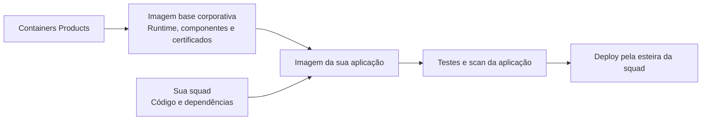
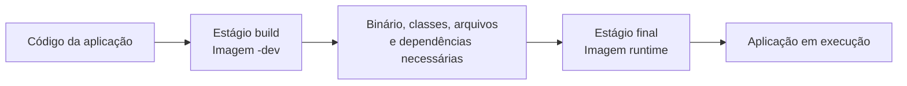
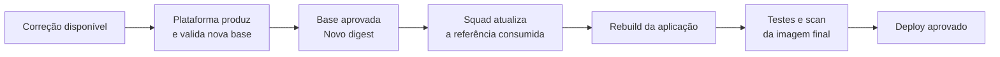
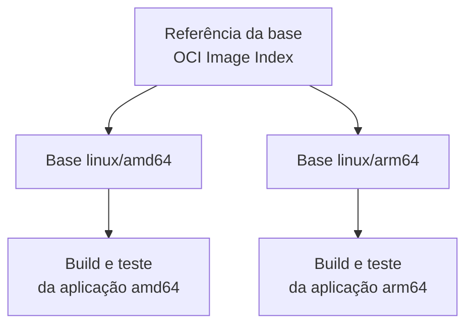

# Imagens base corporativas — Guia do desenvolvedor

> **Menos manutenção da base. Mais foco na sua aplicação.**
>
> Containers Products mantém a imagem base. Sua squad acrescenta a aplicação, valida o resultado e controla seu deploy.

**Público:** desenvolvedores e squads que vão consumir as imagens.  
**Escopo:** benefícios, responsabilidades e primeiros passos; os detalhes internos da Factory ficam na documentação técnica.  
**Edição:** 28/09/2026 — versão para revisão e publicação no projeto.

**Antes de começar:** confirme com Containers Products o registry, o ambiente e a versão liberados para sua squad. O catálogo definido não garante que todas as tags `stable` estejam disponíveis em todos os ambientes. Os exemplos abaixo são modelos de consumo; os Dockerfiles ainda precisam ser executados e homologados sobre as referências corporativas aprovadas.

## Navegação

| Entenda a proposta | Comece a usar | Mantenha sua aplicação |
| --- | --- | --- |
| [1. O que é a solução?](#visao-geral) | [5. Qual imagem devo usar?](#catalogo) | [10. Atualizações e CVEs](#atualizacoes) |
| [2. Por que usar?](#por-que-usar) | [6. Runtime × `-dev`](#runtime-dev) | [11. Certificados](#certificados) |
| [3. O que você ganha?](#beneficios) | [7. Quick Start](#quick-start) | [12. amd64 × arm64](#arquiteturas) |
| [4. Matriz RACI](#responsabilidades) | [8. Exemplos por linguagem](#exemplos) | [13. Troubleshooting](#troubleshooting) |
| | [9. `stable`, tag e digest](#referencias) | [14. FAQ](#faq) · [15. Suporte](#suporte) |

---

<a id="visao-geral"></a>
## 1. O que é a solução?

As imagens base corporativas são a **fundação do container da sua aplicação**: fornecem o ambiente de execução, as bibliotecas essenciais e a integração de certificados prevista para a base.

A Factory, mantida pelo **Containers Products**, constrói essas bases, executa verificações e testes e as distribui pelo **Amazon ECR**, o registro de imagens usado pelo produto. Sua squad consome uma base no `FROM` do Dockerfile e acrescenta seu código ou artefato compilado.



**A Factory não é uma plataforma de deploy.** Ela não implanta seu serviço, não administra seus secrets e não atualiza automaticamente aplicações já construídas.

---

<a id="por-que-usar"></a>
## 2. Por que usar as imagens corporativas?

**Porque manter uma aplicação não deveria exigir que cada squad mantenha, sozinha, toda a base do seu container.**

Ao partir de uma distribuição genérica, o time também precisa decidir quais pacotes instalar, como disponibilizar o runtime, como tratar certificados e como acompanhar atualizações dessa base. A proposta da RFC-013 é centralizar essa fundação e reduzir a repetição dessas decisões entre squads.

| Sem uma base comum | Com a imagem base corporativa |
| --- | --- |
| Cada squad escolhe e adapta sua fundação. | Existe um catálogo comum de runtimes e variantes. |
| Certificados e componentes básicos podem seguir estratégias diferentes. | A plataforma mantém o contrato da base e sua integração de confiança. |
| Ferramentas de compilação podem acabar no container final. | O modelo separa construção da aplicação e execução. |
| A origem e o conteúdo da base exigem controles próprios. | A base vem com identidade e evidências verificáveis. |

Isso **não significa que imagens externas sejam necessariamente inseguras**, nem que migrar seja apenas trocar uma linha. O ganho é consumir um produto de plataforma com responsabilidades, testes e distribuição padronizados.

**Distroless** descreve o runtime mínimo, sem shell ou gerenciador de pacotes no perfil final previsto. **Hardened** acrescenta controles de segurança e manutenção a essa base. Imagem pequena, sozinha, não é garantia de segurança.

---

<a id="beneficios"></a>
## 3. O que você ganha?

| Benefício | O que muda para sua squad |
| --- | --- |
| **Manutenção centralizada da base** | Você não precisa repetir a composição do runtime e dos componentes básicos em cada projeto. |
| **Menos componentes desnecessários** | Compiladores, shells e ferramentas de desenvolvimento ficam fora do estágio final quando não são necessários à execução. |
| **Correções disponibilizadas pela plataforma** | Novas bases podem incorporar patches disponíveis; sua esteira consome a versão aprovada em um novo build. |
| **Certificados padronizados** | A integração de confiança da base deixa de ser uma solução improvisada em cada Dockerfile. |
| **Duas arquiteturas** | As bases do catálogo contemplam `linux/amd64` e `linux/arm64`; sua aplicação também precisa ser construída e testada para a arquitetura de destino. |
| **Testes além do scan** | Os contratos verificam execução, versão, identidade do processo, filesystem e confiança TLS conforme a família. |
| **Conteúdo e origem verificáveis** | Digest, assinatura, SBOM e provenance permitem conferir o que foi recebido e sua origem. |
| **Um padrão de consumo** | Java, Go, .NET, Node.js e Python compartilham a mesma convenção de distribuição. |

### Os termos de segurança, sem complicação

**CVE** é um identificador de vulnerabilidade conhecida. **Trivy** é o scanner: identifica vulnerabilidades e segredos segundo a política configurada; não aplica correções. **SBOM** é o inventário de componentes. **Assinatura** permite verificar a identidade de quem assinou o artefato. **Provenance** é uma declaração verificável sobre sua origem e produção.

**Não há promessa de zero CVE, compatibilidade universal ou prazo de correção não formalizado.** A base reduz componentes e centraliza controles, mas não substitui código seguro, scan da imagem final ou configuração segura do ambiente. Ganhos de tamanho, desempenho e quantidade de findings devem ser medidos na aplicação migrada.

---

<a id="responsabilidades"></a>
## 4. Responsabilidades — matriz RACI

**R:** executa a atividade. **A:** responde pelo resultado. **C:** é consultado. **I:** é informado. **R/A** reúne execução e responsabilidade pelo resultado.

A matriz abaixo expressa o contrato de consumo proposto para este guia. Não substitui as atribuições formais de Segurança, PKI, Cloud ou dos responsáveis pelo ambiente de execução.

| Atividade | Containers Products | Squad da aplicação |
| --- | :---: | :---: |
| Manter o catálogo e a composição das bases | **R/A** | I |
| Atualizar runtimes e pacotes da base, incorporando correções disponíveis | **R/A** | I |
| Integrar e atualizar CAs aprovadas na base, em conjunto com PKI | **R/A** | I |
| Executar o scan e tratar findings dos componentes da base | **R/A** | C |
| Testar e publicar novas versões da base | **R/A** | I |
| Produzir assinatura, SBOM e provenance da base | **R/A** | I |
| Disponibilizar referências aprovadas e comunicar mudanças relevantes da base | **R/A** | I |
| Escolher a base compatível com a aplicação | C | **R/A** |
| Manter código e dependências da aplicação | C | **R/A** |
| Escanear e tratar vulnerabilidades da imagem final da aplicação | C | **R/A** |
| Incorporar a base atualizada e reconstruir a aplicação | I | **R/A** |
| Testar compatibilidade, funcionalidade e desempenho após a atualização | C | **R/A** |
| Fazer deploy e rollback da aplicação | I | **R/A** |
| Configurar secrets e permissões do workload | C | **R/A** |
| Operar a aplicação e comunicar falhas reproduzíveis relacionadas à base | C | **R/A** |

> **Plataforma cuida da base; squad cuida da aplicação.** Uma correção disponibilizada na base só chega ao serviço quando a aplicação incorpora essa base, é reconstruída, testada e implantada.

A plataforma integra certificados aprovados; não se torna a autoridade emissora das CAs. Exceções de segurança e prazos de correção seguem a governança corporativa aplicável.

---

<a id="catalogo"></a>
## 5. Qual imagem devo usar?

Escolha primeiro a **família e a versão compatíveis com sua aplicação**. Depois, verifique se precisa de um estágio de compilação/preparação ou somente do runtime.

| Aplicação | Imagem de execução | Imagem de construção/preparação |
| --- | --- | --- |
| Java 21 | `image-base-java21` | `image-base-java21-dev` |
| Java 25 | `image-base-java25` | `image-base-java25-dev` |
| Go 1.25 | `image-base-go1-25` | `image-base-go1-25-dev` |
| Go 1.26 | `image-base-go1-26` | `image-base-go1-26-dev` |
| .NET 10 / ASP.NET Core | `image-base-dotnet10` | `image-base-dotnet10-dev` |
| Node.js 22 | `image-base-nodejs22` | `image-base-nodejs22-dev` |
| Node.js 24 | `image-base-nodejs24` | `image-base-nodejs24-dev` |
| Python 3.13 | `image-base-python3-13` | Sem variante `-dev` neste catálogo |
| Python 3.14 | `image-base-python3-14` | Sem variante `-dev` neste catálogo |

O catálogo descrito reúne **16 imagens: nove runtimes e sete variantes `-dev`**. Fonte: [definições dos frameworks](../frameworks/).

Para a primeira migração, preserve a linha de runtime que sua aplicação já suporta. Trocar a imagem base e a versão principal da linguagem ao mesmo tempo dificulta identificar a causa de incompatibilidades.

**Confirme o ambiente de consumo.** DEV é o ambiente interno do time. HOM, associado à `staging` no modelo de evolução, é o destino previsto para testes dos usuários finais; sua liberação não deve ser presumida. `main` está reservada para uma futura produção real. Uma `stable` de DEV não é automaticamente uma aprovação para HOM ou PROD.

---

<a id="runtime-dev"></a>
## 6. Entendendo runtime × `-dev`

**Runtime** é o ambiente necessário para executar a aplicação. **`-dev`** contém ferramentas para construí-la ou prepará-la: JDK, SDK .NET, compilador Go ou Node com npm, conforme a família.



**Multi-stage** é um Dockerfile com mais de um estágio. Você compila no primeiro e copia somente a saída necessária para o último. O SDK não precisa acompanhar o aplicativo no container final.

**Atenção: `-dev` não significa ambiente DEV.** É uma variante de imagem para construção, que também pode ser usada na esteira de uma aplicação destinada a HOM ou PROD. O ambiente é definido pelo destino e pelo processo de release.

Nos pares Go, Java e .NET, use as referências runtime/`-dev` da **mesma release aprovada**. Não misture digests de releases diferentes. Para Node, o uso dev → runtime é um padrão de consumo; ele não transforma as variantes em um par de promoção no modelo atual.

Python não ter `-dev` não significa que qualquer biblioteca Python possa ser instalada sem preparação. Dependências externas e extensões nativas exigem uma estratégia de build compatível com o runtime.

---

<a id="quick-start"></a>
## 7. Quick Start — uma aplicação funcionando

Este exemplo usa **Python 3.13 e biblioteca padrão**, sem instalar pacotes. É um servidor HTTP demonstrativo para testar o consumo da base, não um servidor recomendado para tráfego de produção.

### 7.1 Pré-requisitos e acesso

Você precisa de Docker/Buildx com containers Linux, uma sessão AWS corporativa autorizada a ler o ECR e conectividade ao registry. Na esteira, use os runners e a autenticação aprovados pela empresa; não copie credenciais estáticas da plataforma.

Os comandos abaixo usam **Bash/Git Bash**. Ajuste os valores:

```bash
export AWS_REGION='sa-east-1'  # substitua se o destino aprovado for outro
export REGISTRY='<conta-do-registry>.dkr.ecr.sa-east-1.amazonaws.com'
export PLATFORM='linux/amd64' # use linux/arm64 se for seu destino
```

`REGISTRY` é o host do ECR, sem `https://`. O número da conta é o do registry fornecedor da base, não necessariamente o da sua aplicação.

Com sua sessão AWS já autenticada:

```bash
set -euo pipefail
aws ecr get-login-password --region "$AWS_REGION" \
  | docker login --username AWS --password-stdin "$REGISTRY"
```

Esse é o login documentado pela AWS. Ele não concede permissões que sua identidade não possua. Acesso ao conteúdo e autenticação no registry são necessários; o token de login tem validade limitada. [Documentação AWS](https://docs.aws.amazon.com/AmazonECR/latest/userguide/registry_auth.html).

Para a demonstração, use a `stable` **somente se ela estiver liberada para esse runtime no ambiente escolhido**:

```bash
export RUNTIME_IMAGE="$REGISTRY/image-base-python3-13:stable"
docker pull --platform "$PLATFORM" "$RUNTIME_IMAGE"
```

Se a plataforma entregar uma referência por digest, use-a diretamente em `RUNTIME_IMAGE`. Não troque por um candidate aleatório quando `stable` não existir.

### 7.2 Crie os arquivos

Em um diretório de teste, crie `app.py`:

```python
import json
import platform
import signal
import threading
from http.server import BaseHTTPRequestHandler, ThreadingHTTPServer


class Handler(BaseHTTPRequestHandler):
    def do_GET(self):
        known = self.path in ("/", "/health", "/ready", "/info")
        body = json.dumps({
            "status": "ok" if known else "not_found",
            "runtime": "python",
            "version": platform.python_version(),
            "architecture": platform.machine(),
        }).encode("utf-8")
        self.send_response(200 if known else 404)
        self.send_header("Content-Type", "application/json")
        self.send_header("Content-Length", str(len(body)))
        self.end_headers()
        self.wfile.write(body)


server = ThreadingHTTPServer(("0.0.0.0", 8080), Handler)


def stop_server(_signum, _frame):
    threading.Thread(target=server.shutdown, daemon=True).start()


signal.signal(signal.SIGTERM, stop_server)
try:
    server.serve_forever()
except KeyboardInterrupt:
    pass
finally:
    server.server_close()
```

Crie `Dockerfile`:

```dockerfile
ARG RUNTIME_IMAGE
FROM ${RUNTIME_IMAGE}

WORKDIR /app
COPY --chown=10000:10000 app.py /app/app.py
EXPOSE 8080
ENTRYPOINT ["/usr/bin/python3", "-B", "/app/app.py"]
```

`COPY --chown` mantém a propriedade dos arquivos coerente com o usuário da base. O `ENTRYPOINT` em formato de lista executa Python diretamente, sem depender de shell.

### 7.3 Construa e execute

```bash
docker buildx build --pull --load \
  --platform "$PLATFORM" \
  --build-arg RUNTIME_IMAGE="$RUNTIME_IMAGE" \
  -t minha-app:teste .

docker run -d --name minha-app-teste \
  --platform "$PLATFORM" \
  --read-only \
  --cap-drop=ALL \
  --security-opt=no-new-privileges \
  --tmpfs /tmp:rw,nosuid,nodev,noexec,size=64m,mode=1777 \
  -p 127.0.0.1:8080:8080 \
  minha-app:teste
```

O host precisa suportar execução da arquitetura escolhida; para outra arquitetura, é necessário um runner nativo correspondente ou emulação aprovada.

Teste **pelo host**, após a inicialização:

```bash
curl --fail http://localhost:8080/health
curl --fail http://localhost:8080/info
docker logs minha-app-teste
```

O esperado é HTTP 200 com `status: ok`, a versão Python e a arquitetura observada. A aplicação do exemplo escuta na porta 8080; `EXPOSE` apenas documenta a porta, não cria um servidor nem publica a porta sozinho.

Finalize apenas o container desta demonstração:

```bash
docker stop --time 15 minha-app-teste
docker rm minha-app-teste
```

**O que você acabou de validar:** acesso à base, construção de uma imagem derivada, execução sem shell e resposta HTTP com filesystem raiz somente leitura. Isso ainda não equivale à homologação da sua aplicação.

---

<a id="exemplos"></a>
## 8. Exemplos por linguagem

Os exemplos usam `ARG BUILD_IMAGE` e `ARG RUNTIME_IMAGE` para evitar gravar uma conta ou ambiente no Dockerfile. Esses argumentos recebem **referências de imagem, nunca credenciais**.

Para os exemplos multi-stage:

```bash
# Referências completas fornecidas/verificadas no processo de release.
export BUILD_IMAGE='<registry>/image-base-<framework>-dev@sha256:<digest-dev>'
export RUNTIME_IMAGE='<registry>/image-base-<framework>@sha256:<digest-runtime>'

docker buildx build --pull --load \
  --platform "$PLATFORM" \
  --build-arg BUILD_IMAGE="$BUILD_IMAGE" \
  --build-arg RUNTIME_IMAGE="$RUNTIME_IMAGE" \
  -t minha-app:teste .
```

Substitua os placeholders pelos valores reais. Para Go/Java/.NET, selecione o par aprovado, não os dois digests mais recentes de forma independente.

Os modelos abaixo são **adaptáveis à aplicação**, inspirados nas [fixtures consumidoras do projeto](../tests/consumer-apps/). Dependências de Maven, npm, NuGet ou módulos Go devem usar as fontes corporativas autorizadas. A ausência de dependências externas nas fixtures de certificação não se aplica automaticamente ao seu projeto.

### 8.1 Java — JDK para compilar, JRE para executar

Para uma aplicação simples com `Main.java` na raiz e sem dependências externas:

```dockerfile
ARG BUILD_IMAGE
ARG RUNTIME_IMAGE

FROM ${BUILD_IMAGE} AS build
ENV HOME=/tmp
WORKDIR /app
COPY --chown=10000:10000 Main.java ./
RUN javac -d /app/classes Main.java

FROM ${RUNTIME_IMAGE}
WORKDIR /app
COPY --from=build --chown=10000:10000 /app/classes /app/classes
ENTRYPOINT ["java", "-cp", "/app/classes", "Main"]
```

Use o par Java 21 ou Java 25, conforme a aplicação. Para projetos Maven/Gradle/Spring, adapte o estágio de build e copie a saída apropriada. **JDK não implica Maven ou Gradle pré-instalados.** Wrappers e downloads também precisam de rede, certificados e repositórios aprovados.

Se sua esteira já produziu um JAR executável compatível, basta o runtime:

```dockerfile
ARG RUNTIME_IMAGE
FROM ${RUNTIME_IMAGE}
WORKDIR /app
COPY --chown=10000:10000 target/app.jar /app/app.jar
ENTRYPOINT ["java", "-jar", "/app/app.jar"]
```

Troque `target/app.jar` pelo caminho real. O uso de `java -jar` pressupõe JAR executável e empacotamento correto das dependências.

### 8.2 Go — compile o binário, não leve o compilador ao runtime

Exemplo para um módulo Go com `main` na raiz, compatível com **`CGO_ENABLED=0`**:

```dockerfile
ARG BUILD_IMAGE
ARG RUNTIME_IMAGE

FROM ${BUILD_IMAGE} AS build
ENV HOME=/tmp GOCACHE=/tmp/gocache GOMODCACHE=/tmp/gomodcache \
    GOPATH=/tmp/gopath GOTOOLCHAIN=local CGO_ENABLED=0
WORKDIR /app
COPY --chown=10000:10000 . .
RUN go build -trimpath -buildvcs=false -o /app/server .

FROM ${RUNTIME_IMAGE}
WORKDIR /app
COPY --from=build --chown=10000:10000 /app/server /app/server
ENTRYPOINT ["/app/server"]
```

Use o par Go 1.25 ou 1.26. Configure o proxy de módulos corporativo quando houver dependências. `GOTOOLCHAIN=local` evita que uma exigência de outra versão seja atendida por download implícito de um compilador diferente.

Projetos com CGO ou bibliotecas C exigem validação específica; não desative CGO se a aplicação depende dele. O runtime Go mínimo não contém o comando `go`: sua função é executar o binário entregue pela squad.

### 8.3 .NET — SDK no build, ASP.NET no runtime

Exemplo para um projeto `App.csproj`, com target compatível com .NET 10 e `NuGet.config` da aplicação:

```dockerfile
ARG BUILD_IMAGE
ARG RUNTIME_IMAGE

FROM ${BUILD_IMAGE} AS build
ENV HOME=/tmp DOTNET_CLI_HOME=/tmp NUGET_PACKAGES=/tmp/nuget \
    DOTNET_CLI_TELEMETRY_OPTOUT=1 DOTNET_NOLOGO=1
WORKDIR /app
COPY --chown=10000:10000 . .
RUN dotnet restore App.csproj --configfile NuGet.config && \
    dotnet publish App.csproj -c Release -o /app/out \
      --no-restore --no-self-contained -p:UseAppHost=false

FROM ${RUNTIME_IMAGE}
WORKDIR /app
ENV ASPNETCORE_URLS=http://0.0.0.0:8080
COPY --from=build --chown=10000:10000 /app/out/ /app/out/
EXPOSE 8080
ENTRYPOINT ["dotnet", "/app/out/App.dll"]
```

Ajuste o caminho do projeto e o nome da DLL para o `AssemblyName` real. Dependências nativas, publicação self-contained, AOT e necessidades de globalização exigem validação adicional; não estão cobertas por este exemplo genérico.

### 8.4 Node.js — npm na preparação, Node na execução

Exemplo para JavaScript sem transpilation, com `package.json`, `package-lock.json` e `src/server.js`. Este modelo pressupõe dependências que não precisam de scripts de instalação:

```dockerfile
ARG BUILD_IMAGE
ARG RUNTIME_IMAGE

FROM ${BUILD_IMAGE} AS build
ENV HOME=/tmp npm_config_cache=/tmp/npm-cache
WORKDIR /app
COPY --chown=10000:10000 package.json package-lock.json ./
RUN npm ci --omit=dev --ignore-scripts --no-audit --no-fund
COPY --chown=10000:10000 src/ ./src/

FROM ${RUNTIME_IMAGE}
WORKDIR /app
ENV NODE_ENV=production
COPY --from=build --chown=10000:10000 /app/ /app/
EXPOSE 8080
ENTRYPOINT ["node", "/app/src/server.js"]
```

Use Node 22 com Node 22-dev, ou Node 24 com Node 24-dev. A aplicação precisa escutar no endereço/porta desejados; este Dockerfile não modifica seu servidor.

Para TypeScript, bundles ou frameworks com build, instale as dependências de desenvolvimento no estágio de construção, execute o build e selecione a saída/dependências de produção para o estágio final. Se houver scripts de instalação legítimos, revise-os e ajuste o comando; `--ignore-scripts` não é compatível com todo pacote. Addons nativos precisam corresponder ao Node, Linux, bibliotecas e arquitetura de destino.

### 8.5 Python — fonte sobre o runtime

Para uma aplicação sem bibliotecas externas, use o Dockerfile do [Quick Start](#quick-start), com a base Python 3.13 ou 3.14.

**Não presuma que o runtime contém `pip`, compilador ou gerenciador de pacotes do sistema.** Projetos com `requirements.txt`, wheels ou ambientes virtuais precisam preparar suas dependências em um ambiente compatível e autorizado, depois copiar somente o necessário.

Não copie uma `.venv` do Windows/macOS para o container Linux, nem wheels de uma arquitetura para outra. Quando faltar um caminho de build suportado para suas dependências, trate-o com Containers Products antes da adoção, em vez de adicionar ferramentas à base final improvisadamente.

### Cuidados comuns aos exemplos

Use `.dockerignore` para excluir `.git`, `.env`, credenciais, caches e saídas locais indevidas. **Não exclua o artefato que o Dockerfile precisa copiar** — por exemplo, o JAR em `target/` no exemplo Java.

Tokens de registries de dependências devem entrar pelo mecanismo de secrets da esteira/BuildKit, não por `ARG`, `ENV`, URL com senha ou arquivo copiado para a imagem. [Build secrets](https://docs.docker.com/build/building/secrets/).

---

<a id="referencias"></a>
## 9. Como escolher `stable`, build tag ou digest

| Referência | Significado | Uso |
| --- | --- | --- |
| `image-base-java21:stable` | Versão aprovada atual daquele destino; pode mudar. | Conveniência para descobrir/consumir uma atualização aprovada. |
| `image-base-java21:<tag-de-build>` | Referência imutável da publicação. | Identificar a release enquanto ela estiver retida. |
| `image-base-java21@sha256:<digest>` | Hash do conteúdo exato da imagem. | Fixar a identidade utilizada no build e registrar evidência. |

**Candidate** é uma publicação que ainda não equivale à aprovação `stable`. Testes assistidos podem consumir candidates por digest, desde que isso esteja explicitamente combinado.

Para um build auditável, prefira receber/resolver e verificar as referências aprovadas, registrar os digests e fornecê-los como argumentos ao Dockerfile. No par compilado, registre **os dois membros da mesma release**. Ler duas tags móveis em momentos diferentes pode não representar o par aprovado.

Um digest fixa identidade, **não garante retenção eterna nem segurança permanente**. Combine a janela de recuperação com a plataforma e preserve também as imagens finais da aplicação necessárias ao seu rollback.

### Verifique a base; escaneie a aplicação

O [contrato de verificação do consumidor](consumer-verification-contract.md) descreve como conferir assinatura, identidade esperada, SBOM e provenance associados ao digest. Use a política de identidade corporativa, não a identidade do LAB.

A assinatura da base **não assina automaticamente sua imagem derivada**. Da mesma forma, o SBOM da base não lista todas as bibliotecas que você adicionar. O scan, a geração de evidências e os controles de release da imagem final continuam na esteira da aplicação.

---

<a id="atualizacoes"></a>
## 10. Como funcionam atualizações e correções de CVE?

**Trivy detecta. A atualização, remoção ou substituição do componente corrige.**

A plataforma incorpora correções disponíveis nos componentes da base, produz outro candidate e aplica seus controles antes de liberar a referência aprovada. Esse processo não modifica imagens de aplicações já construídas.



### O novo build vai incorporar a correção?

**Somente se ele consumir a base corrigida.** Com uma tag móvel, `--pull` pede ao builder que consulte as imagens referenciadas. Com digest fixo, é preciso atualizar o digest primeiro. `--no-cache` não substitui `--pull` e não transforma um digest antigo em outro. [Docker: atualização de bases](https://docs.docker.com/build/building/best-practices/).

```bash
# Para o Dockerfile configurado com a referência aprovada atual:
docker buildx build --pull --load \
  --platform "$PLATFORM" \
  --build-arg RUNTIME_IMAGE="$RUNTIME_IMAGE" \
  -t minha-app:teste .
```

Em multi-stage, atualize também a referência de build quando aplicável. Trocar somente o runtime não garante corrigir vulnerabilidades incorporadas ao binário durante a compilação.

**Reiniciar o Pod não reconstrói a aplicação.** Se a imagem final continua a mesma, atualizar a `stable` da base não injeta novas camadas naquele aplicativo.

### E se a aplicação ficar meses sem PR?

Ela pode continuar com a base antiga. A squad deve definir um processo de adoção: revisão periódica, rebuild controlado ou automação aprovada que proponha atualização das referências e dispare os testes. Esse mecanismo não está entregue automaticamente apenas por adotar a Factory.

| Onde está o problema? | Tratamento |
| --- | --- |
| Pacote/runtime fornecido pela base | Containers Products avalia e disponibiliza a base corrigida quando a correção existe. |
| Biblioteca adicionada pela aplicação | A squad atualiza a dependência e valida seu uso. |
| Componente incorporado durante build | A squad atualiza os insumos/toolchain pertinentes e recompila. |
| Sem correção disponível | Registrar risco e seguir o processo de análise/exceção; não declarar o problema resolvido. |

No baseline documentado, o gate usa `--ignore-unfixed` e reporta os casos sem correção separadamente. Portanto, **scan aprovado não significa ausência de todas as vulnerabilidades conhecidas**. Confirme a política vigente na release consumida.

---

<a id="certificados"></a>
## 11. Certificados e conexões HTTPS

Uma **CA**, ou autoridade certificadora, é uma raiz/intermediária de confiança usada na validação de certificados. **TLS** protege conexões como HTTPS. O **trust store** é o conjunto de autoridades que o cliente aceita.

A base oferece a integração de certificados prevista pelo produto. Isso não significa confiar em qualquer servidor interno: a cadeia apresentada precisa ser válida, corresponder ao hostname e estar coberta pelas autoridades aprovadas. Uma aplicação que configura um trust store próprio também pode substituir o comportamento da base.

Java pode usar um store próprio da JVM; Node, Python, Go e .NET têm mecanismos diferentes. Não aplique uma única variável de ambiente a todas as linguagens esperando comportamento idêntico.

Se houver `x509: unknown authority` ou erro equivalente, confira a cadeia, hostname, validade, relógio e qual store seu cliente usa. Acione a plataforma/PKI para tratar CAs ausentes; não use `curl -k`, `verify=False`, `NODE_TLS_REJECT_UNAUTHORIZED=0` ou callbacks que aceitam qualquer certificado como correção.

**Certificado cliente e chave privada para mTLS não são CA bundle.** Eles pertencem à configuração segura da aplicação e não devem ser incorporados à base compartilhada. Da mesma forma, assinatura Cosign da imagem e confiança HTTPS são controles distintos.

---

<a id="arquiteturas"></a>
## 12. amd64 × arm64

`amd64` é a arquitetura x86-64. `arm64` é a arquitetura ARM de 64 bits. Um **OCI Image Index** reúne as versões da imagem para as plataformas disponíveis, permitindo ao cliente selecionar a correspondente. [Docker: multi-platform](https://docs.docker.com/build/building/multi-platform/).



**A base ser multiarch não torna sua aplicação multiarch automaticamente.** Bibliotecas nativas, wheels Python, addons Node, CGO, JNI e dependências .NET específicas precisam corresponder ao destino.

Para um Dockerfile com estágio de build, teste uma arquitetura por vez:

```bash
docker buildx build --pull --load \
  --platform linux/amd64 \
  --build-arg BUILD_IMAGE="$BUILD_IMAGE" \
  --build-arg RUNTIME_IMAGE="$RUNTIME_IMAGE" \
  -t minha-app:amd64 .

docker buildx build --pull --load \
  --platform linux/arm64 \
  --build-arg BUILD_IMAGE="$BUILD_IMAGE" \
  --build-arg RUNTIME_IMAGE="$RUNTIME_IMAGE" \
  -t minha-app:arm64 .
```

Para Dockerfiles somente runtime, omita `BUILD_IMAGE`. Execute e teste cada saída em um host compatível ou por emulação aprovada; presença do manifest não comprova execução. QEMU permite emulação, mas pode ser mais lento e não substitui benchmark no hardware de destino.

A publicação da imagem final multiarch deve ocorrer na esteira da squad e no registry da aplicação — **não nos repositórios `image-base-*`**.

---

<a id="troubleshooting"></a>
## 13. Troubleshooting em Distroless

A ausência de `/bin/sh`, Bash, curl ou gerenciador de pacotes no runtime é esperada. Comece por logs, estado do container, eventos e configuração do workload, sem instalar ferramentas na imagem final.

```bash
# Desenvolvimento local
docker logs minha-app-teste
docker inspect minha-app-teste

# Kubernetes: use somente no namespace/contexto autorizado
kubectl logs '<pod>' -n '<namespace>' -c '<container>'
kubectl describe pod '<pod>' -n '<namespace>'
```

Não envie dumps completos de `docker inspect` ou configurações sem revisão: podem conter variáveis sensíveis.

| Sintoma | O que verificar primeiro |
| --- | --- |
| `no basic auth credentials`, 401 ou 403 | Sessão/login, permissões de pull, região, registry e conectividade corporativa. |
| Tag ou manifest não encontrado | Ambiente, nome, release disponível e retenção do digest. Não crie `stable` manualmente. |
| `exec format error` | Arquitetura do binário, da imagem e do nó. |
| `/bin/sh` ou `bash` não encontrado | Comando depende de shell ausente; use o executável diretamente. |
| Arquivo existe, mas executável não inicia | Permissão, shebang/CRLF, loader ou biblioteca dinâmica ausente. |
| `permission denied` | UID/GID, propriedade de arquivos e permissões de volumes. Não mude para root como primeira resposta. |
| `read-only file system` | Aplicação tentou gravar fora de um mount autorizado; configure diretórios graváveis específicos. |
| Erro TLS | Cadeia/CA, hostname e trust store realmente usado pelo cliente. |
| JAR/DLL/módulo não encontrado | Caminho de `COPY`, saída do build, dependências e comando de entrada. |

Para diagnóstico interativo em Kubernetes, use **o toolkit e o processo de ephemeral container aprovados pela plataforma**. O container efêmero fornece ferramentas separadamente; não exige transformar a aplicação em uma imagem de troubleshooting. Seu uso depende de autorização e das políticas do cluster. [Kubernetes: debug de Pods](https://kubernetes.io/docs/tasks/debug/debug-application/debug-running-pod/).

### Segurança da execução continua sendo configuração do workload

O usuário previsto pela base é UID/GID `10000`. Root filesystem somente leitura e restrições de privilégio precisam ser configurados no runtime; não são impostos para sempre pelo Dockerfile da base.

Exemplo de **trecho do container** em um manifesto Kubernetes:

```yaml
securityContext:
  runAsNonRoot: true
  runAsUser: 10000
  runAsGroup: 10000
  readOnlyRootFilesystem: true
  allowPrivilegeEscalation: false
  capabilities:
    drop: ["ALL"]
  seccompProfile:
    type: RuntimeDefault
```

Adicione os volumes/mounts graváveis que sua aplicação realmente precisa; esse trecho isolado não os cria. Valide a compatibilidade com os padrões do cluster. [Kubernetes: security context](https://kubernetes.io/docs/tasks/configure-pod-container/security-context/).

---

<a id="faq"></a>
## 14. Perguntas frequentes

**Posso fazer `RUN apk add`, `apt-get` ou instalar Bash no runtime?**  
Não conte com esses comandos na base final. Uma dependência adicional de sistema precisa ser avaliada no contrato da base. Não use a variante `-dev` como runtime apenas para contornar a ausência de ferramentas.

**Preciso conhecer Melange, Apko ou Terraform para consumir?**  
Não. Essas ferramentas compõem/provisionam a solução. O consumo principal é escolher a referência aprovada e usá-la no Dockerfile/esteira.

**Preciso da imagem `-dev` se meu pipeline já compila?**  
Não necessariamente. Você pode copiar o artefato pronto para o runtime, desde que ele seja compatível com a versão, o sistema, as bibliotecas e a arquitetura de destino.

**Posso usar `:stable` nos dois estágios?**  
É uma referência de conveniência. Para garantir um par compilado auditável, resolva/verifique a mesma release e fixe os dois digests antes do build; não suponha atomicidade entre duas tags móveis.

**Posso usar `-dev` em HOM ou PROD?**  
Como estágio de build, sim, dentro do processo aprovado. Como estágio final da aplicação, não é o padrão recomendado do produto. `-dev` descreve a função da imagem, não o ambiente.

**A `stable` de DEV serve automaticamente para produção?**  
Não. `stable` significa aprovado naquele destino. Use somente o ambiente/release liberados para sua squad.

**Minha aplicação terá `/health`, `/ready` e `/info` automaticamente?**  
Não. Esses endpoints existem nas aplicações de exemplo/certificação. Sua aplicação implementa seus próprios endpoints e probes.

**A imagem vem com todas as bibliotecas da minha aplicação?**  
Não. Spring, dependências npm/Python/NuGet e bibliotecas internas pertencem à aplicação. A base não é um ambiente de desenvolvimento completo.

**O scan verde elimina a necessidade de scan da minha imagem final?**  
Não. Seu código, suas dependências e seus arquivos acrescentam conteúdo que não existia na base. Assinatura da base também não comprova segurança desse conteúdo.

**Atualizar a tag da base e reiniciar o Pod corrige tudo?**  
Não. É necessário reconstruir a aplicação usando os insumos corrigidos, testar e fazer deploy da nova imagem final.

**Como faço rollback?**  
Pelo processo de release da aplicação, usando uma imagem final anterior retida e autorizada. Recovery de `stable` da base não altera automaticamente deployments nem substitui o rollback da squad.

---

<a id="suporte"></a>
## 15. Suporte e adoção assistida

Comece por uma aplicação de baixo risco, preserve a versão de runtime quando possível e compare funcionamento, tamanho e findings antes/depois. Homologue com testes da própria aplicação antes de expandir o uso.

O responsável pelo produto é **Containers Products**. O canal oficial, o catálogo de releases liberadas e os prazos de atendimento devem ser informados pela equipe; este guia não inventa endereço de suporte nem SLA.

Ao solicitar ajuda, forneça uma reprodução sem secrets:

```text
Aplicação / squad:
Ambiente e arquitetura:
Runtime escolhido:
Referência completa da base + digest:
Referência da variante -dev, se usada:
Run/job da esteira:
Etapa da falha: pull / build / startup / runtime / TLS
Mensagem de erro sanitizada:
Comportamento esperado e observado:
Dockerfile mínimo ou instruções de reprodução:
Impacto e urgência:
```

Não envie tokens, chaves privadas, senhas, arquivos `.env` completos ou dumps sensíveis.

### Checklist de adoção

- [ ] Ambiente, registry e release liberados para a squad.
- [ ] Referências/digests registrados; par de build/runtime coerente quando aplicável.
- [ ] Artefato final deriva do runtime, sem toolchain desnecessário.
- [ ] Testes, scan da aplicação, TLS, permissões de escrita e shutdown validados.
- [ ] Arquiteturas necessárias realmente construídas e executadas.
- [ ] Processo de atualização da base definido, sem depender de um PR eventual meses depois.
- [ ] Deploy/rollback e canal de suporte conhecidos.

### Referências e escopo desta edição

Este guia foi elaborado a partir da RFC-013, do documento de fluxo e dos checkpoints compartilhados. A atualização informada pelo responsável registra **`stable` em DEV e lifecycle via IaC**; isso não comprova disponibilidade de todas as versões em HOM/PROD nem certificação de toda aplicação consumidora.

Os exemplos são modelos novos/adaptados; as fixtures consultadas pertencem à implementação de referência do LAB no commit `f44b2edf84538b41bfb96dde68e0aa7ffb192d00`. Elas apoiam a estrutura dos exemplos, mas não substituem a revisão e a execução no ambiente corporativo. Nesta edição foram conferidas a sintaxe dos blocos Python/Bash/YAML e as respostas HTTP e o SIGTERM do serviço Python em execução local, com porta de teste. Não houve build Docker, acesso ao ECR ou homologação corporativa dos exemplos nesta elaboração.

**Fontes do produto:** [RFC-013](../RFC-013-Image-Base-Completa-com-Mermaid.md), [fluxo técnico](../TODO/ALRIC-CONTAINERS-IMAGE-BASE-FLOW.md), [catálogo](../frameworks/), [contrato de verificação](consumer-verification-contract.md), [certificação de aplicações](consumer-app-certification.md) e [fixtures de aplicação](../tests/consumer-apps/).

**Referências externas usadas para conferir os exemplos e recomendações de operação:** documentação oficial [Dockerfile](https://docs.docker.com/reference/dockerfile/), [Buildx](https://docs.docker.com/reference/cli/docker/buildx/build/), [boas práticas de build](https://docs.docker.com/build/building/best-practices/), [secrets de build](https://docs.docker.com/build/building/secrets/), [multiarch](https://docs.docker.com/build/building/multi-platform/), [autenticação ECR](https://docs.aws.amazon.com/AmazonECR/latest/userguide/registry_auth.html), [security context](https://kubernetes.io/docs/tasks/configure-pod-container/security-context/) e [debug de Pods](https://kubernetes.io/docs/tasks/debug/debug-application/debug-running-pod/).

<details>
<summary>Revisão editorial antes de publicar no repositório corporativo</summary>

- Publicar preferencialmente como `docs/consumer-guide.md`; os links relativos foram escritos para essa posição e precisam ser conferidos no checkout de destino.
- Confirmar catálogo/references liberados e acrescentar o canal oficial de suporte e acesso.
- Ratificar a RACI com os responsáveis, sem substituir a governança de Segurança/PKI/Cloud.
- Validar os Dockerfiles nas versões corporativas aprovadas; ajustar nomes de projetos, ferramentas e fontes de dependências conforme o consumidor.
- Não anunciar SLA, ganho percentual, atualização automática de aplicações ou homologação HOM/PROD sem evidência e aprovação.

</details>

---

> **Você recebe uma base padronizada e verificável. Sua squad mantém o controle da aplicação — inclusive quando incorporar uma atualização e quando fazer deploy.**
