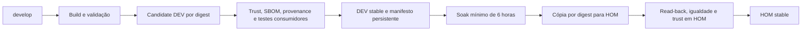

# Factory: DEV → HOM por release imutável

`develop` é a fonte do código da Factory e o destino dos PRs. Os ambientes são
GitHub Environments e contas AWS. Não se cria branch `stable`, nem se usa
`staging` para promover imagens. Mudanças em workflows, políticas, catálogo,
certificados, Apko/Melange e Terraform passam por PR.

| Ambiente | Conta | Região | Role OIDC |
| --- | --- | --- | --- |
| DEV | `712107929769` | `us-east-1` | `alric-image-base-factory-dev` |
| HOM | `248908662184` | `sa-east-1` | `alric-image-base-factory-hom` |

O profile local `revolution-dev` autentica a conta **HOM** desta Factory.
Essas identidades estão versionadas em
[`environments.json`](../policies/release/environments.json). A role HOM lê
somente o catálogo e os manifestos DEV e escreve nos seus próprios recursos.
A role DEV não escreve em HOM. Nenhuma delas cria repositórios ou apaga releases.
As trusts exigem o subject imutável do repositório e o Environment exato;
os Environments permitem somente a branch `develop`.



## Execução automática

1. `workflow.yml` executa em push, dispatch ou no cron diário `23 3 * * *`.
   O perfil diário continua sendo Go 1.26 + Go 1.26-dev; o catálogo completo
   está disponível no dispatch de `catalog-certification.yml`.
2. `build-base-images.yml` valida o OCI, Trivy, runtime, certificados e as duas
   arquiteturas. Publica o candidate imutável em DEV, assina e atesta os SPDX
   originais e a provenance. O artifact de publicação inclui run, attempt,
   SHA, tag e digests.
3. `dev-stable.yml` exige sucesso dos gates globais e das publicações. Confere
   os digests e a provenance da execução exata, verifica SPDX do índice e das
   duas arquiteturas e executa aplicações consumidoras reais em amd64/arm64.
   Só então atualiza DEV `stable`, confirma todas as tags e persiste o manifesto.
4. `promote-stable.yml` roda no cron `17 * * * *`, com
   `STABLE_PROMOTION_AUTHORIZED=true`. O soak começa após o último read-back
   de DEV `stable`. Não há runner aguardando seis horas.
5. A seleção lê manifestos aprovados, escolhe a release elegível mais nova e
   fixa seus digests. Não resolve DEV `stable`. Assim, A pode completar o
   soak enquanto DEV já aponta para B, sem promover B por engano.
6. A promoção revalida source, quarentena e Trivy, copia índices, filhos,
   camadas, OCI referrers e attachments legados. Usa ORAS e Cosign, sem build.
   Confere a tag imutável, os digests, assinatura, provenance e os três SPDX
   em HOM antes da primeira escrita de `stable`.
7. Atualiza todas as tags da release e repete a leitura de todos os membros.
   Somente o sucesso completo grava o recibo de promoção.

A granularidade é **todo o manifesto solicitado**. Cada linguagem com `-dev`,
inclusive Node, precisa estar completa; Python é singleton. O perfil completo
promove 16 imagens como uma release de nove cenários consumidores.
DEV e HOM podem servir releases distintas durante o soak.

## Manifesto, evidências e concorrência

Manifestos ficam em
`s3://712107929769-image-base-releases-dev/releases/r<RUN>-a<ATTEMPT>/manifest.json`.
HOM guarda uma cópia em seu bucket `248908662184-image-base-releases-hom`.
A escrita exige `If-None-Match: *`: um ID já existente não pode mudar de conteúdo.
O manifesto inclui SHA, tag, digests do índice/arquiteturas, hashes dos predicados
SPDX originais, testes consumidores e confirmação das tags DEV.

Os buckets têm versionamento, criptografia AES256, bloqueio de acesso público
 e exigência de TLS. `events/` contém o estado anterior e o recibo completo;
`promoted/` comprova que uma release terminou a promoção HOM. `state/` registra
por imagem a release atual, a maior identidade já promovida e pausas operacionais.
Os logs detalhados dos jobs permanecem como artifacts por 30 dias. Manifestos,
resultados consumidores e recibos persistem no S3; HOM não possui expiração
por idade que remova silenciosamente um destino de recovery ou suas attestations.
DEV preserva a política existente de sete dias, além da proteção da stable atual.
Uma release DEV cujos artifacts expiraram falha fechado na cópia/verificação.

Promoção e recovery compartilham `stable-mutation-HOM-<repositório>`, com
`cancel-in-progress: false`. DEV tem seu próprio lock. Não há transação ECR
entre repositórios: uma falha na segunda escrita pode deixar tags diferentes.
Antes de escrever, o processo grava uma pausa para **todos** os membros. Em
falha, timeout ou interrupção, a pausa impede outra promoção automática e as
evidências identificam o que foi escrito. Um escritor administrativo externo
não participa desse lock; não altere tags fora dos workflows.

## Recovery sem PR e sem rebuild

Escolha um `release_id` que tenha um recibo em `promoted/` no bucket HOM:

```sh
gh workflow run recover-stable.yml --ref develop \
  -f release=r123456-a1 -f reason='Regressão identificada pelas squads'
```

O workflow verifica o manifesto, aprovação anterior em HOM, digests, trust,
SPDX e provenance; reescaneia ambas as arquiteturas com a política atual.
Restaura **todos os membros** da release por digest e confirma as tags.
Falha de segurança bloqueia o recovery, inclusive em emergência.

A promoção automática desses membros permanece pausada depois do recovery.
Não é necessário PR de quarentena. Para retomar, escolha uma release elegível
cuja identidade seja igual ou posterior à maior já promovida e solicite:

```sh
gh workflow run promote-stable.yml --ref develop \
  -f release=r123999-a1 -F resume-automation=true -F soak-hours=6
```

Esse dispatch mantém soak, scans, trust e read-back. A pausa só é removida após
sucesso. Um schedule não pode remover pausas nem fazer downgrade. O kill switch
`STABLE_PROMOTION_AUTHORIZED=false` interrompe a promoção; recovery continua
manual e disponível. Se houver uma falha na primeira release HOM, não existe
recibo anterior para recuperar: inspecione os registros e reexecute uma promoção
explícita com `resume-automation=true` após corrigir a causa, conservando os gates.

DEV também mantém pausa em escrita parcial. A reconciliação de DEV deve
confirmar/restaurar todas as tags registradas em `events/` antes de remover a
pausa; remover apenas um lado não autoriza o outro. Reexecute o build completo
em nova tentativa quando os artifacts de publicação da tentativa não estiverem
presentes. Evidence de outra tentativa nunca é escolhida silenciosamente.

## Provisionamento e ativação

```sh
terraform -chdir=infra/lifecycle init
terraform -chdir=infra/lifecycle plan -out=bootstrap.tfplan
terraform -chdir=infra/lifecycle apply bootstrap.tfplan
python3 infra/lifecycle/configure_github.py
```

`infra/lifecycle` tem state local de bootstrap, separado de `infra/ecr`. Guarde
`infra/lifecycle/terraform.tfstate` em armazenamento administrativo seguro;
não o versione. O módulo referencia os OIDC providers já existentes. O state
DEV de ECR continua em seu backend S3; aplique por ele a política versionada
que permite leitura à role HOM. Não importe os mesmos repositórios em dois states.

A preparação de infraestrutura não ativa código ainda em revisão. Para concluir
 o cutover após aprovação do PR:

1. Integre o PR em `develop`, mantendo checks e revisão das mudanças da Factory.
2. Configure a proteção de `develop` com os mesmos checks/revisores obrigatórios
   da branch anterior. Confirme DEV/HOM restritos a `develop` e as variáveis
   produzidas por `configure_github.py`.
3. Retire a autorização de publicação dos workflows históricos em `main`
   desabilitando a trust da role antiga `alric-github-repo-1360616627`; a nova
   publicação usa `alric-image-base-factory-dev`. Trate também a role histórica
   de Infra PR antes de reabilitar esse caminho; veja
   [retirada de autorização histórica](develop-as-dev.md#retirada-da-autorizacao-historica).
   Jobs antigos podem pedir novas sessões por reexecução; mudar o YAML atual
   não os revoga. Preserve o Environment de Infra com seus controles de revisão.
4. Altere a default branch para `develop`. Não crie branches de ambiente.
5. Execute um build aprovado, confira o manifesto e DEV stable e ative
   `STABLE_PROMOTION_AUTHORIZED=true`. O cron promove após seis horas reais.
6. Confirme os dois índices e suas attestations em HOM e execute um teste
   consumidor. Registre run, attempt, SHA, source/target digests e recibo S3.
   Valide recovery quando houver uma segunda release HOM aprovada.

Até esse aceite, testes locais e recursos provisionados não comprovam OIDC
real, cópia cross-account ou promoção completa em GitHub Actions.

## Contrato consumidor

```dockerfile
FROM 248908662184.dkr.ecr.sa-east-1.amazonaws.com/image-base-java21-dev:stable AS build
# build da aplicação
FROM 248908662184.dkr.ecr.sa-east-1.amazonaws.com/image-base-java21:stable
# aplicação
```

A squad precisa de conta/registry HOM, framework/version e `stable`. Mover a tag
não altera containers existentes: a aplicação incorpora a correção da base no
próximo build. PROD pode ser acrescentado como outro destino com os mesmos
manifestos e verificação por digest.

A cópia inclui referrers porque Skopeo sozinho não leva esses artefatos, conforme
[a documentação ECR](https://docs.aws.amazon.com/AmazonECR/latest/userguide/migrate-from-third-party.html).
A separação de trust por Environment segue o
[contrato OIDC do GitHub para AWS](https://docs.github.com/en/actions/how-tos/secure-your-work/security-harden-deployments/oidc-in-aws).
