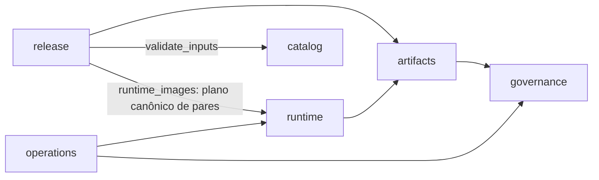

# Arquitetura do repositório

O produto deste repositório são imagens base distroless. A estrutura separa
composição das imagens, regras de automação, políticas, orquestração e testes.
Os diretórios consumidos pelo contrato Apko (`frameworks/`, `distroless/`,
`melange/` e `tests/runtime/`) mantêm seus caminhos públicos.

Antes do mapa de diretórios: por que essas imagens são tratadas como um
produto de segurança e supply chain, não só como filesystems mínimos, está
na RFC-013, ["O que significa \"hardened\""](../RFC-013-Image-Base-Completa-com-Mermaid.md#o-que-significa-hardened).

## Mapa de responsabilidades

| Área | Responsabilidade |
| --- | --- |
| `distroless/` | Base comum herdada por todas as imagens |
| `frameworks/` | Catálogo declarativo de runtimes e variantes de build `-dev` |
| `melange/` | Receita do pacote adicional de certificados; `keys/` contém signing key Wolfi pública e pin revisados; private keys e pacotes gerados são ignorados |
| `scripts/certificates/` | Aquisição, verificação e pins do bundle corporativo |
| `scripts/pipeline/catalog/` | Validação de framework, soak e digest antes de operações privilegiadas; lote padrão = catálogo − exclusões |
| `scripts/pipeline/artifacts/` | Índices OCI, referências por digest e execução de scans |
| `scripts/pipeline/runtime/` | Contratos funcionais das imagens e readiness com limite de tempo |
| `scripts/pipeline/release/` | Seleção de candidatos, publicação, promoção e evidência de CVEs |
| `scripts/pipeline/operations/` | Saúde, tempos, resumos e versões efetivas das ferramentas |
| `scripts/pipeline/governance/` | Hardening, pins, cache e contratos com workflows compartilhados |
| `policies/governance/` | Origem revisada da biblioteca; os SHAs permanecem nas referências literais dos workflows |
| `policies/operations/` | Limites, donos, retenção e exceções operacionais (frameworks fora do lote padrão, com ADR) |
| `policies/release/` | Quarentena de digests e identidades de assinatura/provenance |
| `.github/workflows/` | Gatilhos, permissões, concorrência e composição dos jobs |
| `.github/scripts/` | Seis adaptadores temporários exigidos pelo executor publicado |
| `tests/unit/pipeline/` | Testes por domínio, sem Docker, AWS, sockets ou acesso à rede |
| `tests/integration/` | Certificados, servidor TLS real, adaptadores e contrato com o checkout compartilhado |
| `tests/runtime/` | Probes e projetos mínimos executados nas imagens candidatas reais |
| `docs/` | Arquitetura, decisões (`docs/adr/`) e runbooks vigentes |

O mecanismo de `scripts/certificates/` prepara âncoras aprovadas para o pacote
Melange e os providers Apko; o perfil versionado é público, sem CAs corporativas
reais. A receita Mozilla anterior é histórica. Ver [composição](image-composition.md)
e o [contrato canônico de consumo](consumer-verification-contract.md).

## Dependências entre domínios

Os módulos são pacotes Python regulares, executados a partir da raiz:

```sh
python3 -B -m scripts.pipeline.governance.pin_inventory lint
```

Imports usam nomes qualificados. Domínios não importam testes nem adaptadores.
As dependências permitidas são verificadas no gate unitário:



`catalog` e `governance` não dependem de outros domínios. `artifacts/build_image`
consulta somente a verificação offline de `governance/wolfi_trust` antes de
lock/build, compartilhando o mesmo pin do inventory sem duplicar a policy.
`operations` pode consultar o plano de runtime e os contratos de governança.
`release` reutiliza somente `runtime/runtime_images` para resolver os pares
canônicos e `catalog/validate_inputs` para validar escopo/soak; o teste limita
essas duas dependências aos módulos nomeados, sem abrir todo o domínio.
Imports dentro do próprio domínio são permitidos. Nova dependência exige uma
mudança explícita nesta documentação e no teste de arquitetura.

## Workflow responsibilities

Cada workflow ativo representa uma capacidade permanente da plataforma.
`image-trust-scope.yml` mantém separada a regressão hospedada de orquestração
de trust que já detectou um defeito real; ela não é incorporada ao CI rápido.

| Categoria | Papel | Workflows |
| --- | --- | --- |
| CI | Gate rápido obrigatório em Linux: unit, integração offline, sintaxe/hardening, pins imutáveis e contratos do repositório. Sem publicação, role AWS de publicação, apply ou golden path hospedado | `ci.yml` |
| Build | Compor, validar e publicar o artifact: build once com Melange/Apko, scan nas duas arquiteturas e contrato funcional antes de qualquer publicação | `workflow.yml` (entrypoint), `build-base-images.yml`, `validate-base-images.yml`, `test-runtime-images.yml` |
| Security | Gate de confiança da imagem e regressão hospedada de escopo, sem credencial AWS | `image-trust.yml`, `image-trust-scope.yml` |
| Release | Autorizar runtime/dev antes de qualquer escrita; exigir soak, assinatura/provenance e re-scan de ambos, depois read-back dos dois digests | `promote-stable.yml` |
| Recovery | Restaurar `stable` para um digest já publicado, com as mesmas verificações e sem bypass | `recover-stable.yml` |
| Operations | Saúde do pipeline: idade de publicação/`stable`, lacunas de cron e disponibilidade dos pins | `pipeline-health.yml` |
| Automation | Atualização de dependências por revisão, sem alterar pins fora de PR | `.github/dependabot.yml`, `renovate.json` |

`workflow.yml` é o entrypoint agendado/por evento do grupo Build; os demais do
grupo são `workflow_call` chamados por ele. `build-base-images.yml` também é
a identidade de assinatura verificada na promoção — seu nome de arquivo é
contrato, não estética.

Os nomes de exibição organizam a UI em `CI - Repository checks`,
`Distroless - …`, `Infra - …` e `Ops - Pipeline health`.
`Distroless - Build & publish` identifica o entrypoint `workflow.yml`;
`Distroless - Build engine` identifica a implementação reutilizável
`build-base-images.yml`.
Arquivos e IDs de jobs permanecem estáveis. O caller `build-base-images`
serializa todo o build/publicação em `factory-build-publish-${github.repository}`,
com `cancel-in-progress: false`, incluindo validação, contratos, assinatura e
attestations. PRs de validação ficam fora desse lock. É o controle dos runs
disparados pelo entrypoint deste repositório, não um lock global para callers
externos da capacidade reutilizável.

O CI atual executa em Linux. Windows/Git Bash é opcional apenas para testes
locais. O destino corporativo será Linux self-hosted efêmero em Kubernetes
via Actions Runner Controller; essa documentação não adiciona runners.

## Fronteira entre produto e workflows compartilhados

O repositório `alric-corp/alric-containers-reusable-workflows` fornece os executores genéricos
Melange/Apko/scan e runtime (`validate-apko-images.yml`, `test-runtime-images.yml`,
a composite `actions/setup-trivy`). O checkout desses executores é o commit do
**consumidor**, de onde vêm os manifests, scripts, certificados e projetos de
teste — intencional: outro produto precisa implementar as mesmas interfaces
(contrato Apko/OCI) antes de adotar o pacote, não apenas apontar para ele.

O `image-base` conserva catálogo, ECR, tags, soak, quarentena, identidade do
assinador e recuperação — `workflow.yml`, `build-base-images.yml`,
`promote-stable.yml`/`recover-stable.yml` e a saúde operacional nunca migram
para o executor compartilhado. O executor compartilhado não recebe comandos
livres, regras de negócio ou credenciais AWS como parte de seu contrato; ele
só aceita `workflow_call`, sem cron, dispatch ou secrets próprios.

Biblioteca aprovada: `alric-corp/alric-containers-reusable-workflows@7a9b055a462eeb8552d3404c26538b44e8ccd83f`.

Os dois chamadores usam esse commit. Actions externas e reusable workflows
exigem SHA completo; imagens de ferramentas usam digest. A origem aprovada
fica em
[policies/governance/reusable-workflows.json](../policies/governance/reusable-workflows.json).
O lint (`scripts/pipeline/governance/workflow_dependencies.py`) confere, só a
partir dos arquivos **deste** repositório: origem aprovada, SHA completo e
único entre os dois chamadores, ausência de refs móveis, inputs exatos dos
chamadores (incluindo build bloqueado), alinhamento da action
Trivy interna entre promoção/recuperação e o grupo do Dependabot. Ele nunca
abre nem clona o repositório compartilhado — implementação, contrato interno de inputs/outputs,
hardening, actionlint e retenção dos dois YAMLs consumidos são verificados
pelo CI do próprio `alric-containers-reusable-workflows`, não duplicados
aqui. Dependabot agrupa a origem aprovada; Renovate acompanha os digests
locais.

Essa conferência local não prova publicação do commit, acesso privado, nem
substitui a verificação interna da biblioteca. Uma origem nova exige
referências estáticas coerentes e futuro release da chamada interna. A
biblioteca e os pins sandbox permanecem inalterados; migração para outra
origem e acesso privado a uma biblioteca corporativa continuam pendentes (ver
[readiness corporativo](corporate-production-readiness.md)).

O nome e a retenção dos artifacts trocados com o executor são parte da API:
`melange-repo`, `build-scans-*`, `sbom-*` e `runtime-*` (30 dias) e
`validated-oci-*` (3 dias). Todos são artifacts que o executor compartilhado
sobe; sua retenção é declarada e testada em
`alric-containers-reusable-workflows`, não pelo lint deste repositório (que só
cobre os artifacts que os workflows deste repositório sobem). Um run deve
chamar a validação uma única vez
com o lote completo, porque os nomes dos artifacts são compartilhados dentro
do run. `verify_promotion.py` preserva a identidade exata do workflow
assinante; a compatibilidade com um nome de repositório anterior exige IDs
cadastrados em `policies/release/signing-identities.json` — não há wildcard
para aceitar candidatos históricos.

**Critério para extrair mais lógica para o executor compartilhado:** pelo
menos dois consumidores reais com o mesmo contrato. Hoje há exatamente um
produto (`image-base`); publicação, atestação e as decisões de release
continuam no produto por design, não por lacuna a fechar. Forçar uma nova
extração sem um segundo consumidor real é abstração por estética.

## Compatibilidade da migração

O executor publicado ainda chama seis paths em `.github/scripts/`:
`validate_inputs.py`, `oci_artifact.py`, `scan_images.py`, `tool_versions.py`,
`report_unfixed_cves.py` e `runtime_images.py`. Esses arquivos apenas delegam
para o pacote canônico. O adaptador de runtime também preserva as funções
`runtime`, `supported` e `project`, importadas pelo workflow publicado.

Testes de integração executam os adaptadores e conferem os paths exigidos pelo
checkout fixado. Só remova um adaptador quando **todos os releases suportados**
usarem o pacote canônico e a integração comprovar a retirada do contrato antigo.
Novos workflows deste produto usam `python3 -m scripts.pipeline...`.

As políticas passaram de `.github/pipeline-health.json` e
`.github/promotion-quarantine.json` para `policies/operations/health.json` e
`policies/release/promotion-quarantine.json`, respectivamente. Consumidores,
runbooks e filtros de CI acompanham os novos paths. Seu conteúdo operacional
foi preservado.

## Verificação e contribuição

[CONTRIBUTING.md](../CONTRIBUTING.md) descreve o ambiente e os comandos.
`make test-unit` é independente de infraestrutura. `make check` acrescenta
integração e o lint local (hardening, origem/SHA/tooling dos chamadores,
pins, retenção e lote padrão) e `make lint-workflows` roda actionlint nos
YAMLs deste repositório. Nenhum dos dois clona ou abre outro repositório: um
`git clone` deste repositório sozinho basta. O CI usa os mesmos alvos e
preserva os IDs `test` e `lint-workflows`, com os nomes exibidos
`Unit & integration tests` e `Repository & workflow lint`; os testes de
certificados executam uma única vez. Required check contexts acompanham os
nomes exibidos e precisam ser alinhados no merge autorizado, sem retirar
essas exigências.

`CODEOWNERS` cobre os domínios e também arquivos novos pelo dono padrão.
Os testes verificam que mudanças nos insumos movidos continuam cobertas pelos
filtros de build. Evidências geradas ficam em `reports/` (ignorado) e não são
versionadas; o histórico Git é a fonte de runs/evidências passadas.

## Alcance para produção

Esta estrutura torna revisão, manutenção e validação repetíveis. Ela não
comprova sozinha implantação produtiva. A adoção corporativa ainda depende
dos controles remotos, dos donos efetivos e dos aceites de publicação,
promoção e recuperação descritos na [RFC-013](../RFC-013-Image-Base-Completa-com-Mermaid.md).
Os manifestos de imagem e o toolkit de troubleshooting mantêm seu estado
anterior; esta migração não certifica nem publica novas imagens.

## Referências das decisões

- [GitHub: segurança de Actions](https://docs.github.com/en/actions/reference/security/secure-use):
  permissões mínimas, SHA completo, proteção dos workflows e OIDC.
- [GitHub: CODEOWNERS](https://docs.github.com/en/repositories/managing-your-repositorys-settings-and-features/customizing-your-repository/about-code-owners):
  ownership de arquivos depende de acesso e revisão obrigatória na plataforma.
- [Python: descoberta de testes](https://docs.python.org/3.13/library/unittest.html#test-discovery):
  pacotes importáveis e descoberta com diretório raiz explícito.

A divisão de domínios é uma decisão deste produto, não um padrão obrigatório
prescrito por essas fontes.
